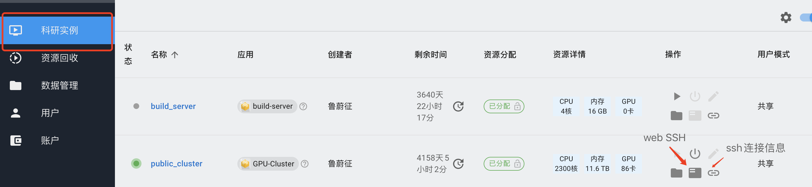
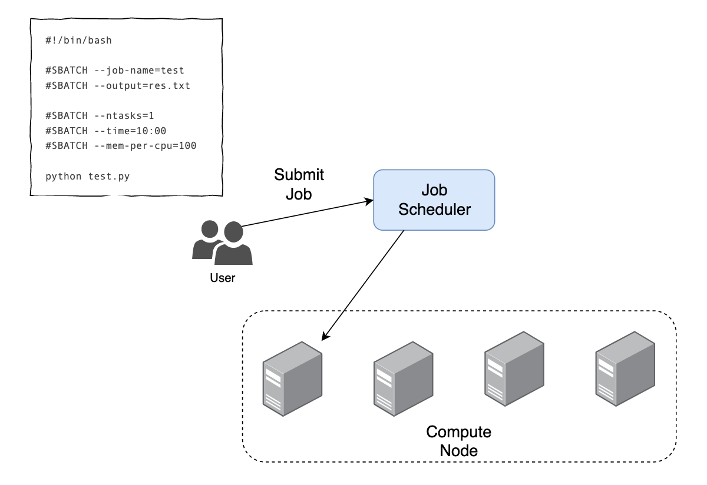
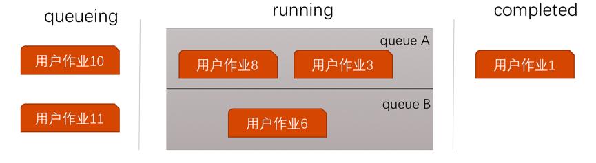
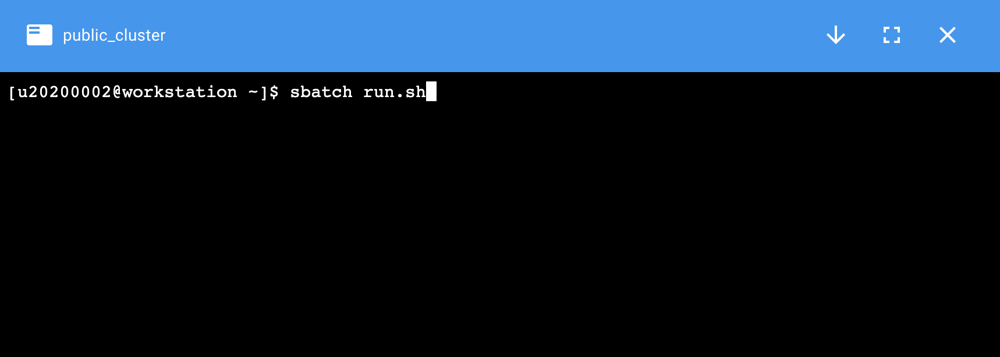
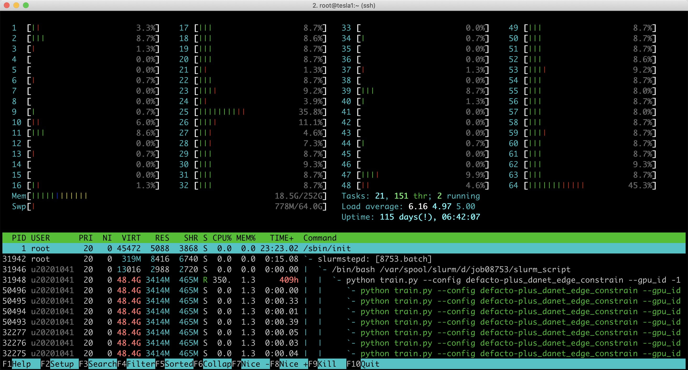

# 共享集群使用方法

## 1. 集群入门

一个计算集群是由一组计算性能强劲的计算机通过高速网络连接后组成。集群中某单台计算机被称为节点（node）。高性能计算集群一般由登录节点、计算节点和存储节点组成。


用户需要先连接到登录节点，登录节点是连接整个集群的入口。用户通过登录节点来进一步访问计算节点和存储节点。

计算节点，是提供计算服务的计算机节点，可以是CPU节点或GPU节点。通常情况下，一个用户作业任务需要一台或多台计算节点来支持其计算服务。

将某个计算作业任务分配到不同计算节点上进行计算的工具被称为**作业调度系统**。

计算作业一般需要读写文件，我们采用了**共享存储系统**，将存储节点的磁盘空间映射到所有计算节点上。共享存储的可用磁盘容量非常大，用户可以像操作本地的文件一样操作远程的存储节点上的文件。

!!! warning "请勿在登录节点执行计算任务！"
    共享集群的登陆节点配置了资源限制，请勿在共享集群的登陆节点执行大的计算任务。

## 2. 共享集群

在计算平台平台上，我们已经创建了一个共享集群，名为“public_cluster”。在计算平台上，点击“共享资源”，选择`public_cluster`进入该集群。


登录这个集群，可以使用Web SSH直接登录，也查看SSH登录信息，然后使用本地的SSH客户端登录。Windows上的开源免费客户端有[MobaXterm](https://mobaxterm.mobatek.net/)、[XShell + Xftp](https://www.netsarang.com/zh/free-for-home-school/)等。我们提供了一个MobaXterm的校内[下载链接](./../files/MobaXterm_Portable_v20.3.zip)。

!!! tip "不建议使用破解版软件！"
    MobaXterm和XShell都对教育用户免费。网络上有一些破解版软件，这些破解软件往往植入了病毒，比如使用集群资源挖矿。我们不建议用户使用这些破解软件。



!!! warning "登录注意事项"
    1. 登录时注意设置正确的端口号，端口号在SSH连接信息处查看。
    2. 校内用户可直接使用IP和端口号登录该IP地址。校外用户，使用SSH客户端登录，需要先登录我校[VPN](../manual/vpn.md)。

“数据管理”页面可以上传下载数据。该目录为用户在共享集群上的Home目录，实际上是挂载了共享存储系统。

## 3. 计算资源

目前，公共集群上有如下两类计算资源：CPU类型和GPU类型，分为不同的队列。

| 队列名      | CPU型号            | CPU核数 | 内存     | GPU                          | 卡数  | 台数  | 本地SSD         |
| -------- | ---------------- | ----- | ------ | ---------------------------- | --- | --- | ------------- |
| gpu-a800 | Intel 8358       | 64    | 1024GB | NVIDIA A800 NVLink 80GB      | 8   |     | /disk: 3.84TB |
| gpu-a100     | Intel 6348       | 56    | 512GB  | NVIDIA A100 PCI-E 80GB       | 4   | 1   |               |
| gpu-v100     | Intel 4210       | 20    | 128GB  | Nvidia Tesla V100 PCI-E 32GB | 6   | 1   |               |
| gpu-titan    | Intel 5218       | 64    | 128GB  | Nvidia Titan RTX PCI-E 24GB  | 4   | 3   |               |              |
| cpu24c   | Intel E5-2650 v4 | 24    | 64GB   | -                            | -   | 50  |               |
| cpu64c   | Intel 6438M      | 64    | 512GB  | -                            | -   | 14  |               |
| cpu64c1t | Intel 6438M      | 64    | 1024GB    | -                            | -   | 2   |               |

## 4. 调度系统

SLURM（Simple Linux Utility for Resource Management）是一种可用于大型计算集群的作业调度系统，被世界范围内的超级计算机和计算集群广泛采用。

集群调度系统在提交作业时都需要用户在一份文件中做一些参数说明，告知本作业需要多少CPU、GPU和内存，用来申请计算资源。用户提交一个作业，需要先将这些参数填写进一个脚本中，用户提交这个脚本给SLURM，SLURM会分配相应的计算资源给这个作业，如下图所示。



如果把向集群提交作业比作前往银行办理业务，那么作业调度器就是银行门口的取号机，用户需要排队，根据叫号来办理业务。用户一般需要告知取号机自己办理哪种服务，比如存取款的普通柜台、对公柜台、VIP柜台、理财顾问等等。取号机在相应的柜台服务上生成排队号码。调度器中的队列与之相似，用户在提交作业时，一般要告知调度器作业所属的队列，调度器会把用户作业放在该队列里排队。

下图展示了作业通过调度器来排队的情况。queue A和queue B是两个队列，某个作业会在这两个队列中排队并执行，两个队列里的作业互不干扰，不会互相占用资源。



在公共集群上，我们按照计算设备的类型，分成了不同的队列，用户提交作业时需要确定自己所需的队列。

我们首先登陆到共享集群的登录节点，可以使用Web SSH，也可以使用SSH客户端。

下文将详细介绍如何使用SLURM来提交作业。[这里](../files/slurm-summary.pdf)提供了一个两页SLURM用户手册。

### 4.1 查看集群状态

我们可以使用`sinfo`查看集群信息和状态。

```bash
sinfo
```

得到当前集群的队列信息：

```
PARTITION AVAIL  TIMELIMIT  NODES  STATE NODELIST
a100         up 28-00:00:0      1   idle a100-1
...
```

可以看到，我们有多个队列，每个队列的设备参数可以参考[计算资源](#_3)部分。

| STATE | 解释                                               |
| ----- | ------------------------------------------------ |
| idle  | 这些节点闲置，可向其提交作业                                   |
| mix   | 这些节点一部分CPU资源被占用，一部分闲置，可向其提交作业，但新提交作业的资源需 <= 闲置资源 |
| alloc | 这些节点CPU资源全部被占用                                   |
| down  | 这些节点宕机                                           |
| drng | 这些节点即将进行维护，待作业运行结束后进入 drain 状态                                |
| drain | 这些节点因维护原因，暂时不提供服务                                |

查看指定分区节点空闲状态：

```bash
sinfo -p cpu24c
```

### 4.2 提交作业

在 SLURM 系统中，提交作业前需要先准备一个脚本，该脚本中会说明用户本次申请的资源。准备好脚本后，再使用`sbatch`提交作业。

这里我们提供了一个脚本模板，将其命名为`run.sh`，将这个脚本上传至共享集群的个人目录下。

```bash
#!/bin/bash

### 将本次作业计费到导师课题组，tutor_project改为导师创建的课题组名
#SBATCH --comment=tutor_project

### 给您这个作业起个名字，方便识别不同的作业
#SBATCH --job-name=example

### 指定该作业需要多少个节点
### 注意！没有使用多机并行（MPI/NCCL等），下面参数写1！不要多写，多写了也不会加速程序！
#SBATCH --nodes=1

### 指定该作业需要多少个CPU核心
### 注意！一般根据队列的CPU核心数填写，比如cpu队列64核，这里申请64核，并在您的程序中尽量使用多线程充分利用64核资源！
#SBATCH --ntasks=4

### 指定该作业在哪个队列上执行
#SBATCH --partition=cpu

### 以上参数用来申请所需资源
### 以下命令将在计算节点执行

### 本例使用Anaconda中的Python，先将Python添加到环境变量配置好环境变量
### 根据具体情况和需要配置 PATH 
export PATH=/opt/app/anaconda3/bin:$PATH
### 激活一个 Anaconda 环境 tf22
source activate tf22

### 执行您的作业
python test.py
```

!!! warning "计费问题"
    提交作业时如果报错`invalid account or account/partition combination specified`，可能的原因有：

    1. `#SBATCH --comment=tutor_project`中的`tutor_project`名称没写对，要注意大小写一致。
    2. 账户余额不足，超过透支额度。

!!! warning "注释与井号"
    上面这个脚本中，三个井号###表示注释，单个井号`#SBATCH`用来表示指定参数。不要把`#SBATCH`中的井号删掉。

假如我们想执行一个Python程序`test.py`，Python程序`test.py`也要放在`run.sh`相同的目录下。做好以上准备后，在该目录下提交这个作业：

```bash
sbatch run.sh
```



这个程序将提交至作业调度系统，作业调度系统会为作业生成一个作业ID，并分配相应节点执行该作业。同时，程序中各类输出结果也会生成到文件中，文件名为`slurm-jobid.out`。

以上只是一个简单的案例，SLURM 有更多使用参数，比如`--output=<output-filename>`指定标准输出文件参数、`--error=<error-filename>`指定标准错误文件参数、`--gpus=1`指定使用一张GPU卡。请参考[Slurm进阶](./slurm-advanced.md#)，或者作业参数信息，请参考[官方文档](https://slurm.schedmd.com/sbatch.html)。

### 4.3 登录到计算节点

用户在登录节点（workstation）不能进行计算，否则影响其他人登录。我们已经做了一些限制，进程无法长时间运行；同时，如果发现，我们将直接杀死进程。

用户无法直接登录到计算节点，需要使用`sbatch`或者`salloc`提交作业后，使用`ssh hostname`来登录目标节点。比如，分配的节点为`a100-1`，`ssh a100-1`可登录到计算节点。

### 4.4 GPU

使用GPU，请使用`--gres=gpu:1`参数，程序未使用多卡并行优化，此参数设置为1！

!!! warning
    登录节点（workstation）上没有GPU，无法使用`nvidia-smi`，也无法跑任何GPU相关运算，一切GPU运算都应该在相应的GPU队列上。可以使用`sbatch`或者下文提到的`salloc`交互式方式，将作业提交到GPU队列。

    SSH登录到GPU节点上，请使用`/opt/app/eaas/eaas_smi`查看完整的`nvidia-smi`信息。

一个使用GPU的作业提交脚本：

```bash
#!/bin/bash

### 将本次作业计费到导师课题组，tutor_project改为导师创建的课题组名
#SBATCH --comment=tutor_project

### 给您这个作业起个名字，方便识别不同的作业
#SBATCH --job-name=gpu-example

### 指定该作业需要多少个节点
### 注意！没有使用多机并行（MPI/NCCL等），下面参数写1！不要多写，多写了也不会加速程序！
#SBATCH --nodes=1

### 指定该作业在哪个队列上执行
#SBATCH --partition=gpu-a800

### 申请一块GPU卡，一块GPU卡默认配置了一定数量的CPU核
### 注意！程序没有使用多卡并行优化的，下面参数写1！不要多写，多写也不会加速程序！
#SBATCH --gres=gpu:1 

### 以上参数用来申请所需资源
### 以下命令将在计算节点执行

### 激活环境
### 例1：source activate env-name
### 例2：module load package
source activate env-name

### 执行您的作业
python test.py
```

### 4.5 管理作业

使用`sbatch run.sh`提交作业后，作业就进入运行状态：如果程序报错，错误日志会写到输出文件中。

我们可以使用`squeue`命令将显示作业调度系统中所有的作业。

查看自己提交的作业信息：

```bash
squeue -u `whoami`

squeue -u u2020xxxx
```

!!! tip "查看输出文件"
    如果执行上面的命令查看不到自己的作业，表示作业已经执行结束，很可能是执行遇到问题，建议查看输出文件中的报错信息。

如果想取消某个作业，可以使用`scancel`命令，比如想取消ID为43的作业：

```bash
scancel 43
```

取消当前用户的所有作业：

```bash
scancel -u `whoami`

scancel -u u2020xxxx
```

取消当前用户下作业状态为PENDING的作业：

```bash
scancel -t PENDING -u `whoami`

scancel -t PENDING -u -u2020xxxx
```

### 4.6 交互式debug

前面介绍的提交作业的模式只能提前准备好程序，不方便debug，另外一种交互模式可以为用户申请特定的机器，用户可以进一步SSH登录上去，进而进行debug。我们需要使用`salloc`命令。下面的命令在`cpu24c`队列申请1个节点，每个节点8个核心，时间为10分钟，`tutor_project`为您所在的计费课题组。

```bash
salloc --nodes=1 --ntasks=8 --partition=cpu24c --time=00:10:00 --comment=tutor_project
# 以下为屏幕反馈信息
# salloc: Granted job allocation 49933
# salloc: Waiting for resource configuration
# salloc: Nodes titan-1 are ready for job
# 登录到当前计算节点
ssh titan-1
python test.py

# 退出当前计算节点
exit
# 以下为屏幕反馈信息
# logout
# Connection to titan-1 closed.

# 释放当前salloc计算资源
exit
# 以下为屏幕反馈信息
# salloc: Relinquishing job allocation 49933
```

SLURM会分配给一个机器，比如分配机器为titan-1，接着我们可以`ssh titan-1`，来登录到这台机器上，执行相应的计算和并进行debug。比如，执行一个Python程序，查看输出：`python test.py`。

使用完后，我们需要先执行一次`exit`退出当前机器，这里是titan-1这台机器；再执行一次`exit`，提醒Slurm释放掉`salloc`所申请的资源。

### 4.7 申请多节点

以下配置可以申请4个节点，共 4 × 24 = 96 个CPU核：

```bash
### 申请 4 个节点
#SBATCH --nodes=4
### 每个task 24 个CPU
#SBATCH --cpus-per-task=24
### 每节点 1 个task 
#SBATCH --ntasks-per-node=1
```

以下配置可以申请4个GPU节点，共 4 × 8 = 32 个GPU卡，系统将自动分配对应的CPU核。

```bash
### 申请 4 个节点
#SBATCH --nodes=4
### 每节点 8 个GPU 
#SBATCH --gres=gpu:8
```

### 4.8 多节点作业启动

如果申请了多个节点，每个节点启动的进程略有不同，可以使用 `srun` 在不同节点上启动进程。

1. 获取本次分配的节点列表和对应IP。
2. 使用 srun，将制定作业运行到指定节点上。

以下为一个案例：

```bash
#!/bin/bash

#SBATCH --job-name=xorbits
#SBATCH --nodes=4
#SBATCH --cpus-per-task=24
#SBATCH --ntasks-per-node=1
#SBATCH --partition=cpu24c
#SBATCH --time=00:30:00

### 激活环境
source activate df
### 添加debug log，打印所有 Linux 命令行信息
### 如果不想看到这些信息，可以删除下面这行
set -x

### 获得本次所申请的所有的节点的 hostname
nodes=$(scontrol show hostnames "$SLURM_JOB_NODELIST")
nodes_array=($nodes)

### 将第一个节点作为 head 节点，并获取IP
head_node=${nodes_array[0]}
head_node_ip=$(srun --nodes=1 --ntasks=1 -w "$head_node" hostname --ip-address)

if [[ "$head_node_ip" == *" "* ]]; then
    IFS=' ' read -ra ADDR <<<"$head_node_ip"
    if [[ ${#ADDR[0]} -gt 16 ]]; then
        head_node_ip=${ADDR[1]}
    else
        head_node_ip=${ADDR[0]}
    fi
    echo "IPV6 address detected. We split the IPV4 address as $head_node_ip"
fi

### 在第一个节点上启动名为 supervisor 的进程，使用某个端口号
port=16380
web_port=16379
echo "Starting HEAD at $head_node"
srun --nodes=1 --ntasks=1 -w "$head_node" \
    supervisor -H "$head_node_ip" -p "$port" -w "$web_port" &

### 休眠 10秒 等待进程启动，便其他 worker 能够连接
sleep 10

### 其他节点启动 worker 进程，worker 进程连接 supervisor 进程
worker_num=$((SLURM_JOB_NUM_NODES - 1))
for ((i = 1; i <= worker_num; i++)); do
    node_i=${nodes_array[$i]}
    port_i=$((port + i))

    echo "Starting WORKER $i at $node_i"
    srun --nodes=1 --ntasks=1 -w "$node_i" \
        worker -H "$node_i"  -p "$port_i" -s "$head_node_ip":"$port" &
done
```

上面的例子中，启动了两类进程：`supervisor` 和 `worker`。修改 `supervisor` 和 `worker`为您的工作负载。

`SLURM_JOB_NODELIST` 是环境变量，当这个作业启动后，环境中就会添加该环境变量，其他环境变量请参考：[SLURM 环境变量](https://slurm.schedmd.com/sbatch.html#SECTION_OUTPUT-ENVIRONMENT-VARIABLES)。

## 5. 存储

与单个节点上的存储系统不同，集群的存储系统示意图如下：



!!! warning "小文件请务必阅读下面的内容！"
    图片类小文件请务必阅读[存储系统](./storage.md)，这非常影响你的作业性能！

## 6. 资源划分

在当前的SLURM共享集群中，我们将所有的计算资源（CPU、内存、GPU）都定义为TRES（Trackable RESources），也就是说，计算资源是按需申请的，SLURM分配好资源后，会通过cgroups的方式对申请到的资源进行限制。同时，SLURM会根据所申请的资源进行计费。

### 6.1 CPU队列

对于CPU队列，用户1使用`--ntasks=2`在队列cpu上某1个节点上申请了2个CPU核，无论代码中使用了多少线程，SLURM会限制该用户只能使用2个CPU核，即使该节点上剩下的62个CPU核都空闲，用户也只能使用2个CPU核；假如另外一个用户2使用`--ntasks=8`也在cpu队列上申请1个节点的8个CPU核，SLURM很有可能将第二个作业分配到同一个节点。两个作业在同一个物理节点上运行。直到物理节点上空闲的CPU核无法满足新作业的需求，SLURM将不在该物理节点上分配作业。

### 6.2 GPU队列

GPU作业更加复杂，既要满足CPU资源，又要满足GPU资源。为了简化配置，用户可以只使用`--gres=gpu:<gpus>`来申请GPU卡数量，不需要设置CPU资源。校级计算平台已经根据当前CPU核和GPU卡的数量配比，已经给GPU队列设置了一张GPU卡对应的CPU的默认配比数量，即`CPU核数÷GPU卡数`，因此，不需要使用`--ntasks=<ncpus>`。当然，用户可以根据自身需要使用`--ntasks=<ncpus>`申请CPU核，使用`--ntasks=<ncpus>`后将覆盖默认的配比。

假如用户不设置`--gres=gpu:<ngpus>`，则用户无法获取到GPU资源；假如`--gres=gpu:1`，SLURM会使用cgroups限制用户只能使用1张GPU卡。直到物理节点上空闲的CPU核或空闲的GPU卡无法满足新作业的需求，SLURM将不再该物理节点上分配作业。

### 6.3 内存

为了避免运行在同一个节点上多个作业互相争抢资源，同一个节点上的不同作业之间的内存也是相互隔离的。目前我们设置了一个CPU核对应的默认内存大小，默认值为`内存大小÷CPU核数`。比如，fat队列上，1个CPU核对应3GB内存，如果用户申请16个CPU核，能获取到的内存为48GB。

### 6.4 意见

目前的这种方式对计算资源进行了细粒度的划分，并允许多个作业运行在1个物理节点上，可以充分利用资源。但是，多个作业运行在1个物理节点上，作业之间在内存、IO等地方有争抢。1个物理节点上运行的作业越多，作业之间争抢可能就越严重，作业运行速度就可能越慢。如果不希望别人争抢自己的资源，那么用户需要参考计算资源列表，在提交作业时申请该队列的所有CPU核或GPU卡。当然，申请更多的资源意味着计费时成本更高。以GPU队列gpu-a800为例，用户需要申请`--gres=gpu:8`，这样才能独占该节点，其他作业才不会与之共享运行在同一物理节点上。

## 7. 如何合理设置CPU/GPU资源数

到底如何设置CPU和GPU的资源？目前没有一个标准化的答案。所申请的CPU和GPU资源的数目与具体的作业任务有关。有些计算任务是高度依赖CPU的，有些是GPU密集型的，有些既需要CPU又需要GPU。用户需要了解自己作业中的瓶颈。

!!! tip "提示"
        并不是申请的资源越多，速度就越快，申请更多的资源，就需要在自己的代码层面利用好这些资源；申请的资源越少，计费成本越低，但有可能影响作业的速度。

申请了更多资源后，用户自己的代码中也需要充分利用这些资源，对于CPU程序，代码中应使用多线程；对于GPU程序，代码中应使用多卡并行。

也有一些工具可以帮忙监测作业的运行情况，这里简单介绍两个工具：`htop`用来查看CPU利用率和`nvidia-smi`用来查看GPU利用率。

使用`sbatch`提交作业后，可以用`squeue`查看该作业运行到哪个节点上，假如该作业被分配到tesla1节点。可以`ssh tesla1`登录到该节点。

然后使用`htop`命令查看该节点的运行情况。`htop`会实时显示各个CPU核的负载。



`nvidia-smi`是英伟达提供的GPU管理工具，在我们的计算平台上，`nvidia-smi`稍有不同，无法显示进程ID，是因为GPU被映射到容器里，我们可以使用`/opt/app/eaas/eaas_smi`查看到进程ID。