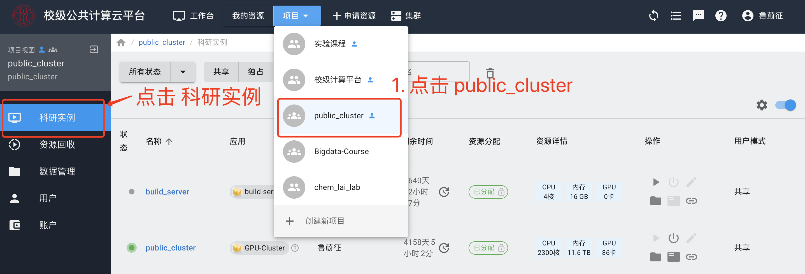

# 共享集群使用方法

## 集群入门

一个计算集群是由一组计算性能强劲的计算机通过高速网络连接后组成。集群中某单台计算机被称为节点（node）。高性能计算集群一般由登录节点、计算节点和存储节点组成。


用户需要先连接到登录节点，登录节点是连接整个集群的入口。用户通过登录节点来进一步访问计算节点和存储节点。计算节点，是提供计算服务的计算机节点，可以是CPU节点或GPU节点。通常情况下，一个用户作业任务需要一台或多台计算节点来支持其计算服务。将某个计算作业任务分配到不同计算节点上进行计算的工具被称为**作业调度系统**。计算作业一般需要读写文件，我们采用了**共享存储系统**，将存储节点的磁盘空间映射到所有计算节点上。共享存储的可用磁盘容量非常大，这样一个大容量的磁盘空间被映射到用户的目录上。映射后，用户可以像操作本地的文件一样操作远程的存储节点上的文件。

!!! warning "请勿在登录节点执行计算任务！"
    共享集群的登陆节点配置了资源限制，请勿在共享集群的登陆节点执行大的计算任务。

## 共享集群

在计算云平台上，我们已经创建了一个共享集群，名为“public_cluster”。在计算云上，点击“共享资源”，选择`public_cluster`进入该集群。



登录这个集群，可以使用Web SSH直接登录，也查看SSH登录信息，然后使用本地的SSH客户端登录。Windows上的开源免费客户端有[MobaXterm](https://mobaxterm.mobatek.net/)、[XShell + Xftp](https://www.netsarang.com/zh/free-for-home-school/)等。我们提供了一个MobaXterm的校内[下载链接](./../files/MobaXterm_Portable_v20.3.zip)。

!!! tip "不建议使用破解版软件！"
    MobaXterm和XShell都对教育用户免费。网络上有一些破解版软件，这些破解软件往往植入了病毒，比如使用集群资源挖矿。我们不建议用户使用这些破解软件。


!!! warning "登录注意事项"
    1. 登录时注意设置正确的端口号，端口号在SSH连接信息处查看。
    2. 校内用户可直接使用IP和端口号登录该IP地址。校外用户，使用SSH客户端登录，需要先登录我校[VPN](https://vpn.ruc.edu.cn/)。

“数据管理”页面可以上传下载数据。该目录为用户在共享集群上的Home目录，实际上是挂载了共享存储系统。

## 计算资源

目前，公共集群上有如下四类计算资源，分为四个队列。

| 队列名 | CPU                         | 内存  | GPU                        | 台数 |
| ------ | --------------------------- | ----- | -------------------------- | ---- |
| tesla  | 2 * Intel Gold 5218 (16核心32线程) | 256GB | 2 * Nvidia Tesla V100 PCI-E 32GB | 3    |
| titan  | 2 * Intel Gold 5218 (16核心32线程) | 128GB | 2 * Nvidia Titan RTX PCI-E 24GB | 7    |
| cpu    | 2 * Intel Gold 5218 (16核心32线程) | 192GB | 无                         | 3   |
| fat    | 4 * Intel Gold 5218 (16核心32线程) | 384GB | 无                         | 2    |

## 调度系统

集群上常见的作业调度系统有Torque（我校2017年项目采用Torque）和Slurm（本项目采用）。Slurm（Simple Linux Utility for Resource Management）是一种可用于大型计算集群的作业调度系统，被世界范围内的超级计算机和计算集群广泛采用。相比Torque，Slurm更先进，因此我们放弃了Torque，转而使用Slurm。无论Torque还是Slurm，作业调度系统主要包括提交作业、查看状态等几大部分。

所有集群调度系统在提交作业时都需要用户在一份文件中做一些参数说明，告知本作业需要多少CPU、GPU和内存，用来申请计算资源。用户提交一个作业，需要先将这些参数填写进一个脚本中，用户提交这个脚本给Slurm，Slurm会分配相应的计算资源给这个作业，如下图所示。


如果把向集群提交作业比作前往银行办理业务，那么作业调度器就是银行门口的取号机，用户需要排队，根据叫号来办理业务。用户一般需要告知取号机自己办理哪种服务，比如存取款的普通柜台、对公柜台、VIP柜台、理财顾问等等。取号机在相应的柜台服务上生成排队号码。调度器中的队列与之相似，用户在提交作业时，一般要告知调度器作业所属的队列，调度器会把用户作业放在该队列里排队。
    
下图展示了作业通过调度器来排队的情况。queue A和queue B是两个队列，某个作业会在这两个队列中排队并执行，两个队列里的作业互不干扰，不会互相占用资源。
    


在公共集群上，我们按照计算设备的类型，分成了不同的队列，用户提交作业时需要确定自己所需的队列。

我们首先登陆到共享集群的登录节点，可以使用Web SSH，也可以使用SSH客户端。

下文将详细介绍如何使用Slurm来提交作业。[这里](../files/slurm-summary.pdf)提供了一个两页Slurm用户手册。

### 查看集群状态

我们可以使用`sinfo`查看集群信息和状态。

```bash
[u20200002@workstation ~]$ sinfo
```

得到当前集群的队列信息：

```
PARTITION AVAIL  TIMELIMIT  NODES  STATE NODELIST
tesla*       up   infinite      3   idle tesla[1-3]
titan        up   infinite      7   idle titan[1-7]
cpu          up   infinite      6   idle cpu[1-6]
fat          up   infinite      2   idle fat[1-2]
```

可以看到，我们有4个队列，每个队列的设备参数可以参考[计算资源](#_3)部分。其中`idle`为空闲，`mix`为节点部分核心可以使用，`alloc`为已被占用。

查看指定分区节点空闲状态：

```bash
[u20200002@workstation ~]$ sinfo -p cpu
```

### 提交作业

在 Slurm 系统中，提交作业前需要先准备一个脚本，该脚本中会说明用户本次申请的资源。准备好脚本后，再使用`sbatch`提交作业。

这里我们提供了一个脚本模板，将其命名为`run.sh`，将这个脚本上传至共享集群的个人目录下。

```bash
#!/bin/bash

### 给你这个作业起个名字，方便识别不同的作业
#SBATCH --job-name=example

### 指定该作业需要多少个节点
### 注意！没有使用多机并行（MPI/NCCL等），下面参数写1！不要多写，多写了也不会加速程序！
#SBATCH --nodes=1

### 指定该作业需要多少个CPU核心
### 注意！一般根据队列的CPU核心数填写，比如cpu队列64核，这里申请64核，并在你的程序中尽量使用多线程充分利用64核资源！
#SBATCH --ntasks=4

### 指定该作业在哪个队列上执行
### 目前可用的队列有 cpu/fat/titan/tesla
#SBATCH --partition=cpu

### 本例使用Anaconda中的Python，先将Python添加到环境变量配置好环境变量
export PATH=/opt/app/anaconda3/bin:$PATH
### 激活一个 Anaconda 环境 tf22
source activate tf22

### 执行你的作业
python test.py
```

!!! warning "注释与井号"
    上面这个脚本中，三个井号###表示注释，单个井号`#SBATCH`用来表示指定参数。用户不要把`#SBATCH`的井号删掉。

假如我们想执行一个Python程序`test.py`，Python程序`test.py`也要放在`run.sh`相同的目录下。做好以上准备后，在该目录下提交这个作业：

```bash
[u20200002@workstation ~]$ sbatch run.sh
```


这个程序将提交至作业调度系统，作业调度系统会为作业生成一个作业ID，并分配相应节点执行该作业。同时，程序中各类输出结果也会生成到文件中，文件名为`slurm-jobid.out`。

以上只是一个简单的案例，Slurm 有更多使用参数，比如`--output=<output-filename>`指定标准输出文件参数、`--error=<error-filename>`指定标准错误文件参数、`--gres=gpu:1`指定使用一张GPU卡。

一个使用GPU的作业提交脚本：

```bash
#!/bin/bash

### 给你这个作业起个名字，方便识别不同的作业
#SBATCH --job-name=gpu-example

### 指定该作业需要多少个节点
### 注意！没有使用多机并行（MPI/NCCL等），下面参数写1！不要多写，多写了也不会加速程序！
#SBATCH --nodes=1

### 指定该作业需要多少个CPU核心
### 注意！一般根据队列的CPU核心数填写，比如cpu队列64核，这里申请64核，并在你的程序中尽量使用多线程充分利用64核资源！
#SBATCH --ntasks=16

### 指定该作业在哪个队列上执行
### 目前可用的GPU队列有 titan/tesla
#SBATCH --partition=tesla

### 申请一块GPU卡
### 注意！程序没有使用多卡并行优化的，下面参数写1！不要多写，多写也不会加速程序！
#SBATCH --gres=gpu:1 

nvidia-smi

### 执行你的作业
python test.py
```

### 管理作业

使用`sbatch run.sh`提交作业后，作业就进入运行状态：如果程序报错，错误日志会写到输出文件中。

我们可以使用`squeue`命令将显示作业调度系统中所有的作业。

查看自己提交的作业信息：

```bash
[u20200002@workstation ~]$ squeue -u `whoami`
```

!!! tip "查看输出文件"
    如果执行上面的命令查看不到自己的作业，表示作业已经执行结束，很可能是执行遇到问题，建议查看输出文件中的报错信息。

如果想取消某个作业，可以使用`scancel`命令，比如想取消ID为43的作业：

```bash
[u20200002@workstation ~]$ scancel 43
```

取消当前用户的所有作业：

```bash
[u20200002@workstation ~]$ scancel -u `whoami`
```

取消当前用户下作业状态为PENDING的作业：

```bash
[u20200002@workstation ~]$ scancel -t PENDING -u `whoami`
```

### 交互式debug

前面介绍的提交作业的模式只能提前准备好程序，不方便debug，另外一种交互模式可以为用户申请特定的机器，用户可以进一步SSH登录上去，进而进行debug。我们需要使用`salloc`命令。下面的命令在`cpu`队列申请1个节点，每个节点8个核心，时间为10分钟。

```bash
[u20200002@workstation ~]$ salloc --nodes=1 --ntasks=8 --partition=cpu --time=00:10:00
```


Slurm会分配给一个机器，比如图中分配机器为cpu5，接着我们可以`ssh cpu5`，来登录到这台机器上，执行相应的计算和并进行debug。比如，执行一个Python程序，查看输出：`python test.py`。在`test.py`中，我们可以增加一些打印语句，将一些信息打印出来，方便查看程序走到哪个位置。

使用完后，我们需要先执行一次`exit`退出当前机器，这里是cpu5这台机器；再执行一次`exit`，提醒Slurm释放掉`salloc`所申请的资源。

## 资源划分

| 队列名 | 队列属性                  | CPU核数             | GPU               | 使用方式 | 台数 |
| ------ | --------------------------- | ----- | -------------------------- | ---- | ---- |
| tesla  | GPU队列 - 共享式 | 64 | 2 张 Nvidia Tesla V100 PCI-E 32GB | 用户1可以使用 --gres=gpu:1 申请单独的1张卡，用户2可以使用使用 --gres=gpu:1 申请第二张卡。 | 3    |
| titan  | GPU队列 - 独占式 | 64 | 2 张 Nvidia Titan RTX PCI-E 24GB | 用户1可以使用 --gres=gpu:1 申请单独的1张卡，用户2可以使用使用 --gres=gpu:1 申请第二张卡。 | 7    |
| cpu    | CPU队列 | 64 | 无 | 用户1可以使用 --ntasks=32 申请CPU核数，申请到后该机器被用户1独占，其他人无法在申请CPU资源。建议用户在该节点上使用所有的64核CPU。 | 3   |
| fat    | CPU队列 | 128 | 无 | 用户1可以使用 --ntasks=32 申请CPU核数，申请到后该机器被用户1独占，其他人无法在申请CPU资源。建议用户在该节点上使用所有的128核CPU。 | 2    |