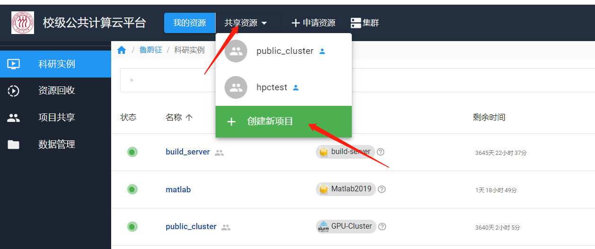
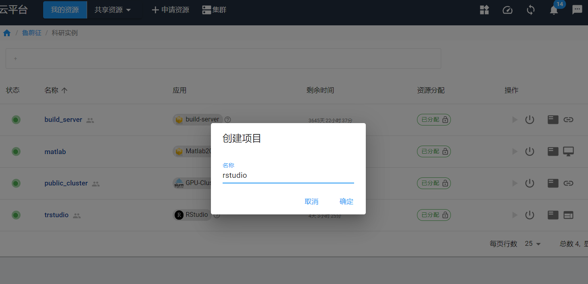
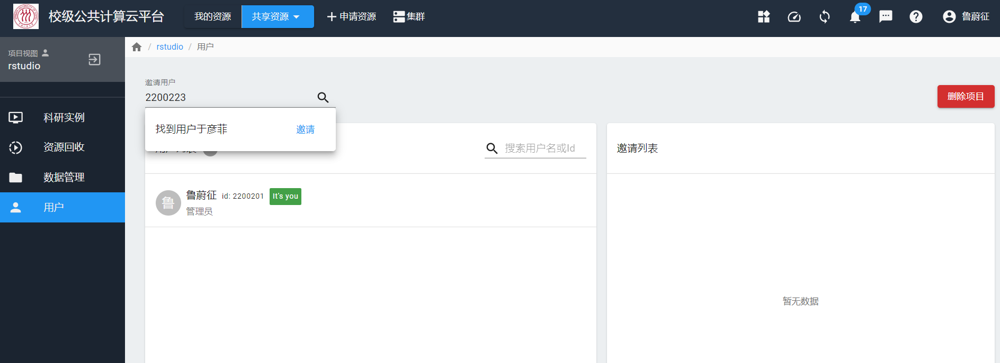

# RStudio

RStudio 是 RStudio 公司打造的一款基于 Web 的开源IDE。计算云提供了多人共享模式的RStudio容器实例，可供多人团队共享使用。

## 创建共享项目

RStudio实例可以被多人共享，可以由课题组中一人创建，并邀请课题组其他人加入该RStudio实例。我们只对创建人进行计费。

要创建共享模式使用的实例，需要先创建**共享项目**：

计算云后端会为**共享项目**在系统中创建一个用户组，并给这个用户组在共享文件系统上分配一个组Home目录。**共享项目**适用于某个团队或某个课题组共用某些实例的场景。

### 邀请其他用户共享使用

如果希望其他用户共享使用此实例，则可以在此共享项目界面的**用户**子页面中**邀请**其他用户加入此共享项目。点击界面右上角的用户名，可以看到用户ID。邀请前，需要先与该用户沟通，获取该用户ID，然后根据用户ID搜索到用户。

当然，我们也可以创建一个共享项目，共享项目中只有自己本人。

## 申请RStudio应用实例

RStudio属于交互实例，在**申请资源**界面里申请：

## 启动与登录

由于RStudio是共享交互实例，需要用计算云的用户名和密码登录。

!!! warning "用户名和密码"
    首次登录需要设置登录密码，密码在右上角用户名下“重置密码”出设置。
    输入用户名时，前面要加上小写的u，比如学工号为 20200002，输入为：u20200002。

## 简单示例

## 软件和数据

!!! note "软件和数据"
    用户可以在 RStudio 实例中安装自己所需的包、上传自己的数据。释放资源后，这些软件依然保存在镜像中，下次使用，可以在“资源回收”页面恢复，该实例将恢复至“我的资源”页面，这些包和数据不会被清理删除，用户可继续使用它们。