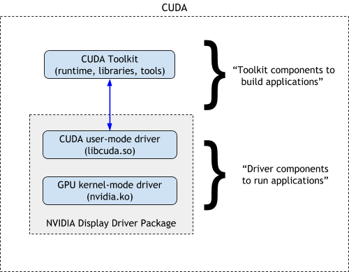

# CUDA

CUDA（Compute Unified Device Architecture），是GPU厂商NVIDIA推出的编程工具箱。一个完整的CUDA包含了CUDA Runtime（cudart）、Libraries、NVCC编译器、nvprof和Nsight性能分析工具、cuBLAS等。

## CUDA与Driver

CUDA与GPU硬件、操作系统内核、GPU驱动（Driver）耦合度非常紧密。在Linux操作系统中，CUDA主要包含两部分：

* CUDA Toolkit（Library、Runtime和开发工具）
* Driver，包括CUDA Driver和NVIDIA GPU设备驱动



上图来自[https://docs.nvidia.com/deploy/cuda-compatibility/index.html](https://docs.nvidia.com/cuda/cuda-toolkit-release-notes/index.html)，同时该页面也提供了CUDA版本与GPU Driver版本的对应表，下表是其中部分节选。

| CUDA Version  | Linux x86_64 Driver Version |
| ------------- | --------------------------- |
| CUDA 11.3     | >=450.80.02                 |
| CUDA 11.2     | >=450.80.02                 |
| CUDA 10.2.89  | >=440.33                    |
| CUDA 10.1.105 | >=418.39                    |

**高版本的CUDA只能运行在高版本的Driver之上。**如果想使用高版本CUDA，那就意味着必须使用高版本的Driver。这就对大型计算平台的运维提出了挑战，因为大型计算平台为了稳定性一般尽量减少升级的次数。

!!! tip "高版本CUDA的优势"
		高版本的CUDA提供了更多的新功能，比如TensorFlow和PyTorch的新版本都会基于较新的CUDA开发一些功能，以加速应用程序。
		
		NVIDIA的新硬件也会使用高版本的CUDA。

在最近一次的升级中，我们的平台将GPU Driver版本升级到450.216.04，可以支持CUDA 11.x。

### GPU节点上的CUDA

我们平台上所有GPU节点（包括Jupyter-with-GPU实例和Slurm共享集群中的GPU节点）已经安装了CUDA，位置为`/opt/pkgs/cuda/`，并通过软连接链接到`/usr/local/cuda/`。

用户可以直接使用这个CUDA，也可以用`conda`安装自己所希望使用的CUDA，或者使用`module`或`spack`加载自己所希望使用的CUDA。

## 多版本与兼容性

一台物理机上一般安装一个版本的Driver，但可以安装多个版本的CUDA。比如Driver为450.216.04的物理机上可以安装CUDA 11.2、CUDA 10.2。多个版本的CUDA可以通过`PATH`与`LD_LIBRARY_PATH`等环境变量、容器、`module`或`spack`等环境管理工具来切换。

高版本的CUDA一般是向下兼容的，也就是说，一个程序使用CUDA 10.1编译生成的可执行文件是可以运行在CUDA 11.1环境下的。相反，使用CUDA 11.1编译生成的可执行文件是很可能无法在CUDA 10.1环境下运行。

## conda

使用`conda`安装深度学习框架时，往往也会安装cudatoolkit。例如某个版本的PyTorch的安装命令为：

```bash
conda install pytorch==1.8.0 cudatoolkit=11.1 -c pytorch -c conda-forge
```

其中的`cudatoolkit=11.1`表示安装了11.1的CUDA。`conda`安装的CUDA只提供了必备的Runtime，不提供NVCC、nvprof、NSight等开发工具。PyTorch程序运行时，优先使用`conda`环境下的CUDA。

在`conda`环境里安装一个独立的CUDA，有助于环境的隔离，但使用时要注意，在该环境后续使用`pip`安装的一些包尽量使用相同版本的CUDA。

