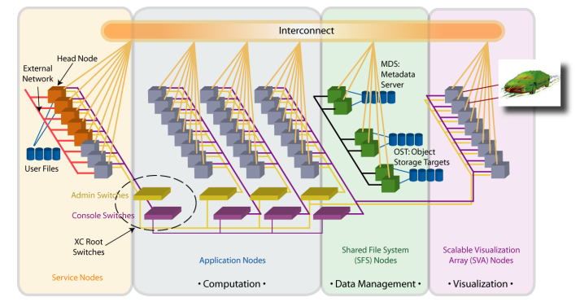

# 网络

高性能计算（HPC）集群一般采用下面的设计。

## 1. 网络概览



在我们的集群上，主要提供了三个网络：

### 1.1 10G以太网

节点间的大部分操作使用的是10G以太网（又称万兆网），用户在计算节点之间的SSH等操作都在10G以太网上，例如，从 a800-1 SSH 到 a800-2，以及两个节点间 scp 数据。

### 1.2 InfiniBand（简称IB网）

节点间高速计算：跨节点并行计算，互相需要通信，需要极低延迟。

节点访问共享存储：所有计算节点访问存储，都通过IB网络。

### 1.3 1G以太网

主要用于后台管理，普通用户感知不到。

在计算节点上使用 `ifconfig` 或者 `ip a` 可以看到实际的网络设备，以及所对应的IP地址。

```bash
ifconfig

## InfiniBand
ib0.8066: flags=4163<UP,BROADCAST,RUNNING,MULTICAST>  mtu 2044
        inet 192.168.1.4  netmask 255.255.255.0  broadcast 0.0.0.0

## 本地网络
lo: flags=73<UP,LOOPBACK,RUNNING>  mtu 65536
        inet 127.0.0.1  netmask 255.0.0.0

## 10G以太网
vpapvn_92004002: flags=4163<UP,BROADCAST,RUNNING,MULTICAST>  mtu 1450
        inet 192.168.0.5  netmask 255.255.255.0  broadcast 0.0.0.0
```

可以看到，里面 `inet` 写清了IP地址，`ib0.8066` 为 IB 网卡（network interface）的名字。

## 2. InfiniBand

### 2.1 设置

在延迟和带宽方面，InfiniBand远远优于10G以太网。

InfiniBand 注意要选择对应的网卡，比如 NCCL 有环境变量 `NCCL_SOCKET_IFNAME`，详情参考[NVIDIA文档](https://docs.nvidia.com/deeplearning/nccl/user-guide/docs/env.html#nccl-socket-ifname)。

例如，PyTorch 多节点训练，使用NCCL后端，建议在提交作业的脚本或者或者 `~/.bashrc`中设置环境变量：

```bash
# ib0.8066 为 ifconfig 或 ip a 所看到的网卡的名字
export NCCL_SOCKET_IFNAME=ib0.8066
```

### 2.2 编译

如果你的程序想使用IB网络，尽量使用一些特定的RDMA的软件包，例如：OpenMPI或Intel MPI。使用这些MPI，程序将优先选择InfiniBand网络。

具体问题也请联系我们。