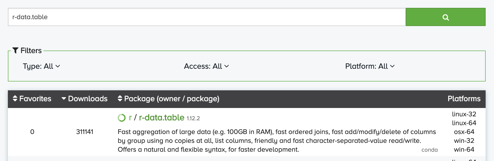

# 在共享集群上提交R作业

!!! warning "RStudio与共享集群"
    共享集群与Jupyter、RStudio等交互实例是相互独立的，在Jupyter或RStudio中安装的一些软件包，并不能直接在共享集群里直接使用，两边都需要单独安装。

## 软件包安装

### conda

在共享集群上，我们建议使用`conda`来创建和管理R环境，`conda` 命令的使用方法可以详见我们提供的[conda入门教程](conda.md)。共享集群的`conda`位于`/opt/app/anaconda3/bin/conda`。

使用`conda`前，先要将`conda`添加到环境变量中。

* 方法1：

如果用户经常使用`conda`管理各类环境，可以将其添加到用户环境变量，即将下面的环境变量添加到`~/.bashrc`的**最后一行**。添加后再在Terminal命令行中执行`source ~/.bashrc`，这样之后，包括登录节点和计算节点在内的所有节点都可以直接使用`conda`了。

```bash
export PATH="/opt/app/anaconda3/bin:$PATH"
```
* 方法2：
  
可以使用`module`，每次使用前，将`conda`添加到环境变量：

```bash
module load anaconda3
```

这种方法只是在每次使用时有效，登录到任何一个计算节点，还需要重新执行一遍`module load anaconda3`。

### 创建R环境

我们要创建一个带有R解释器的环境，环境名为`r36`，里面带有一个3.6版本的R解释器。

```bash
conda create -n r36 r-base=3.6
```

激活这个环境：

```bash
source activate r36
```

安装好基础的R环境后，我们需要安装一些第三方包，主要有两种方法：

* 建议优先使用`conda`安装一些包。

因为`conda`能够帮我们解决一些依赖问题。首先在 [anaconda.org](https://anaconda.org/) 上搜索，比如`data.table`包，添加一个"r-"的前缀：



点进去某个搜索结果，有安装的具体命令，比如：

```bash
conda install -c r r-data.table
```

* 进入R，使用`install.packages("package-name")`来安装。

这种方法能够安装绝大多数的包，但是如果某个包依赖了操作系统的底层包，而操作系统缺少这个底层包，会出现安装不上去的问题。因此，优先建议使用第一种方式。如果仍然安装不上，可以联系<hpc@ruc.edu.cn>。

## 使用调度软件

安装好相关环境后，我们接着可以向共享集群提交作业。在共享集群上，我们使用Slurm作为调度软件，不了解共享集群和调度软件的可以先阅读我们提供的[共享集群快速入门文档](./GPU-Cluster.md)。

我们在`/home/your-id/`的HOME目录下准备好相关的R代码，名为`test.R`。然后编辑一个作业提交脚本，命名为`run.sh`

```bash
#!/bin/bash
### 给你这个作业起个名字，方便识别不同的作业
#SBATCH --job-name=r-test

### 指定该作业需要多少个节点
### 注意！没有使用多机并行（MPI/NCCL等），下面参数写1！不要多写，多写了也不会加速程序！
#SBATCH --nodes=1

### 指定该作业需要多少个CPU核心
### 注意！一般根据队列的CPU核心数填写，比如cpu队列64核，这里申请64核，并在你的程序中尽量使用多线程充分利用64核资源！
#SBATCH --ntasks=16

### 指定该作业在哪个队列上执行
### 目前可用的CPU队列有 cpu/fat
### cpu队列有64核，fat队列有128核
#SBATCH --partition=cpu

### 加载Anaconda
export PATH=/opt/app/anaconda3/bin:$PATH

### 激活R环境
source activate r36

### 执行你的作业
Rscript test.R
```

接着，我们就可以在Terminal命令行中提交这个作业：`sbatch run.sh`。


然后可以使用`squeue`查看所有人的作业。查看自己提交的作业信息：

```bash
$ squeue -u `whoami`
```
