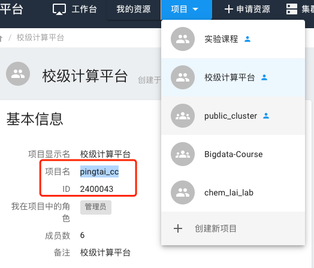

## 课题组共享文件夹

按照[课题组团队管理](../manual/project.md)中的方式创建课题组，将相应用户拉入相应课题组，课题组内所有用户拥有组（group）访问权限。

在我们的共享集群中，`/home/share`为共享目录，可以在这里为课题组创建共享文件夹，设置文件夹的组权限为刚刚创建的课题组名，即可让该文件夹设置为课题组共享。考虑学生的流动性，这里建议使用老师的账号创建目录。

## 1. 创建课题组文件夹

创建课题组文件夹：

```bash
cd /home/share
mkdir <DIRECTORY_NAME>
```

## 2. 向文件夹内拷贝数据或子文件夹

向课题组文件夹内放入数据和文件，这里以`README.md`为例，创建一个空文件。您也可以用 `mv`、`cp` 或其他Linux命令向里面放入文件。

```bash
cd <DIRECTORY_NAME>
touch README.md
```

## 3. 修改新添加文件组权限

`README.md` 文件的文件创建者修改组权限：

```bash
# 文件
chgrp <group_id or group_name> README.md

# 文件夹
chgrp -R <group_id or group_name> README.md
```

其中，`group_id` 和 `group_name` 通过下面方式，找到您所属的课题组项目：



本例中，可以这样：

```bash
chgrp pingtai_cc README.md
``` 

如果是文件夹，可以这样：

```bash
chgrp -R pingtai_cc xx_project
```

## 4. 修改文件夹权限，避免其他人非组成员查看

文件创建者修改文件权限，避免其他人非组成员查看：

```bash
# 文件
chmod 750 README.md

# 文件夹
chmod -R 750 xx_project
```
