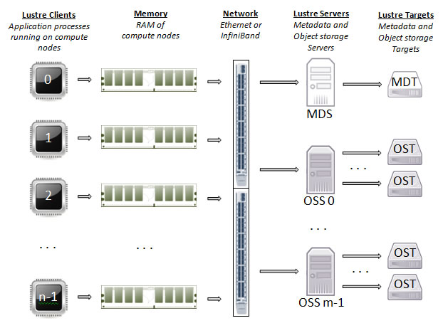

# 存储

## 1. 存储概览

与单个节点上的存储系统不同，集群的存储系统示意图如下：


其中：

* 每个计算节点上有自己本地的磁盘，一般用来存操作系统、SWAP，也可以用来做**本地高速缓存**。
* `/home` 、 `/fs/fast`、`/fs/archive` 等目录在共享文件系统上，背后是主文件系统、全闪存文件系统和归档文件系统，是多个计算节点共享的，且允许多节点并发访问。采用的是 Lustre 文件系统和商用磁盘阵列。
* 计算节点与共享文件系统之间通过InfiniBand网络连接。

## 2. 概念

IOPS和带宽都是衡量文件系统的速度：

* IOPS（Input/Output operations per second），主要衡量存储系统每秒能够接受多少访问量，单位是次/s。越高越好。

* 带宽（Bandwidth），主要衡量存储系统每秒能读写多少Byte数据，单位是 Byte/s。越高越好。

小文件场景需要极高的IOPS。
大文件场景需要高带宽。

* HDD（Hard Disk Drive），传统机械磁盘，读取数据前需要转动磁盘（寻道），IOPS和带宽都比较低。


* SSD（Solid State Drive），固态硬盘，数据读取前不需要转动，相比HDD硬盘的IOPS和带宽高很多。


* NVMe（Non-Volatile Memory express），非易失性内存，下一代固态硬盘，接近内存的速度，数据读取的速度比SSD更快。

## 3. Lustre文件系统

* 每个计算节点上有一个 Lustre 客户端。
* 有两大类IO节点：Metadata Server 和 Object Storage Server。
* 数据存储在 Metadata Targets 和 Object Storage Target上。



Lustre 文件系统挂载到计算节点上，用户可以像访问本地磁盘一样访问这个共享的文件系统，且 Lustre 提供了 POSIX 协议。

相比计算节点的本地磁盘，Lustre文件系统和磁盘阵列的优势是**大文件读写速度快**，因为读写被分配到多块磁盘上。

但是，任何分布式文件系统都难以处理海量小文件（Lots of Small Files），因为每次小文件访问，都要访问一次Metadata Server，再访问Object Storage Server。当小文件量大，且对性能要求高时，文件系统将成瓶颈。

## 4. 平台三类文件系统

|                      | 文件系统   | IOPS  | 带宽      | 可用容量   | 可用文件数（inode） | 用途                 | 设备        |
| -------------------- | ------ | ----- | ------- | ------ | ------------ | ------------------ | --------- |
| /home                | 主文件系统  | 15k   | 10GB/s  | 226TB  | 2.7亿         | 大文件、源代码            | HDD硬盘     |
| /fs/fast             | 全闪文件系统 | 2700k | 30GB/s  | 245TB  | 42.5亿        | 小文件、Python/conda环境 | 全闪存NVMe硬盘 |
| /fs/archive          | 归档文件系统 | 20k   | 12GB/s  | 514TB  | 36亿          | 大文件、长期不用文件         | HDD硬盘     |
| /fs/nvme1 仅a800节点有 | 本地文件系统 | 500k  | 3.2GB/s | 3.84TB | 3.7亿         | 临时文件               | 全闪存NVMe硬盘 |

IOPS主要测试小文件随机读场景，带宽主要测试大文件顺序读场景。

## 5. 使用建议

### 5.1 conda/python环境、图片类小文件

`conda` 等环境，图片类小文件，请放置到 `/fs/fast/uxxxx` 下，其中 `uxxxx` 是您的学号。

* conda 环境

先创建一个专门用于搭建环境的目录：

```bash
mkdir /fs/fast/uxxxx/envs
```

然后在该目录上创建 conda 环境：

```bash
conda create --prefix=/fs/fast/uxxxx/envs/<ENV_NAME>

# 或
mamba create --prefix=/fs/fast/uxxxx/envs/<ENV_NAME>
```

新的环境目录将在：`/fs/fast/uxxxx/envs/<ENV_NAME>`。之后根据提示，使用这个环境：

```
source activate /fs/fast/uxxxx/envs/<ENV_NAME>
```

其他各类命令与[conda/mamba页面](./conda.md)无区别。

### 5.2 高速中间缓存

如果`/fs/fast` 仍无法满足您的要求，部分计算节点提供了本地的SSD或NVMe磁盘，请在计算时或计算前将自己的数据拷贝到计算节点的本地磁盘上。

虽然全闪存文件系统多块NVMe盘共同提供服务，但由于IB网络和文件系统上还有其他工作负载，所以全闪存文件系统并不能提供绝对的服务质量，这时本地的磁盘能作为缓存，提供高速读写服务。

### 5.3 大文件

大文件，或者不需要计算时读写的应用，可以放在`/home`和`/fs/archive`里。

### 5.3 长期不用的文件

请放置在 `/fs/archive` 下。小文件请打包为大文件。