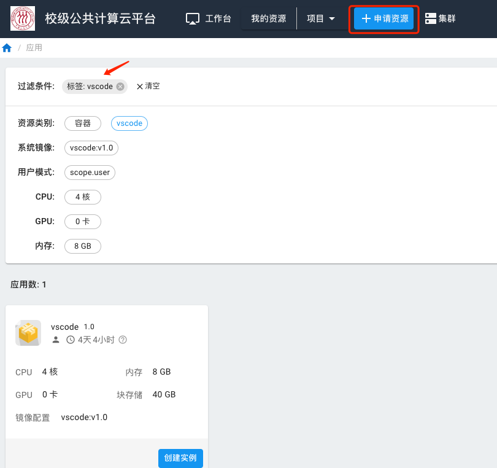
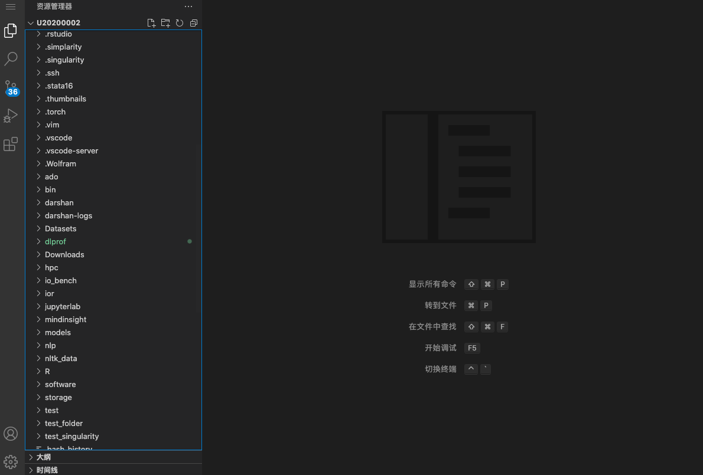

# VSCode

VSCode (Visual Studio Code)是一款可视化代码编辑器，由微软主导开发。我们提供了CPU版本和GPU版本的实例，其中，GPU版本的实例使用的显卡为NVIDIA GeForce 2080 Ti。

## 1. 申请实例

VSCode属于交互实例，在计算平台上使用时，需要先申请资源。首先点击“申请资源”，然后在所有应用中过滤出VSCode。我们准备了CPU版和GPU版的镜像，用户按需申请。

## 2. 使用VSCode

启动好后，即可进入VSCode交互界面。

## 3. 打开终端

* Windows 使用 Ctrl + ` 打开终端。
* mac 使用 control + ` 打开终端。

` 为数字1左侧按键。

## 4. 软件安装

用户有root权限，在终端中用 `sudo -i` 切换至 root，使用 `apt-get install` 安装必要的软件。

Python和R相关软件建议用户使用 Anaconda 来管理和使用Python和R。我们已经在 VSCode 交互实例上安装好了 Anaconda，安装在 `/opt/app/anaconda3/bin`，添加到自己的 `~/.bashrc` 中。 `conda` 命令的使用方法可以详见我们提供的[conda入门教程](conda.md)。

