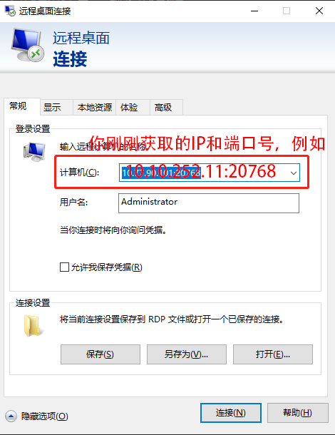

# Windows

一些用户和应用只能在Windows操作系统环境下工作，我们也准备了Windows的虚拟机，用户可以申请虚拟机，并通过远程桌面连接的方式登录到Windows虚拟机上。

## 申请Windows虚拟机

点击“申请资源”页面，找到名为“Windows”的实例，点击“创建实例”。填写“名称”、“邮箱”和“计费账户”等信息，其中申请到计算资源、资源快到期时，会向“邮箱”发送邮件。用户还需根据自身需求修改CPU、内存等资源需求。

首次申请到Windows虚拟机资源，需要清除原有密码，否则无法登陆，如下图所示。

然后点击“远程登录”按钮进入Windows虚拟机实例，这时以Administrator账户登录进入Windows虚拟机：

### 给虚拟机添加密码

进入Windows虚拟机后，需要给这个虚拟机设置新密码：

为虚拟机Administrator账户添加密码，该密码为这个虚拟机的Administrator账户远程登录时所使用的密码：

## 远程桌面连接

### 在虚拟机里开启远程桌面功能

如果您的客户端也是Windows，通过Windows的“远程桌面连接”的方式在本地远程操作这台虚拟机，需要在这台虚拟机中开启远程桌面连接。

在“设置”中搜索“远程桌面设置”：

开启远程桌面设置：

### 配置远程桌面端口

回到计算平台，进入虚拟机实例设置界面：

在右侧“添加自定义服务”：

在弹出的框中，按如下方式填写，其中，端口号请填写3389。

确定后，重启该虚拟机实例，即先点“停止”，待停止后，再点“启动”。点击最右侧红色方框，显示远程登录时所使用的的IP和端口号。

在您的本地Windows客户端中打开“远程桌面连接”，比如，在搜索框中搜索“远程桌面连接”或“mstsc”。打开后，点击“显示选项”，如下图所示。

“计算机(C)”处为前一步，计算平台给提供的该虚拟机实例的IP和端口号，请根据您自己的填写，用户名为Administrator。

### 本地与远程虚拟机文件传输与共享

如果想让本地磁盘中的文件与刚刚创建的虚拟机之间相互传输和共享，还需要点击“本地资源”，在“详细信息”中勾选自己本地的磁盘驱动器。

配置好后，点击“连接”，输入您给虚拟机配置的密码，之后均点“是”，即以Windows远程桌面的形式登录到虚拟机中。

在虚拟机的Windows文件管理器“此电脑”目录下，除了正常Windows系统自带的文件夹外，还多了几个文件夹，如下图所示，其中DavWWWRoot为计算平台为每位用户提供的存储空间（Home目录），以Z盘的形式存在，建议大规模的数据放置这个目录。下面的DESKTOP-XXX为本地共享过来的磁盘，用于将本地的文件拷贝到计算平台上。

## 磁盘扩缩容

如需调整虚拟机磁盘容量，需要先关停该虚拟机，再点击“磁盘扩容”按钮，扩容好后重启该虚拟机。

