# **高性能计算云平台用户手册**

> 高性能计算服务平台是由学校统一规划建设，以超级计算、高性能计算、人工智能计算、大数据处理等软硬
> 件为基础，面向全校各单位提供大规模科学计算和大规模数据处理服务的校级公共计算服务平台。
> 首次使用平台的用户，建议先完整阅读本手册中的快速上手和入门指南。

## 申请资源

> 点击页面上方的“申请资源”，进入资源库。

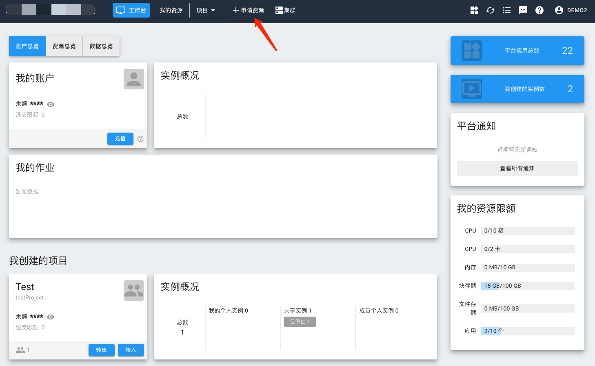

> 根据需要选择自己所需的计算资源。此处以 JupyterLab 为例，点击“创建实例”。

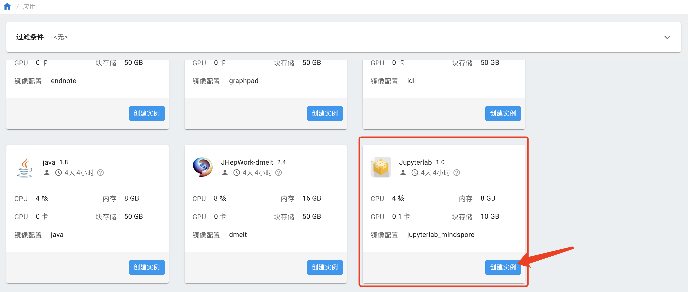

> 在实例设置中填写资源需求信息。

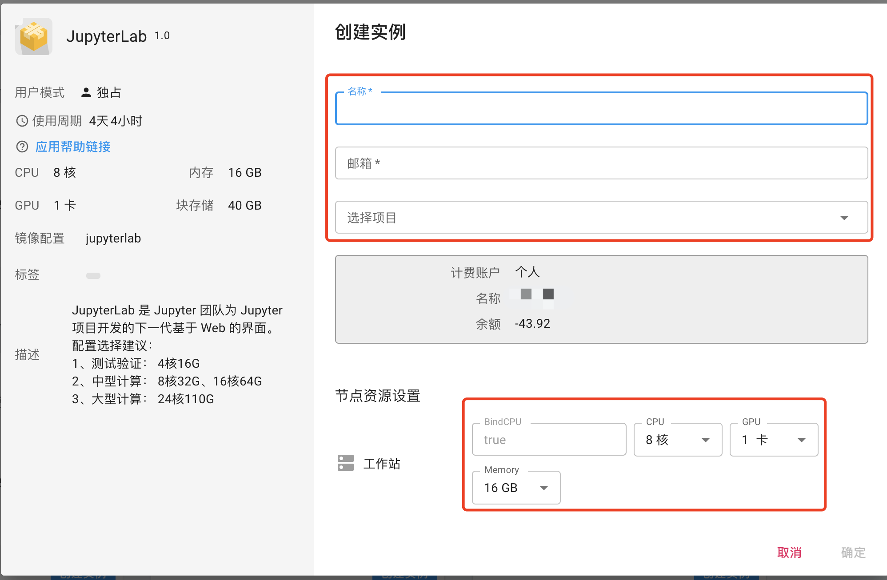

> • **名称**: 为该实例名称，用于分辨同一用户创建的不同实例。
>
> • **通知邮箱**: 用于发送平台通知，例如使用最长到时间即将到期时，将发送邮件通知用户。
>
> • **计费账户**: 用于扣费的账户。可以选择从个人账户扣费，也可以选择从自己所属的项目账户扣费，具体 请参考计费方法。
>
> • **节点资源设置**: 用于设置实例的节点资源。根据实例的不同，可选的资源也不同。

**注解:** BindCPU 是指让一个任务跑在指定的 CPU 上，防止缓存切换，提升性能。BindCPU 为”False”的时候，
进程的 CPU 使用是按照份额的方式调度的，在没有竞争的情况下，可以用所有的 CPU 资源。如果为”True”，就只能用分配的那几个 CPU。对于跑 WEB 服务，或者 Jupyter 那样不是一直跑满的，选择”False”会 更好一点。
CPU 是指实例要使用的 CPU 核数。
GPU 是指实例要使用的 GPU 卡数。如果卡数为 0.x 的小数点，意为共享 GPU。例如 0.2 卡，则系统会分配给 实例 1/5 的 GPU 卡。
Memory 是指实例需要的内存数。

> 在“我的资源”中选择申请的实例，启动该实例。

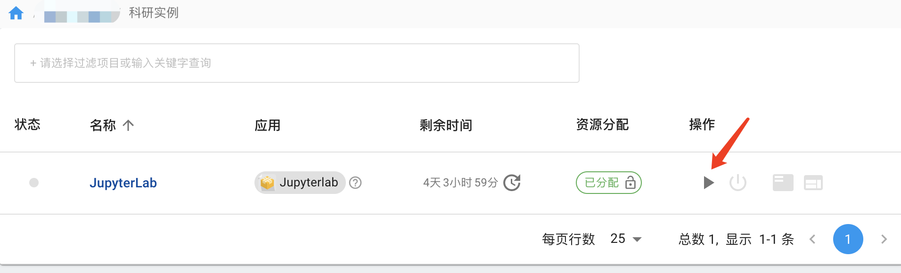

**注意**: 如果平台当前可用资源已经全部分配完毕，该实例申请后需要排队等待分配，此时无法启动实例。
CHAPTER2

## 工作台

> 工作台方便用户查看和操作自己所有的实例，以及查看自己的作业运行情况，和数据管理。
>
> **2.1 账户总览**
>
> 我的账户：账户个人简要信息  
> 实例概括：创建的实例统计，包括运行中和已停止的。
>
> 我的作业：在平台公共集群中提交的作业信息。
>
> 我创建的项目：当前用户为管理员的项目信息以及项目中的实例统计。我参与的项目：当前用户为项目成员的项目信息以及项目中的实例统计。

**7**

> **高性能计算云平台用户手册**

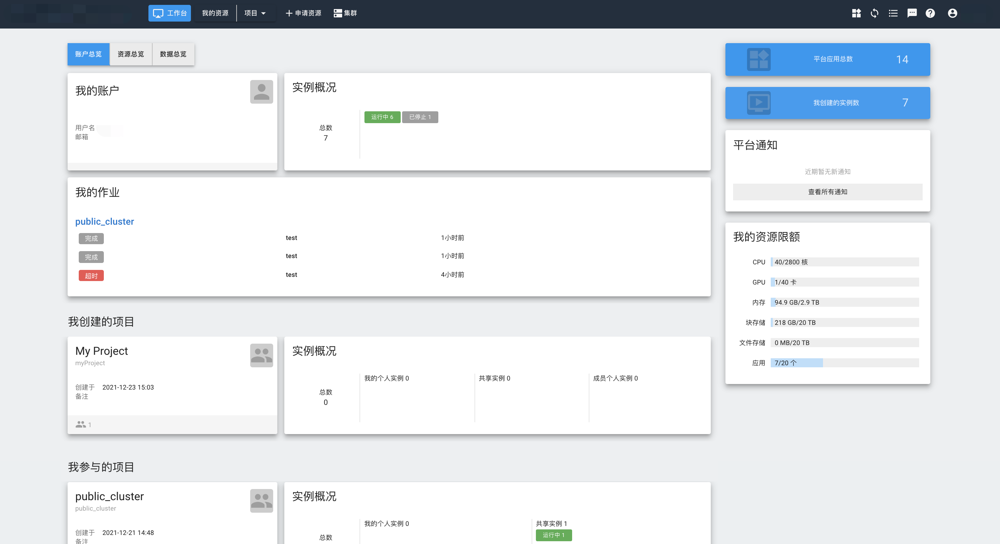

> **2.2 资源总览**  
> 集中显示用户所有的实例运行情况，包括个人实例和项目中的实例。

[TABLE]

**高性能计算云平台用户手册**

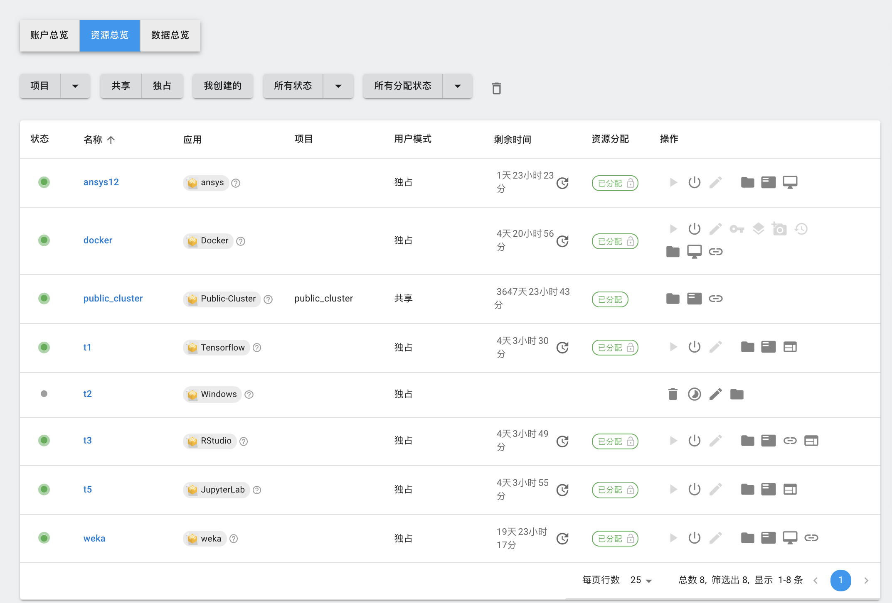

> **2.3 数据总览**  
> 可以在此处统一管理私有实例和共享实例中的数据。

[TABLE]

> **高性能计算云平台用户手册**

[TABLE]

CHAPTER3

用户登录

> **3.1 服务地址**  
> 超算集群的服务地址为：，在校内可通过 Chrome、Firefox 浏览器直接访问，校外请使用。
>
> **3.2 登录方式**  
> 通过浏览器访问，输入用户名和密码，点击“登录”进入服务平台。

**11**

> **高性能计算云平台用户手册**
>
> **3.3 用户注册**  
> 首次登录要在平台上新注册用户并填写完整用户信息，等待管理员审批通过后，才能登录进入平台。点击“注册”按钮，进入到注册界面，填写用户名、密码及其他信息。

[TABLE]

> 注册申请提交后，管理员会在后台进行审核，审核通过后，邮箱会收到一封邮件：  
> 亲爱的用户 xxx 您好，  
> 您的注册申请已经审批通过，请使用用户名 xxx 、Token \*\*\*\*\* 及申请注册时所设置的密码进行登录。收到这样的邮件，就表示已经通过用户审批，可以登录使用平台了。
>
> **3.4 首次登录**  
> 为了验证邮箱为该注册用户邮箱，所以，在用户进行首次登录的时候，需要采用邮箱收到的验证码进行登录。直接输入用户进行登录，系统会判断该用户为首次登录用户，就会自动跳转到使用用户名和验证码登录的界 面。
>
> 输入用户名和邮件收到的验证码，点击登录即可。
>
> **3.5 正常登录**  
> 第一次通过用户名和验证码登录以后，后续登录使用注册时候的密码即可。
>
> **3.6 重置密码**  
> 点击右上角的用户，选择“重置密码”：

[TABLE]

**高性能计算云平台用户手册**

> 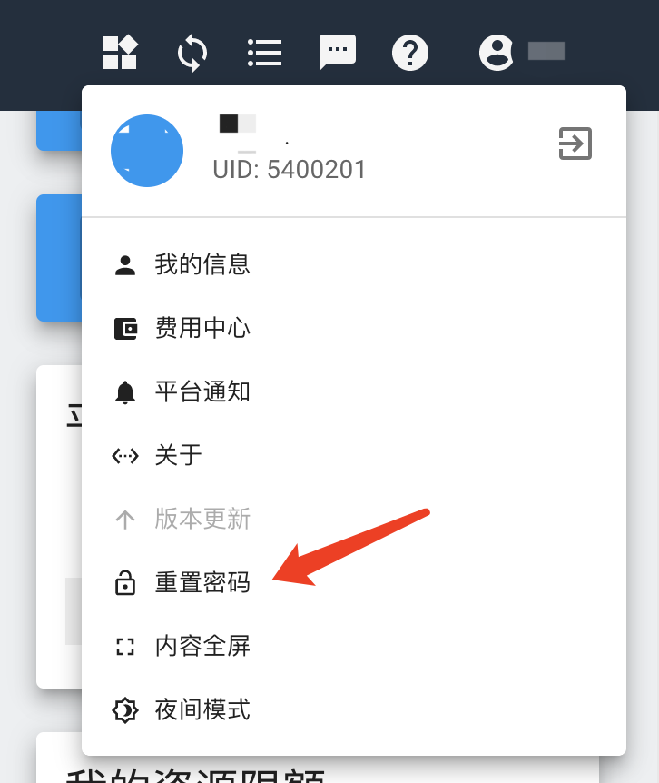
>
> 重置密码时请确认选择足够强度的密码，并保证密码安全。

**重要:** 登录平台 Web 页面，以及使用集群登录、SSH 连接和 WebDAV 等平台服务时用的是注册平台的用户

> 名和密码。

[TABLE]

> **高性能计算云平台用户手册**
>
> **3.7 用户信息**
>
> 页面右上角，点击用户名称，进入“我的信息”界面，可以查看个人信息，包括注册时填写的基本信息以及 用量/限额详情。

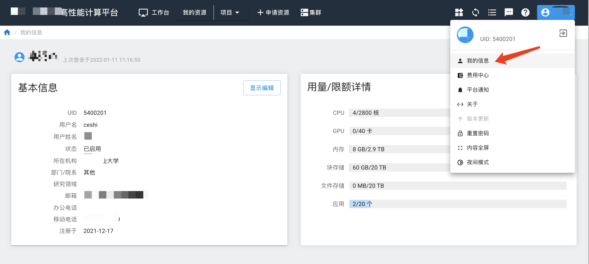

> **3.7.1 用量/限额详情**
>
> 每位用户分配有一定的资源。当创建实例的时候，占用资源限额。如果所用的资源超过了限额，系统会提示 资源不够。用户可以先释放资源，然后再创建实例。
>
> 如果需要资源很多，超过了系统默认限额，用户可以联系管理员修改个人限额。

[TABLE]

CHAPTER4

使用模式

> **4.1 模式对比**

为了满足全校师生复杂多样的个性化计算需求，适应新型计算模式如人工智能训练等对运行环境的复杂要

求，高性能计算平台的建设除了在硬件设备的选型上充分考虑了计算的多样性，提供了包含 CPU 节点、GPU

节点等的丰富算力组合，在软件平台的建设上也采用了区别于传统超算中心的作业调度系统的解决方案，在

> 不损失计算性能的前提下以灵活多样的方式提供服务。

[TABLE]

**15**

> **高性能计算云平台用户手册**

表 1: Usage Mode

[TABLE]

> 如上表所示，计算云主要支持三种模式：  
> 1. 对于计算资源使用量较大、有一定 Linux 命令行基础的用户，可以考虑使用**公共集群**或者**独占集群**模 式。这两种模式都使用作业调度系统提交作业。不同在于**公共集群**按作业运行时长来计费，**独占集群** 的计费从分配资源开始到资源释放，如果中间并未运行作业，依然计费。
>
> 2\. 如果对 Linux 命令行不熟悉，我们提供了**独占/共享实例**模式，可以在“申请资源”处申请有交互界面 的计算资源，提供了 Jupyter 等有交互界面的工具，上手简单，无需学习 Linux，适用于无计算机背景 的新用户。此模式优点是学习成本低，缺点是计费方式粒度粗，不适合有大量计算任务的用户。用户 也可以前期使用这类交互界面实例，如发现计算量较大，建议逐渐迁移到**公共集群**模式上，该模式计 费更准确。
>
> 3\. 对于想独占计算资源的用户，可以使用**独占集群**模式。
>
> 综上，无计算机背景的新用户建议使用**独占/共享实例**模式。下面将分别简述三种模式的使用方法。

[TABLE]

**高性能计算云平台用户手册**

> **4.2 公共集群**
>
> 公共集群以传统的作业调度方式提供公共共享的计算资源，所有用户无需申请即可直接登录使用。每位用户 进入平台后就已经自动分配到公共集群的项目组内，“共享资源”中的第一个项目就是公共集群。
>
> 用户在公共集群内使用资源时以作业提交的方式申请计算资源，通过作业调度系统将任务分发到计算节点 上。用户在公共资源里只具有普通用户权限，可通过 ssh 客户端直接登录集群。
>
> 公共集群的登录节点配置了资源限制，请勿在公共集群的登录节点执行大的计算任务。
>
> 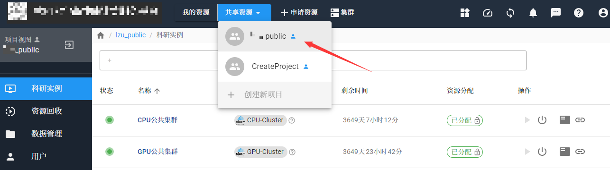
>
> **4.3 独占集群**
>
> 独占集群提供了一种用户独占或多人共享的多节点虚拟集群，用户在自己申请的独占集群中具有虚拟的超级 用户权限，可以对系统进行定制化修改，用户可以在虚拟集群中安装配置自定义的作业调度系统或者直接使 用应用程序自带的调度模块进行任务管理。用户在申请到独占集群资源后，可以随时登录到独占集群上使用 资源。独占资源配置有使用期限，到期后系统会自动对资源进行回收。用户也可以手动释放资源。

[TABLE]

> 独占集群申请流程如下：
>
> 1\. 要申请**项目独占集群**，必须先创建共享的项目，项目名称不允许包含特殊字符。如果是**个人独占集群** 请跳过本步。项目管理请参考此处。
>
> 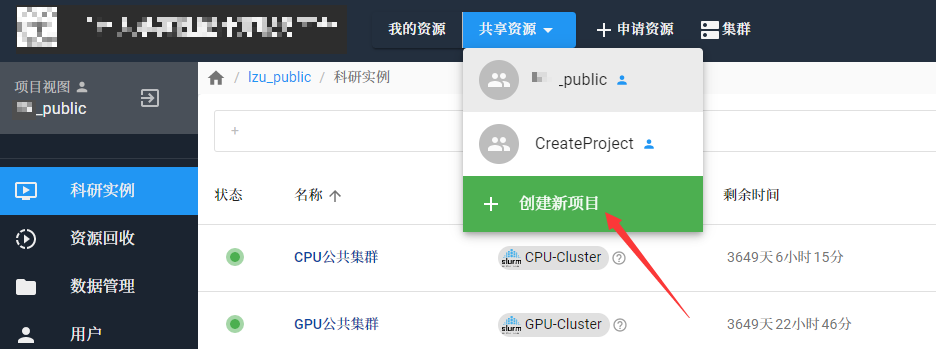

[TABLE]

> **高性能计算云平台用户手册**
>
> 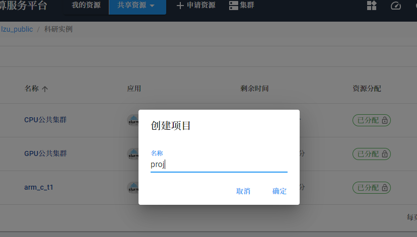
>
> 2\. 在申请资源界面选择项目独占集群的应用模板，点击“创建实例”。
>
> 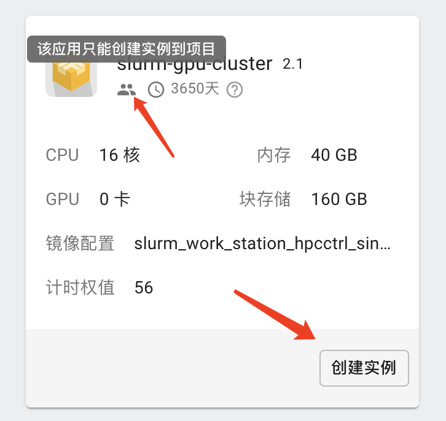
>
> 3\. 在创建实例窗口中填写信息。

[TABLE]

**高性能计算云平台用户手册**

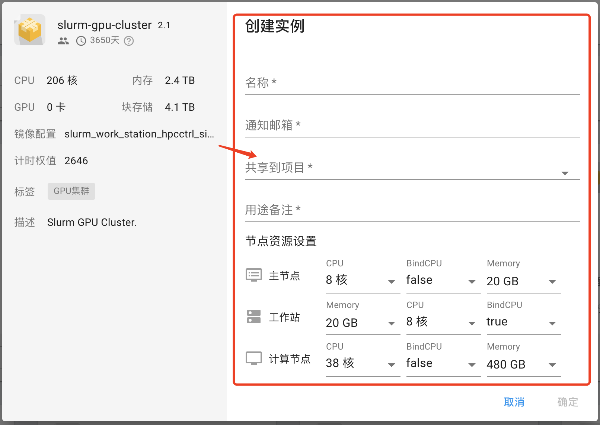

> • **名称**: 为该集群名称，用于分辨同一用户创建的不同实例。
>
> • **通知邮箱**: 用于发送平台通知，例如使用最长到时间即将到期时，将发送邮件通知用户。
>
> • **共享到项目**: 共享到已创建的项目中，项目中其他成员均可以使用该集群。**个人独占集群**没有此选项。• **用途备注**: 为该实例的科研用途。
>
> • **节点资源设置**: 用于设置实例的节点资源。根据实例的不同，可选的资源也不同。BindCPU 是指让一 个任务跑在指定的 cpu 上，防止缓存切换，提升性能。
>
> 4\. 到我的资源中可使用新创建的独占集群资源。

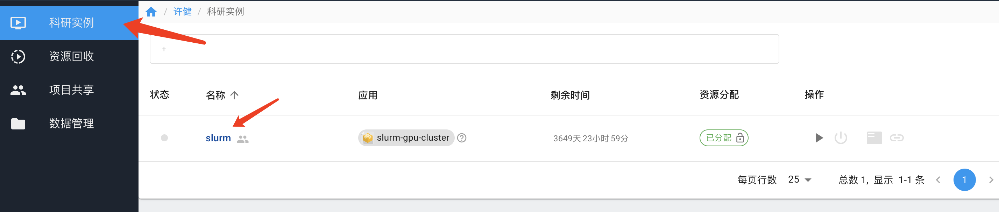

> 5\. 点击具体的实例，可对实例进行管理。可以通过伸缩集群按钮进行集群规模的调整。

[TABLE]

> **高性能计算云平台用户手册**

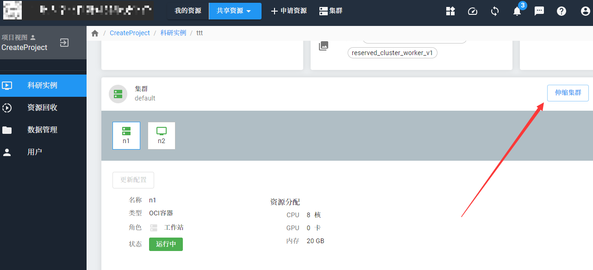

> 关于独占集群多节点任务使用方法，请参考此处。
>
> **4.4 独占实例**
>
> 独占实例是用户独占的单机计算资源，用户在自己的独占实例中具有虚拟超级用户权限，这种资源使用方式 可以提供远程桌面以满足图形化交互计算的需求。除了可以使用到普通的物理计算节点资源，这种实例可以 使用到 KNL 节点等计算资源。
>
> 独占实例的申请流程如下：
>
> 1\. 点击“申请资源”，进入资源库，根据需要在过滤条件处选出自己所需的计算资源，比如 Jupyter 等，点 击“创建实例”。
>
> 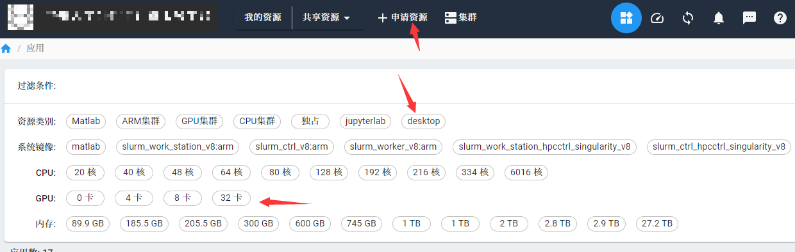
>
> 2\. 填写该实例的必备信息。
>
> • **名称**: 为该实例名称，用于分辨同一用户创建的不同实例。
>
> • **用途**: 为该实例的科研用途。
>
> • **通知邮箱**: 用于发送平台通知，例如使用最长到时间即将到期时，将发送邮件通知用户。• **选择账户**: 选择计费账户。如果选择“无”，则在个人项目账户中计费。
>
> • **节点资源设置**: 用于设置实例的节点资源。根据实例的不同，可选的资源也不同。

[TABLE]

**高性能计算云平台用户手册**

> **注解:** BindCPU 是指让一个任务跑在指定的 CPU 上，防止缓存切换，提升性能。BindCPU 为”False”的时 候，进程的 CPU 使用是按照份额的方式调度的，在没有竞争的情况下，可以用所有的 CPU 资源。如果为”True”，就只能用分配的那几个 CPU。对于跑 WEB 服务，或者 Jupyter 那样不是一直跑满的，选择”False”会 更好一点。
>
> CPU 是指实例要使用的 CPU 核数。
>
> GPU 是指实例要使用的 GPU 卡数。如果卡数为 0.x 的小数点，意为共享 GPU。例如 0.2 卡，则系统会分配给 实例 1/5 的 GPU 卡。
>
> Memory 是指实例需要的内存数。

[TABLE]

[TABLE]

> 
>
> 3\. 在“我的资源”中选择申请的实例，启动该实例。

[TABLE]

> **高性能计算云平台用户手册**

[TABLE]

> 4\. 点击“远程桌面”图标可以登录桌面。
>
> 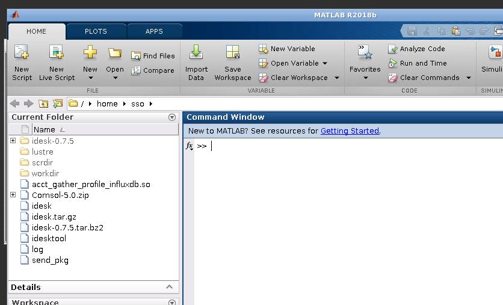
>
> 5\. 点击“控制台”可进入终端界面，输入 sudo -i 可切换至虚拟超级用户对系统进行修改、安装软件
>
> 或开发包。
>
> 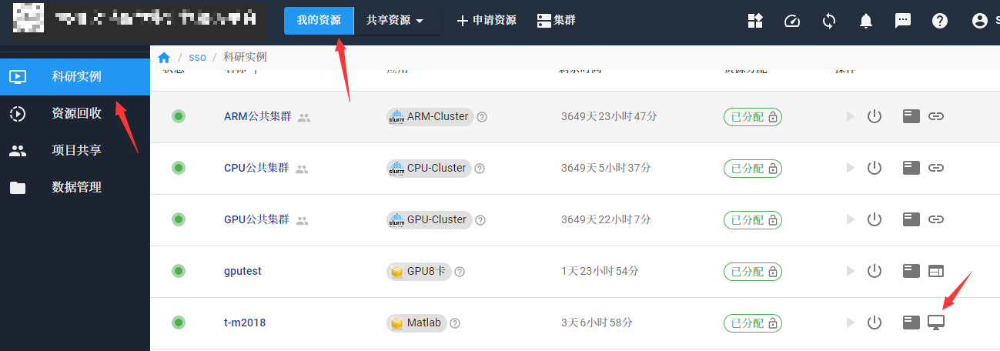

[TABLE]

**高性能计算云平台用户手册**

> 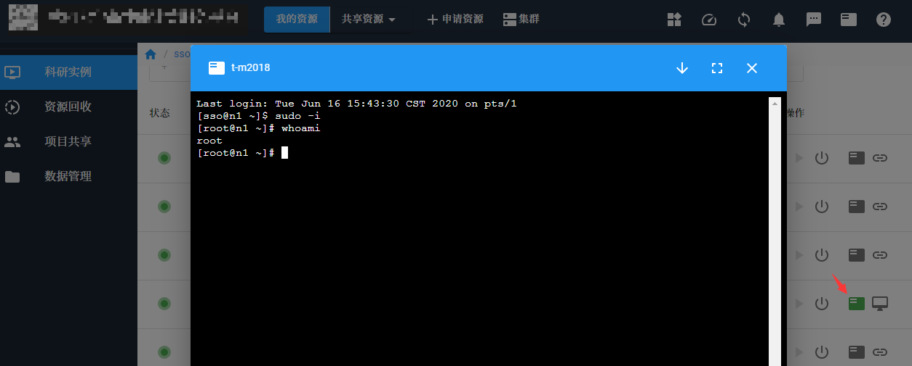

[TABLE]

> **4.5 共享实例**  
> 要创建共享模式使用的实例，需要先创建共享项目。

整个申请过程和独占实例类似，不同之处在于在填写实例信息时需要选定实例所归属的项目。该实例的计费

> 均会计入该共享项目内。

[TABLE]

> **高性能计算云平台用户手册**

[TABLE]

CHAPTER5

用户实例

在“科研实例”中，用户点击实例名称，可以查看实例的基本信息、资源详情、服务和集群，并对实例进行

> 操作。
>
> **注解:** 此处显示的实例包含独占实例和独占集群。

**25**

> **高性能计算云平台用户手册**
>
> **5.1 实例详情**

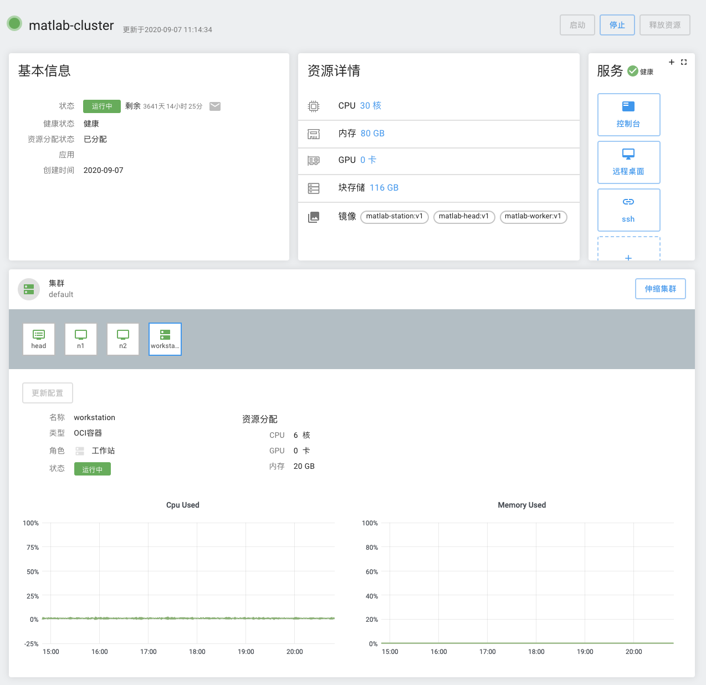

[TABLE]

**高性能计算云平台用户手册**

> **5.1.1 基本信息**  
> 基本信息显示当前实例的运行状态、运行剩余时间、健康状态、资源分配状态、创建实例所用的应用、创建
>
> 时间。
>
> 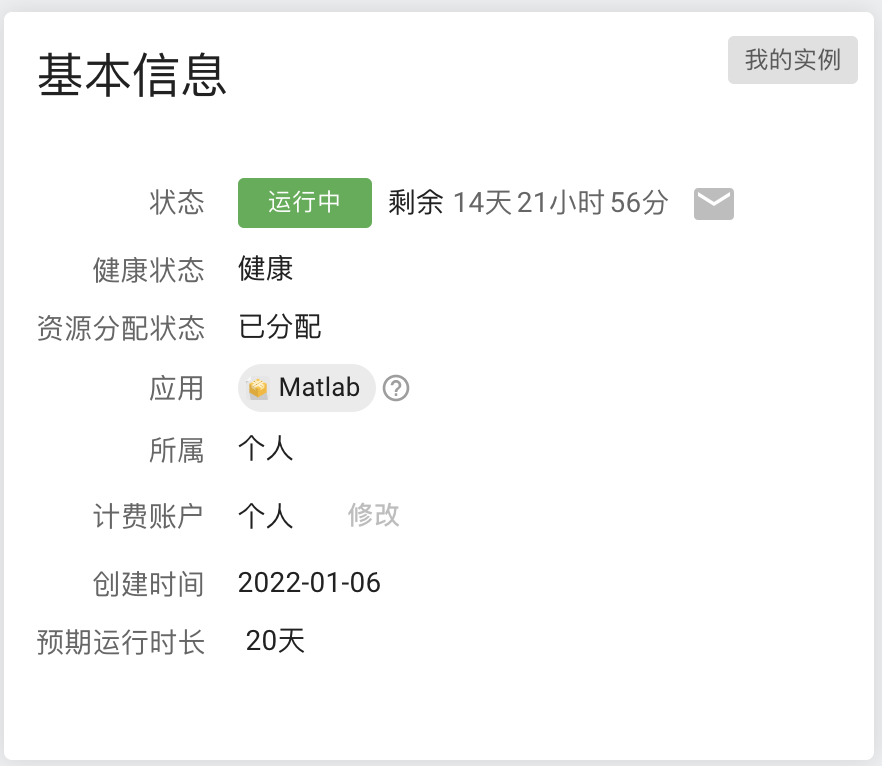
>
> **5.1.2 资源详情**  
> 资源详情显示当前实例所使用的 CPU 核数、内存数、GPU 数、块存储和镜像。

[TABLE]

> **高性能计算云平台用户手册**

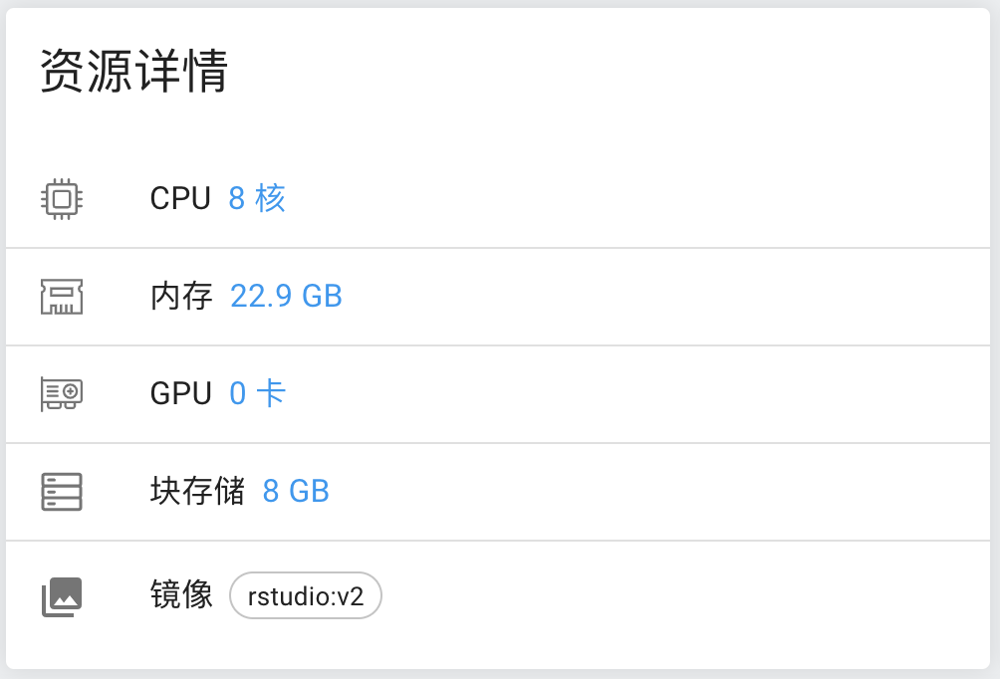

> **5.1.3 服务**  
> 服务显示该实例当前的健康状态和开通的功能，例如控制台、交互界面和 SSH 等。可以点击图标选择相应的
>
> 服务，也可以添加自定义服务。

[TABLE]

**高性能计算云平台用户手册**

> 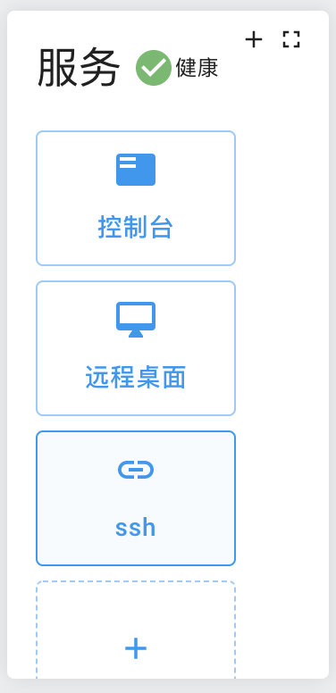
>
> **5.1.4 集群**  
> 集群显示了当前资源所使用的节点和节点的详细信息。

[TABLE]

> **高性能计算云平台用户手册**

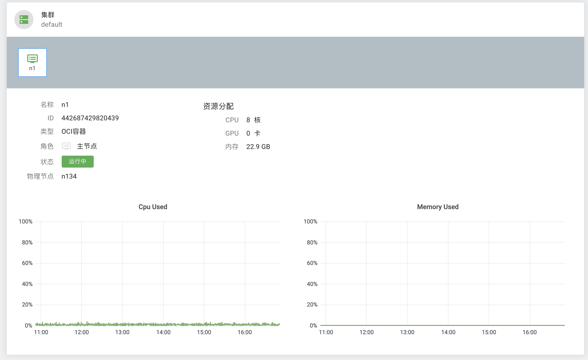

> 根据用户创建的类型不同，节点数量也不同，有的为单节点独占实例，有的为独占集群。

[TABLE]

**高性能计算云平台用户手册**

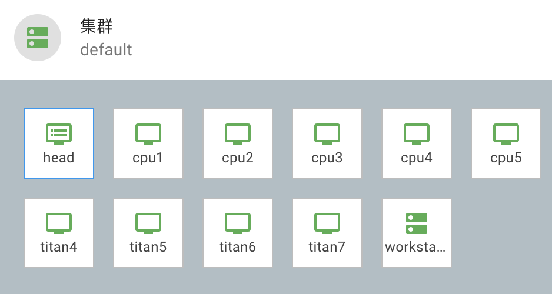

> 可以点击节点图标，切换下方的节点详细信息。

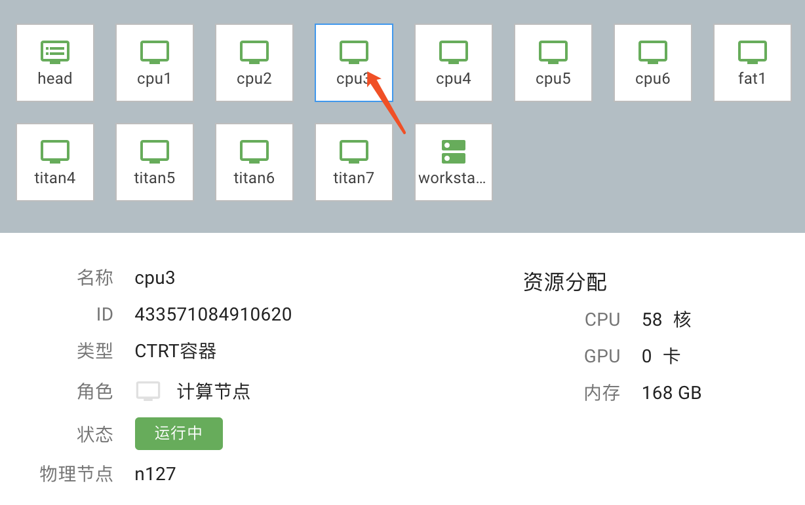

> 节点详细信息包含如下：  
> **名称**：节点名称。
>
> **ID**：节点的 ID。

**类型**：分为“CTRT 容器”，“OCI 容器”和“虚拟机”。“CTRT 容器”是专为集群开发的容器，根据集群的需

[TABLE]

> **高性能计算云平台用户手册**
>
> 求可以进行更细粒度的控制。“OCI 容器”是 Docker 的标准化容器。
>
> **角色**：分为“主节点”、“工作站”和“计算节点”。“主节点”是作业队列系统的管理节点，负责接受用户提 交的任务，进行任务调度和分发。“工作站”节点主要用于用户登录、作业提交、作业查看、文本编辑、数据 传输等工作。“计算节点”用于处理用户的计算任务。
>
> **运行状态**：显示节点当前的运行状态，例如“运行中”、“等待”、“暂停”、“错误”等等。
>
> **物理节点**：显示当前节点所在的物理节点。
>
> **资源分配**：当前节点所占用的资源。
>
> **资源使用统计**：最近 6 小时的 CPU 和内存使用情况。
>
> **5.2 启动/停止实例**
>
> 实例详情的右上角，有“启动”和“停止”按钮，点击后就可以运行或停止实例。

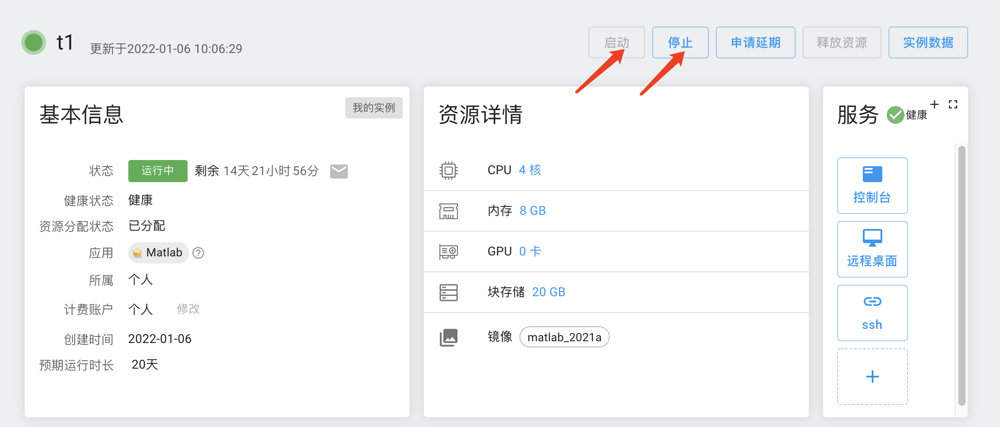

> **5.3 实例延期**
>
> 为了充分的利用资源，每个实例都设有默认的最长使用期限。当创建实例成功后就开始倒计时，倒计时为零 时，系统会自动停止该实例释放资源。如果用户希望延长实例的使用时间，可以申请对实例延期。
>
> 点击“科研实例”中的“申请延期”。

> 在窗口中选择需要延期的类型，填写希望延长的时间和理由，并提交管理员审批。

[TABLE]

**高性能计算云平台用户手册**

> 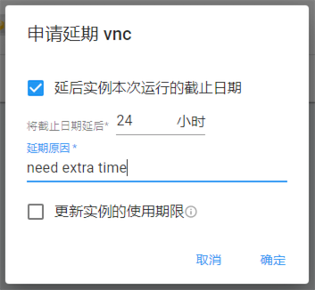

[TABLE]

> **高性能计算云平台用户手册**
>
> 
>
> • **延后实例本次运行的截止日期**：延期申请只针对当前正在运行的实例，不影响之后的实例运行。
>
> • **更新实例的使用期限**：申请用户该实例的默认最长使用期限，只对下次及以后的运行有效。

[TABLE]

> 用户可以在“申请”中查看自己已经提交的延期请求以及审批情况。

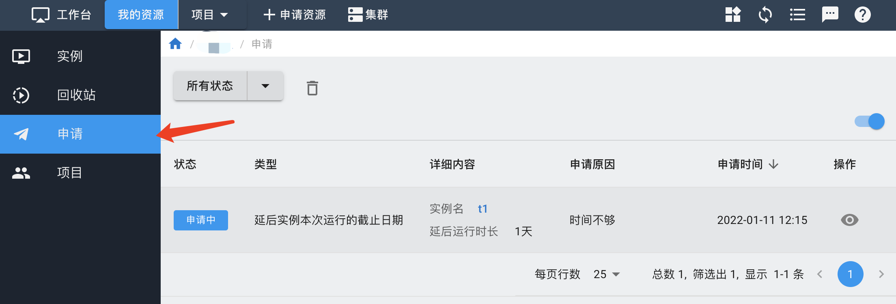

[TABLE]

**高性能计算云平台用户手册**

[TABLE]

> **5.4 资源释放**

[TABLE]

> 实例只有在停止状态下才能释放资源。停止实例后，点击“释放资源”按钮，并停止计费。
>
> 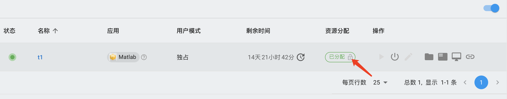

已经释放资源的实例会进入“回收站”，用户可以在“回收站”里找到实例，并重新分配资源，进入计费状态。

> 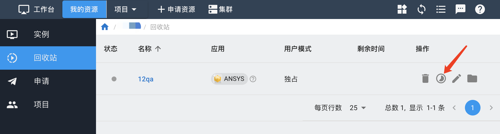

[TABLE]

> **高性能计算云平台用户手册**

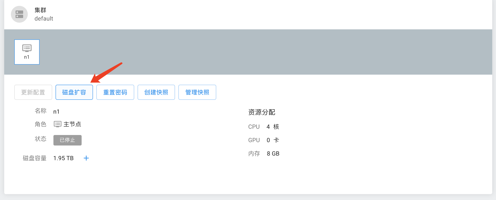

> 在弹出窗口中，通过滑条或是直接输入磁盘尺寸调整所需要的磁盘大小后，点击确定完成扩容。

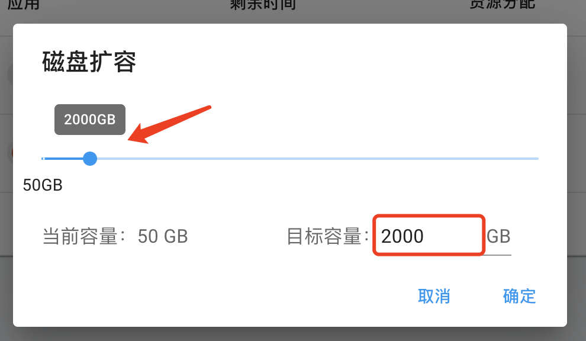

[TABLE]

> 扩容完成后，启动实例，进入到实例中。
>
> 在命令行输入 lsblk，查看磁盘扩容情况，本次扩容空间大小为 20T，见下图：

[TABLE]

**高性能计算云平台用户手册**

> 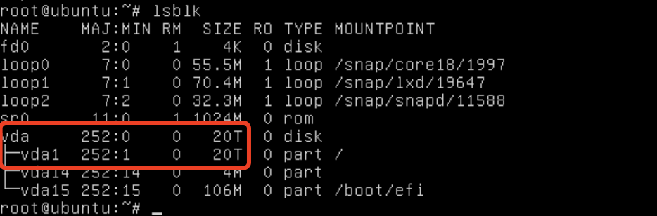
>
> 在命令行继续输入 df -Th 查看磁盘的格式，主要包含 ext4 或者 xfs 两种，本次实例查看见下图：
>
> 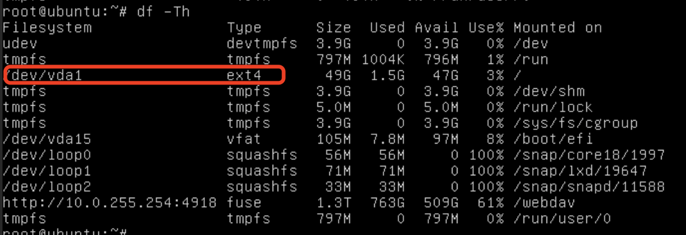
>
> 可以看到，lsblk 和 df -Th 两个命令看到的磁盘大小是不一样的。用 lsblk 看到的是 20T，但是用 df-Th 查看只有 49G，两者存在差异。这是因为 lsblk 查看的是 block device，即逻辑磁盘大小。df 查看的 是 file system, 即文件系统层的磁盘大小。磁盘扩容后，block device 容量变大，但还没有反映到 file system 中，需要用 resize2fs 命令来更新。
>
> 在命令行输入 resize2fs /dev/vda1 进行更新，扩容时间视扩容空间大小而定，扩容 20T 需要几分钟 的时间，提示如下图所示内容，表示扩容完成。
>
> 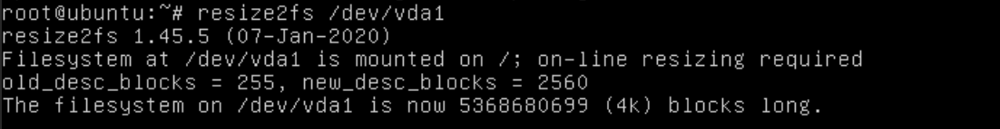
>
> 在命令行输入 df -Th 查看扩容后的磁盘空间，可以看到已经变为 20T。

[TABLE]

> **高性能计算云平台用户手册**

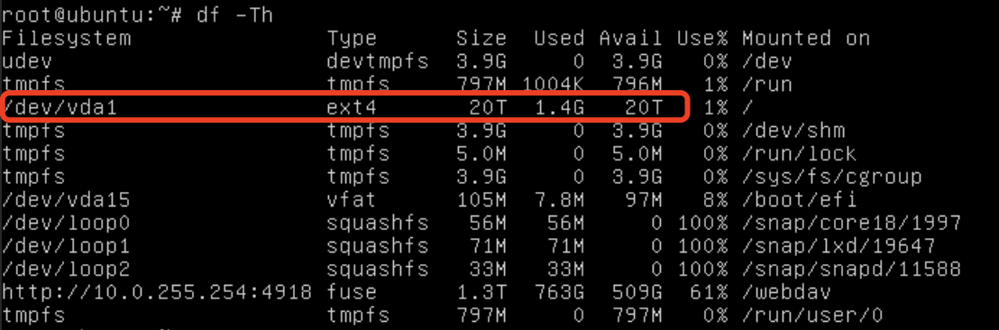

[TABLE]

> **5.6 修改配置**  
> 如果觉得创建的实例资源不够，比如希望增加 CPU 核数、GPU 卡数或是内存，可以修改实例的资源配置。

停止实例，并释放资源，在“我的资源”-“回收站”里找到实例，点击右侧的“修改配置”，在弹出窗口中

> 选择需要的资源配置。

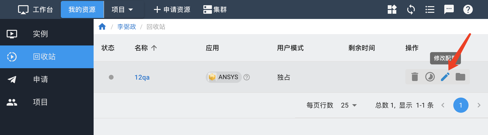

> 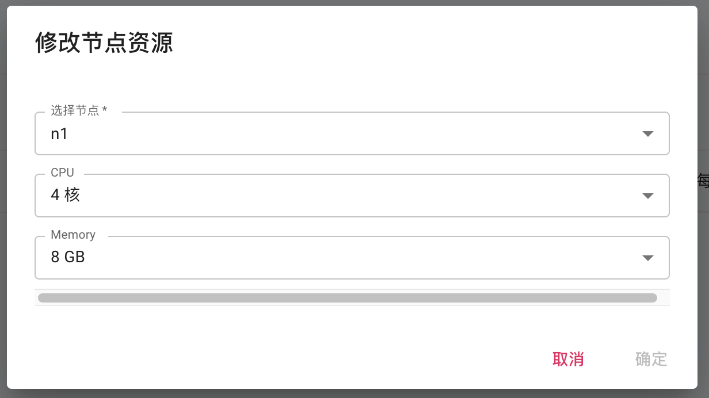

[TABLE]

**高性能计算云平台用户手册**

> 修改资源配置后，为实例重新分配资源并启动即可。

[TABLE]

> **5.7 添加自定义服务**  
> 平台支持用户增加自定义服务，目前只支持自助添加和删除 TCP 端口映射。点击右上角的“添加自定义服
>
> 务”。

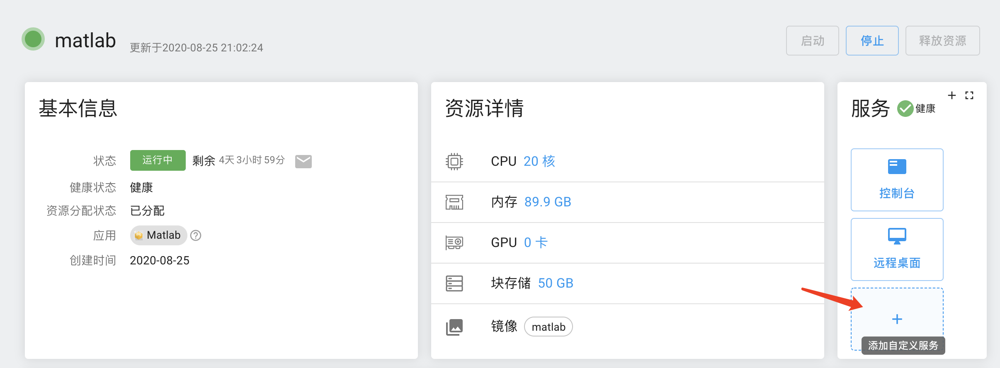

> 在弹出窗口中输入服务名称，容器或虚拟机内部监听的服务地址，端口和所在节点。

[TABLE]

> **高性能计算云平台用户手册**
>
> 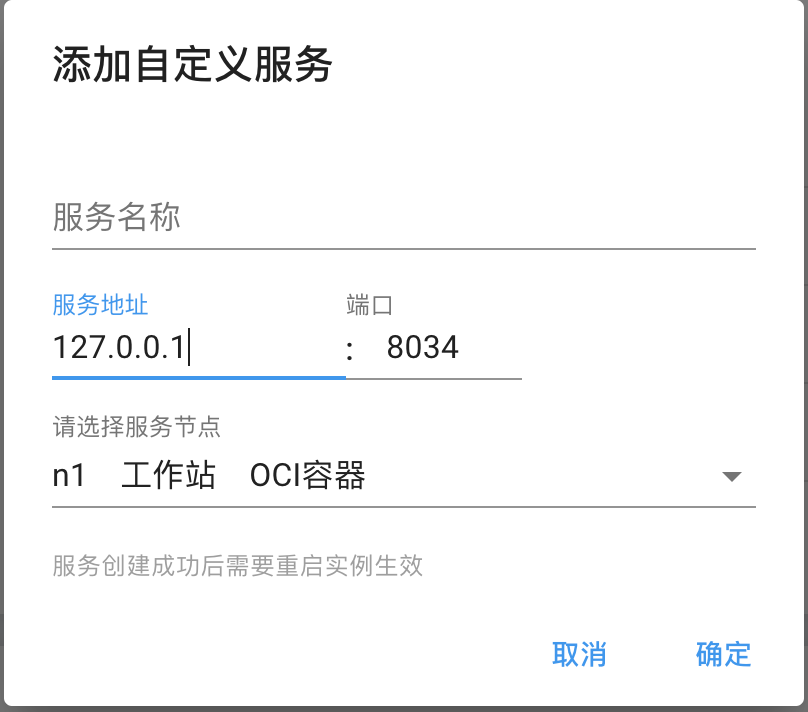

[TABLE]

> **5.8 集群扩缩容**

[TABLE]

> 点击集群右侧“伸缩集群”按钮。

[TABLE]

**高性能计算云平台用户手册**

> 在弹出窗口中，选择扩缩容节点组，选择扩容还是缩容，以及相应的节点数。

[TABLE]

> **高性能计算云平台用户手册**

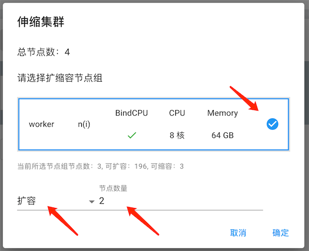

[TABLE]

CHAPTER6

集群登录

> **6.1 浏览器登录**
>
> 通过 Firefox 或者 Chrome 浏览器访问并登录，选择“共享资源”，可以看到平台提供的公共集群。
>
> 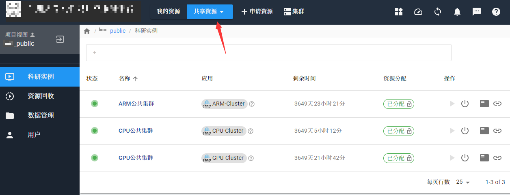
>
> 选择所需使用的公共集群，点击如图所示图标，即可登录字符控制台界面

**43**

> **高性能计算云平台用户手册**
>
> 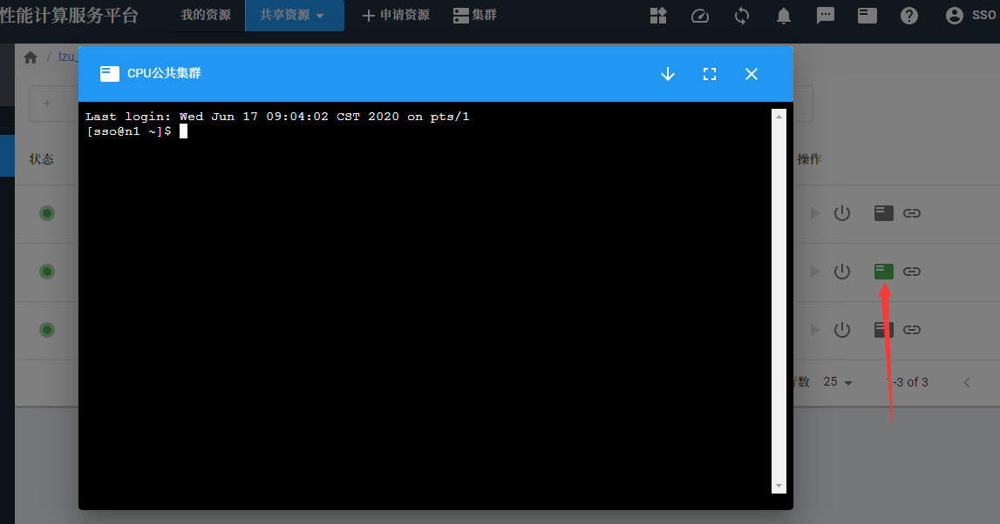
>
> **6.2 查看 SSH 登录信息**  
> 对于共享集群和独占集群，以及自带 SSH 服务的实例可以通过本地机器直接登录。如果实例没有自带 SSH
>
> 服务，可以自行配置。

[TABLE]

> 每套虚拟集群有自己的访问端口，在“我的资源”中通过点击如图所示图标可显示集群的 IP 和端口信息。
>
> 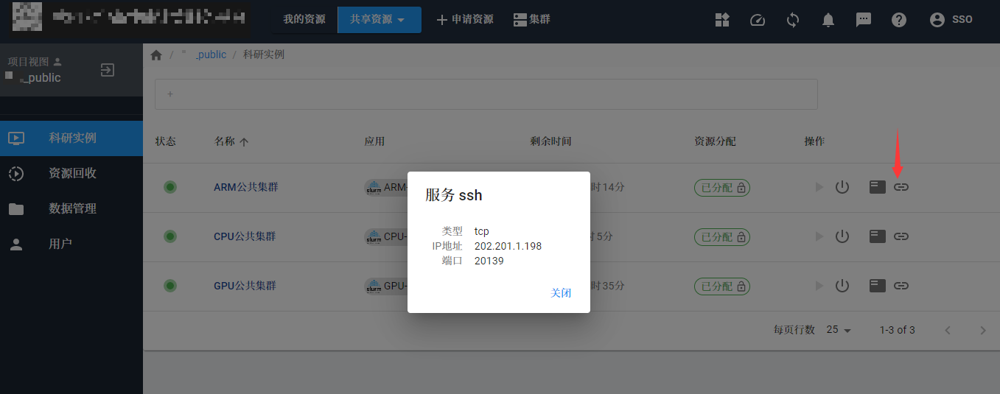

Windows 推荐使用，，等客户端访问集群的服务端口，Linux/Mac 直接使用终端即

> 可。

[TABLE]

**高性能计算云平台用户手册**

> 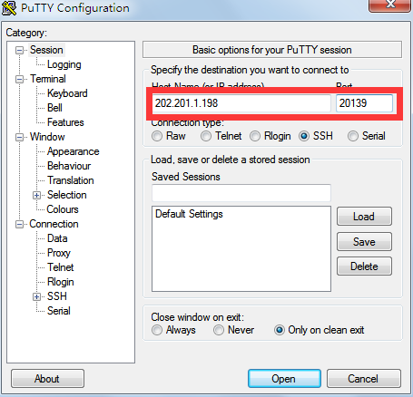
>
> **6.3 SSH 免密码登录**
>
> SSH 免密码登录需要一对密钥对，包括一个公钥和一个私钥，其中私钥放在用户本机，公钥放在集群的 ~/.ssh/authorized_keys 目录。下次登录时，用户本机的私钥和远程集群的公钥通过加密协议验证配 对，验证成功后将不需要密码直接登录成功。所以这里需要生成公私钥，并将公钥上传到目标实例的指定位 置。
>
> 使用 SSH 客户端免密码登录主要需要两步：  
> 1. 在用户本机生成公私钥。
>
> 2\. 将公钥添加到计算云目标实例的 ~/.ssh/authorized_keys 文件末尾。
>
> **6.3.1 生成密钥对**
>
> **MacOS & Linux**
>
> 直接使用终端在用户本机生成公钥和私钥。  
> 输入命令 ssh-keygen -t rsa：

[TABLE]

> 终端会提示：

[TABLE]

> **高性能计算云平台用户手册**

[TABLE]

> 括号内为生成的公私钥的默认目录位置，直接回车就会使用这个默认位置。
>
> 
>
> 如果默认位置已经生成过公私钥，则终端会提示是否需要覆盖，这时可不用再次生成公私钥。

[TABLE]

> 终端会提示输入密码 passphrase，这个密码为生成私钥的密码，将来防止私钥被其他人盗用。这里可以不输 入任何密码，直接回车，再次提示输入密码，再次回车。
>
> 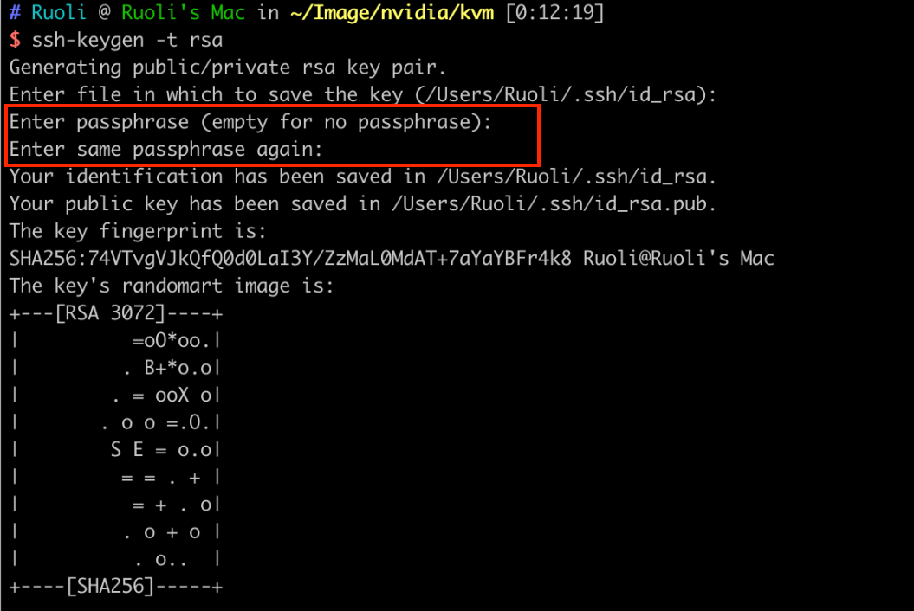
>
> 这时公钥存储在/Users/~your-local-username~/.ssh/id_rsa.pub 文件里，私钥存储在/Users/ ~your-local-username~/.ssh/id_rsa 文件里。
>
> 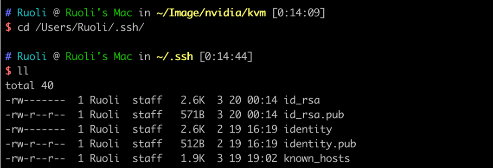
>
> 获取公钥，将返回值拷贝到剪贴板。

[TABLE]

**高性能计算云平台用户手册**

[TABLE]

> 
>
> **Windows**
>
> 可以通过或生成公私钥。下面以 Xshell 软件为例，介绍公私钥生成。打开 Xshell 工具，工具栏有一个工具选项，点开选择新建用户密钥生成向导。
>
> 
>
> 密钥类型默认使用 RSA，密钥长度默认 2048 位，点击下一步。
>
> 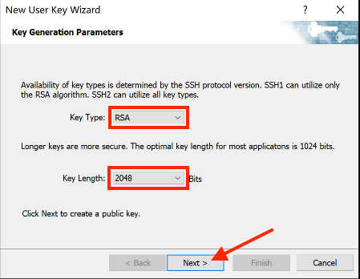
>
> 等待软件自动生成密钥对后点击下一步。

[TABLE]

> **高性能计算云平台用户手册**
>
> 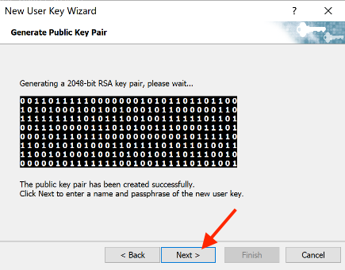
>
> 按照软件指引配置密钥名称和密码后点击下一步。

[TABLE]

> 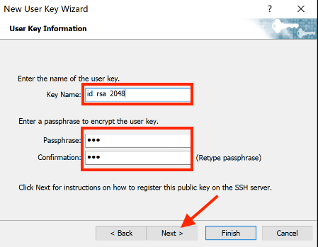
>
> 软件会显示生成的公钥，选中公钥复制到剪贴板，然后点击结束，将公钥另存为文件。
>
> 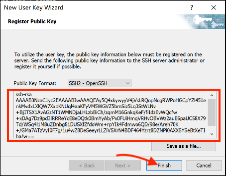

[TABLE]

**高性能计算云平台用户手册**

> 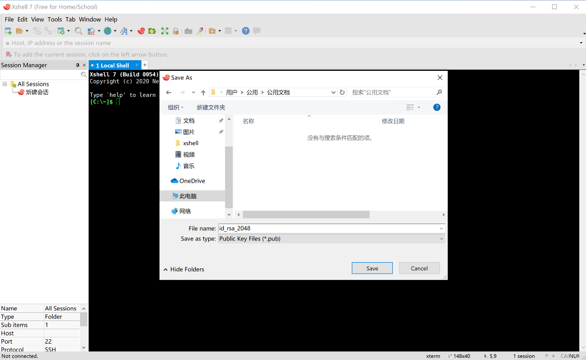
>
> **6.3.2 将公钥添加到集群**
>
> 接下来需要将刚刚复制的公钥追加到集群内 ~/.ssh/authorized_keys。先使用*Web SSH* 登录到集群，在 Web 终端中输入如下命令：

[TABLE]

> 其中，将 “ssh-rsa AAAA..“替换为刚才复制的公钥。
>
> **6.3.3 用密钥登录集群**
>
> **MacOS & Linux**
>
> 本地机器上打开自带的终端，按照上文查看要登录的集群 SSH IP 和端口信息，输入如下命令后回车登录集 群：

[TABLE]

> 其中，202.201.1.198 和 20139 分别替换为集群的 SSH IP 地址和端口，username 替换为自己的平台 用户名。
>
> 如果显示类似如下提示，输入 yes 后回车，即可正常登录。

[TABLE]

[TABLE]

> **高性能计算云平台用户手册**
>
> **Windows**
>
> 此处以登录为例。

点击软件左上角新建会话属性，按照上文查看要登录的集群 SSH IP 和端口信息，输入 SSH IP 地址和端口后

> 点击连接。

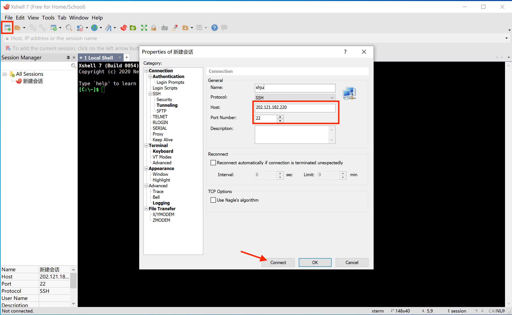

> 输入平台用户名后点击 OK。

[TABLE]

**高性能计算云平台用户手册**

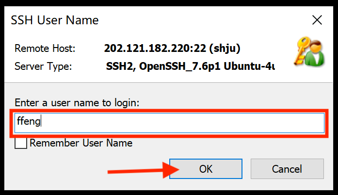

在用户身份验证界面选择“Public Key”选择上文中保存在本地的公钥文件。如果之前在生成密钥对时设置

> 了密钥密码，还需要一并输入密码。

[TABLE]

> **高性能计算云平台用户手册**

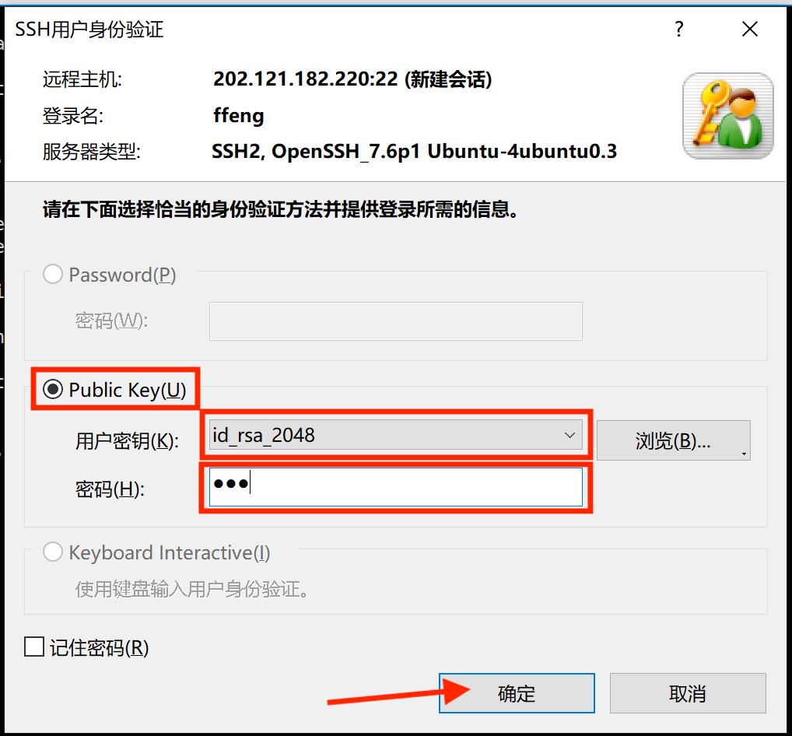

> 点击确认，成功登录。

[TABLE]

**高性能计算云平台用户手册**

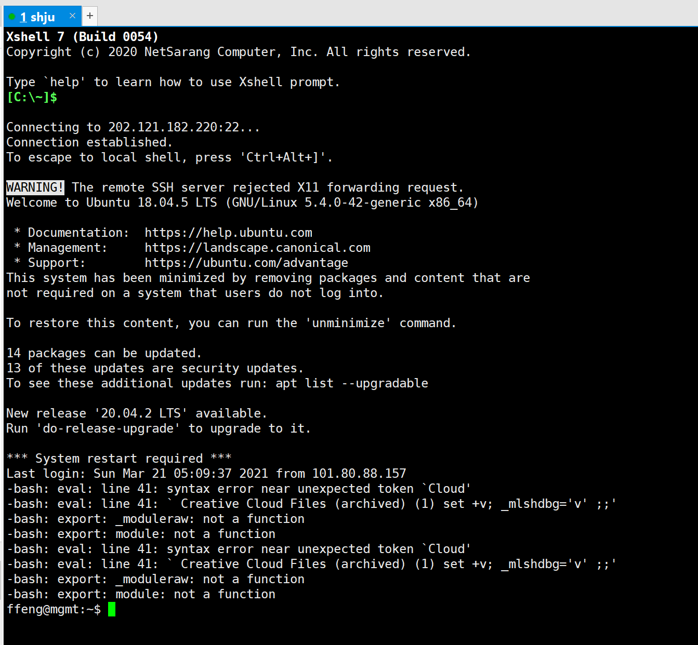

> **6.4 SSH 服务配置**
>
> 启动实例，打开终端安装 ssh 服务

[TABLE]

> 开启 ssh 服务

[TABLE]

> 如果提示 service command not found，执行如下命令：

[TABLE]

> 更改用户密码

[TABLE]

> **高性能计算云平台用户手册**

[TABLE]

> 然后输入新密码。
>
> 用 ssh 工具远程登陆实例。

[TABLE]

CHAPTER7

文件传输

> **7.1 用户数据存储空间**

在平台上，系统根据三种使用模式会为用户在共享文件系统上分配三种目录，分别是个人目录，项目目录和

> 公共集群目录。
>
> 在实例或集群中，这三种目录所对应的路径不同，具体见下表：

[TABLE]

[TABLE]

> **提示:** 项目目录和公共集群目录的具体说明请分别查看项目数据 和集群数据 。

**55**

> **高性能计算云平台用户手册**
>
> **7.2 Web 页面数据传输**  
> 平台支持通过 Web 页面上传下载数据和管理文件。

[TABLE]

进入“工作台”-“数据总览”，选择相应的数据位置，就可以对个人、项目和公共集群中的数据进行管理。

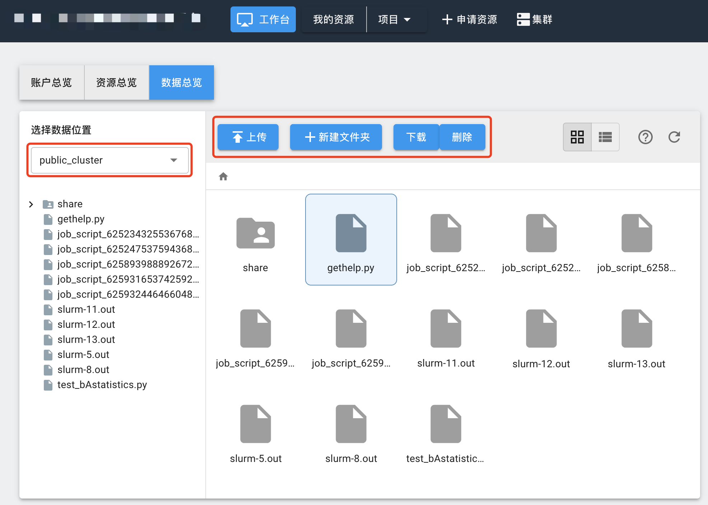

[TABLE]

**高性能计算云平台用户手册**

> **7.3 通过 ssh 账户传输**
>
> 由于 Web 传输文件功能有限，对于开放了 SSH 端口的集群或实例，用户可以通过 SSH 账户使用 scp 类的工 具来传输数据。

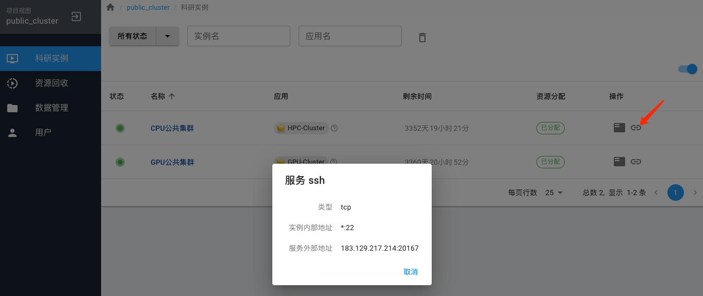

> 以公共集群项目为例，用户在**公共集群** cluster_name 的页面里，选择**科研实例**，点击实例最右侧的 SSH 服务地址按钮，会弹出平台对外开放的 IP 地址和端口：
>
> 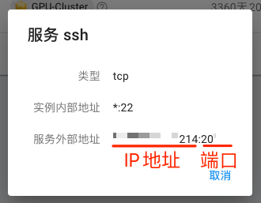
>
> 首次使用 SSH 登录的用户需要重置平台密码

[TABLE]

> **高性能计算云平台用户手册**
>
> 

用户在校内，能够直接访问平台服务 IP 地址的情况下，可以使用 scp、或等 scp 工具来传输

> 数据：

[TABLE]

> **7.3.1 使用 XFTP 传输**  
> Windows 用户也可以使用客户端进行传输。
>
> 1\. 下载并安装 XFTP 软件后打开，点击“文件”-“新建”。

[TABLE]

**高性能计算云平台用户手册**

> 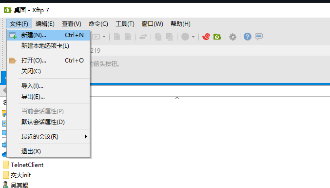
>
> 2\. 名称用户可以自定义，主机选项中输入“服务 ssh“显示的服务外部地址，端口号填写“服务 ssh”中的
>
> 端口号，协议使用默认的 SFTP，用户名和密码填写平台的用户名和密码。点击”连接“。

[TABLE]

> **高性能计算云平台用户手册**
>
> 

[TABLE]

**高性能计算云平台用户手册**

> 3\. 连接后左侧为当前用户计算机的视图，右侧为远程计算机的视图，用户访问的远程计算机路径为/
>
> home/username，即当前用户的家目录，用户可将文件从个人电脑上传输到共享文件夹内，下方传输
>
> 栏会显示传输任务详细信息。
>
> 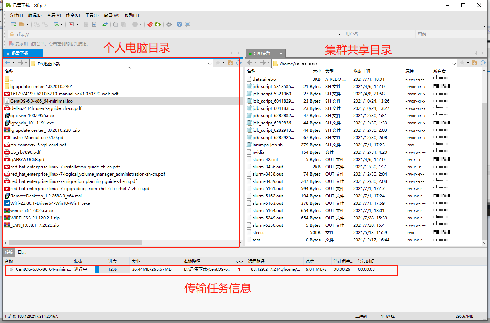
>
> 4\. 传输完成后即可在公共集群或实例控制台的用户家目录中看到刚才传输的文件。

[TABLE]

> **高性能计算云平台用户手册**
>
> 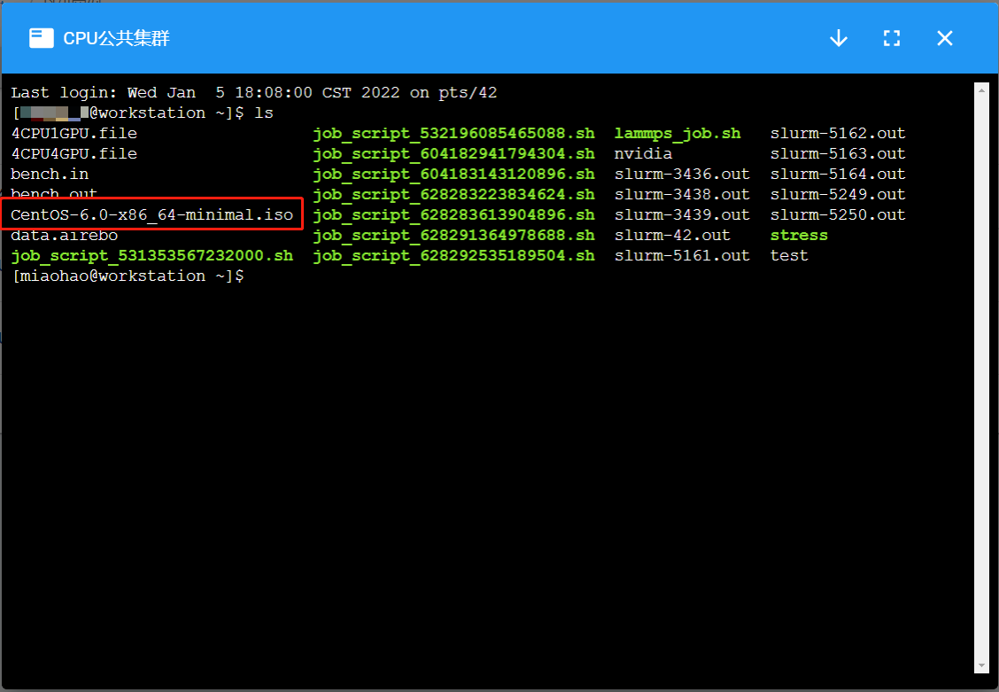
>
> **7.4 WebDAV 协议访问**
>
> 由于不是所有实例都提供 SSH 端口的访问方式，对于需要批量上传或下载的用户，平台还提供了 WebDAV 协议的文件访问方式。
>
> WebDAV 是一种通信协议，支持大批量的文件传输。对于用户来说，相当于将平台的服务器以网盘的形式挂 载到用户的个人电脑，用户将个人电脑里的数据拷贝或者上传到平台的服务器上。
>
> WebDAV 协议访问的地址是 xx.xx.xx.xx:4918 。用户验证请使用平台用户名和密码。
>
> Windows 系统建议使用或。Mac 系统建议使用。Linux 系统建议使用。
>
> 为了方便，平台提供了上述软件，请根据需要下载：
>
> **Mac：**  
> •  
> **Windows：**  
> •  
> •  
> •  
> **Linux：**  
> •

[TABLE]

**高性能计算云平台用户手册**

> **7.4.1 Cyberduck 使用说明**
>
> 打开 Cyberduck，点击“新建连接”，按照下图所示填写连接方式，要选择“WebDAV(HTTPS)”方式。用户 验证请使用平台用户名和密码。
>
> 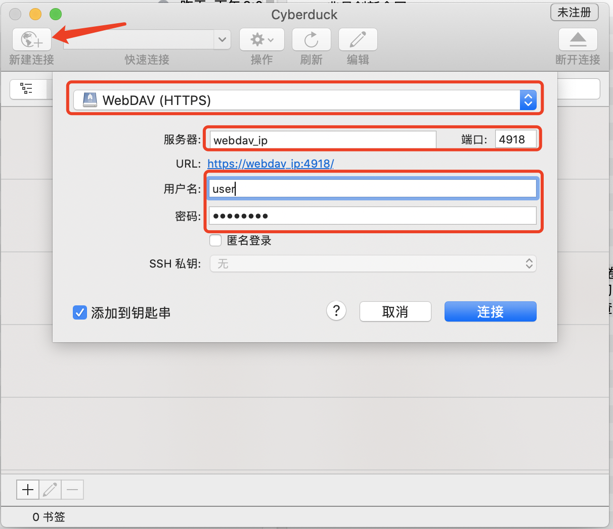

连接过程中出现任何提示，直接点“继续”。连接成功后，可以使用软件的创建文件夹、上传等功能。注意，

> 使用共享实例，比如交互式的 JupyterLab、RStudio、Stata、MATLAB 的用户，目标文件夹是“MyData”文件 夹。软件的“操作”按钮下有“新建文件夹”、“上传”等功能。

[TABLE]

> **高性能计算云平台用户手册**
>
> **7.4.2 RaiDrive 使用说明**  
> 下载并安装后，点击窗口顶部的“添加”按钮，按照下图所示创建 WebDAV 驱动器。
>
> 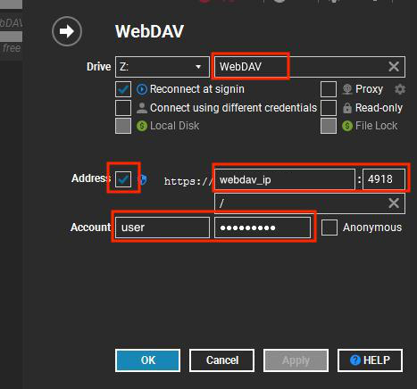

点击确定后，会跳出一个 Windows 资源浏览器窗口。RaiDrive 已经把新添加的 WebDAV 连接创建成了一个

网络存储驱动器，可以像操作本地磁盘一样从其他驱动器里拖拽文件或者拷贝到这个驱动器下的子目录中。

[TABLE]

[TABLE]

**高性能计算云平台用户手册**

> **7.4.3 WinSCP 使用说明**  
> 打开 WinSCP ，在登录对话框中“新建站点”。按下图所示，选择“WebDAV”-“TLS/SSL 隐式加密”、填入 主机名和端口 xx.xx.xx.xx:4918 ，使用平台用户名和密码进行登录

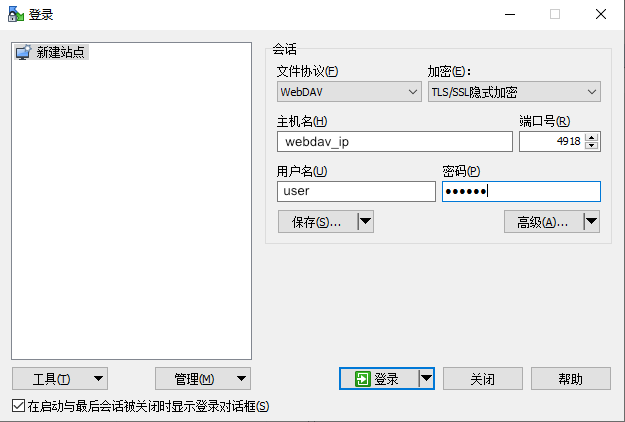

> **7.4.4 rclone 使用说明**  
> 1. 下载 rclone 压缩包  
> 官方链接地址 2. 解压，并将 rclone 程序拷贝到 \$PATH 中，给予相应权限

[TABLE]

> 3\. 配置 rclone config

[TABLE]

(下页继续)

[TABLE]

> **高性能计算云平台用户手册**

(续上页)

[TABLE]

> 以上操作结束后，可以在/root/.config/rclone/rclone.conf 中看到相应配置文件
>
> 4\. 关闭证书检查

[TABLE]

> 有两种关闭检查的方式，如下：
>
> • 1. 在 执 行 命 令 时 带 上--no-check-certificate
>
> --no-check-certificate

参 数， 如：rclone ls remote:

> • 2. 在环境变量里指定，如：export RCLONE_NO_CHECK_CERTIFICATE=true 5.rclone 常用操作

[TABLE]

> 6\. 其它操作可参考官方文档：
>
> **7.5 虚拟机实例内访问 Home 目录**
>
> 平台内的虚拟机实例访问共享文件系统上的 Home 目录的机制类似于用户从外部访问 WebDAV 服务。目前 平台提供 Windows 和 Linux 虚拟机，连接方法分别如下:  
> 1. Linux 虚拟机：在 Linux 虚拟机镜像中已经预先做好了 WebDAV 卷的自动挂载，挂载点是/webdav，可 以直接访问 /webdav/MyData/ 目录下的文件。
>
> 2\. Windows 虚拟机：在 Windows 虚拟机中也预先做好了 WebDAV 卷的自动挂载，原理是使用 Windows 自 带的 WebDAV Client 工具挂载了 WebDAV 服务端提供的网络存储。
>
> 其中，MyData 存放的是个人数据，ProjectGroup(public_cluster) 存放的是 public_cluster 项 目组中的数据，其它项目组同理。如下图:

[TABLE]

**高性能计算云平台用户手册**

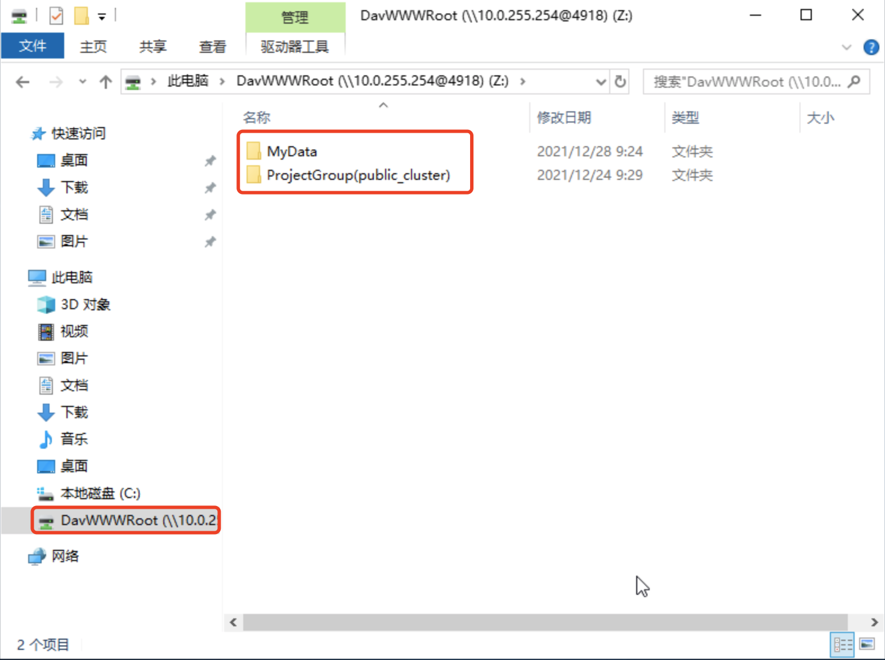

> 算例数据可以通过这种方式拷贝到 C 盘目录去处理，处理完再从 C 盘拷贝到网络存储的目录中，然后从实 例的数据“管理页面”下载到自己的电脑。
>
> **提示:** 通过系统平台的数据管理页面下载时，对下载的文件数量有限制，建议先在虚拟机中对处理结果打包 后再传输。
>
> Windows 系统自带的 WebDAV Client 可以满足大多数文件拷贝需求，但是对单个文件的大小限制为 4G，文 件如果大于 4G 会报错。

[TABLE]

> **高性能计算云平台用户手册**

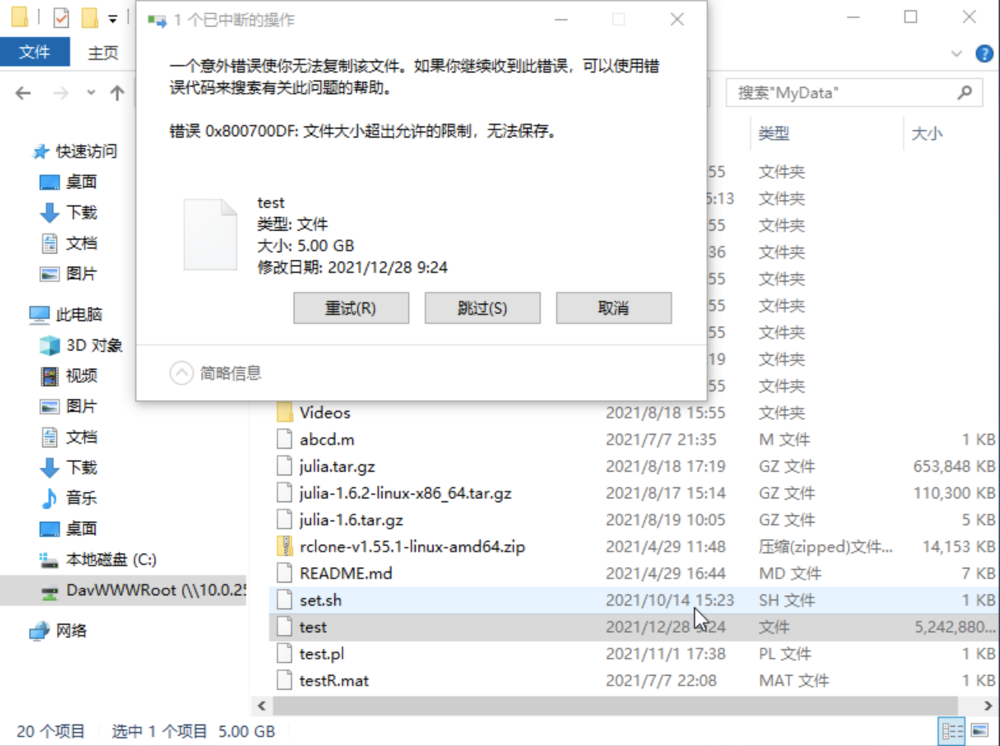

> 此时，需要在虚拟机里安装 WinSCP 工具来拷贝文件，参考前面软件下载部分。以下分别以 RaiDrive 软件和 WinSCP 为例：
>
> **7.5.1 RaiDrive**
>
> 首先下载 RaiDrive 并上传到虚拟机中，安装 RaiDrive 需要.net framework 的支持，会提示下载安装，默 认安装即可。另外，可能会要求重启虚拟机系统，重启即可。
>
> 安装完成后，新建站点并输入以下信息进行连接，“文件协议”-“WebDAV”，不加密，连接地址为 http:/ /10.0.255.254:4918，Account 即平台的用户名、密码。

[TABLE]

**高性能计算云平台用户手册**

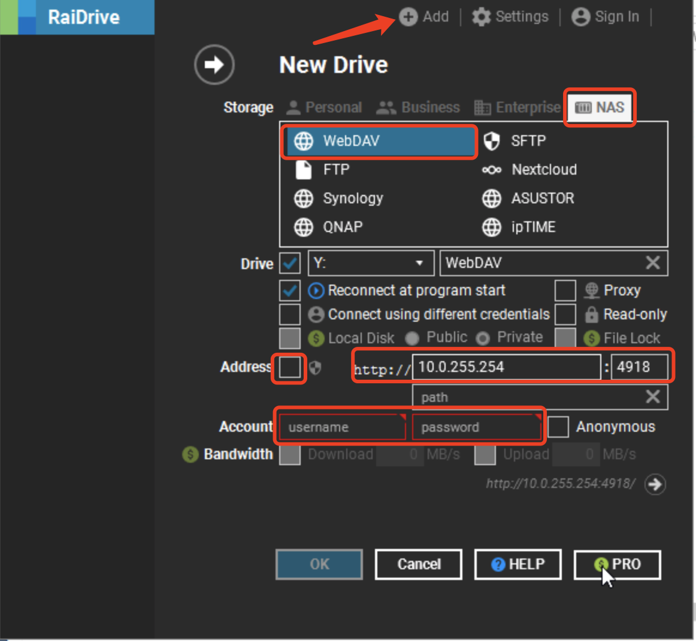

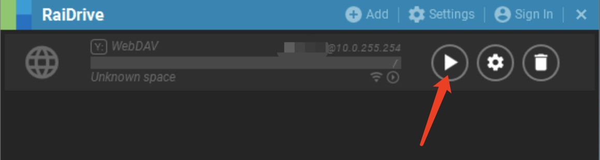

> 连接建立成功后，会自动打开数据目录，再进行文件传输即可。

[TABLE]

> **高性能计算云平台用户手册**

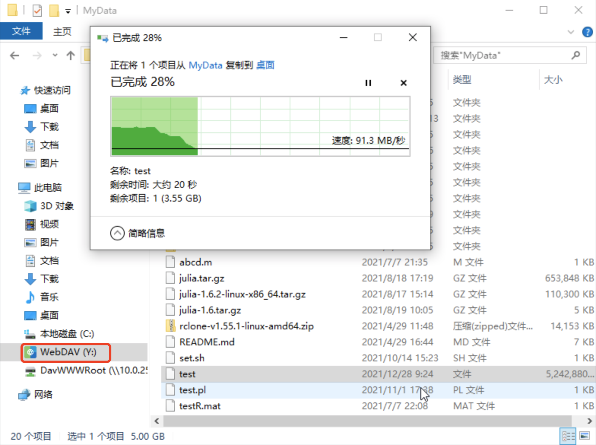

> **7.5.2 WinSCP**  
> 在虚拟机内安装 WinSCP，安装后重启虚拟机系统。按如下新建会话后点击登录。

[TABLE]

**高性能计算云平台用户手册**

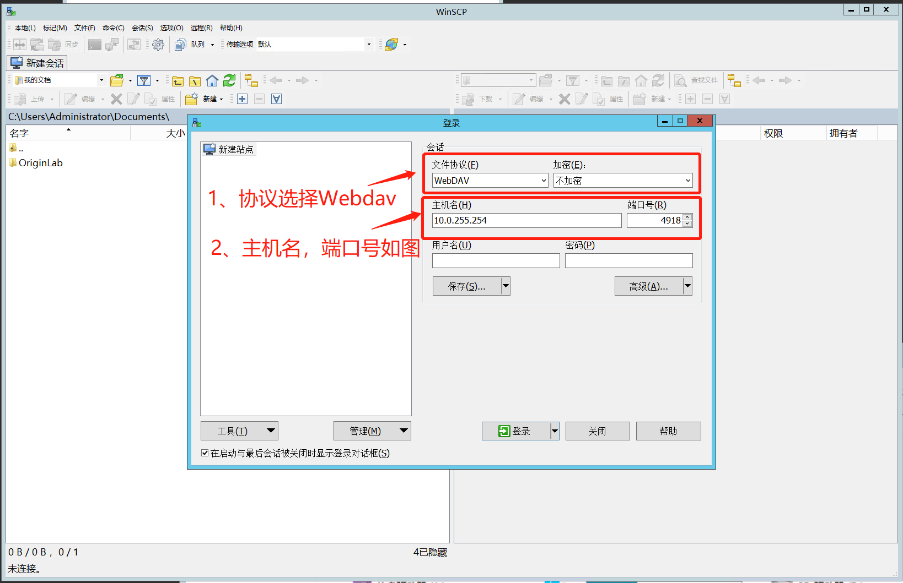

> 连接建立成功后，会自动打开数据目录，再进行文件传输即可。

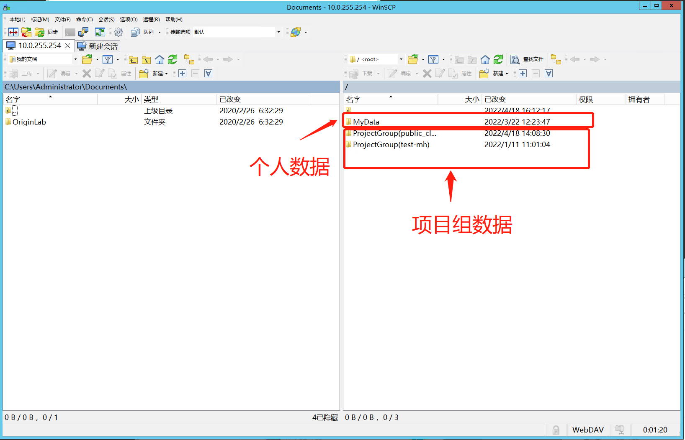

[TABLE]

> **高性能计算云平台用户手册**

[TABLE]

CHAPTER8

作业系统

> **8.1 Slurm 系统简介**  
> 在公共集群中使用 SLURM 作业调度系统进行任务的调度和管理。SLURM （Simple Linux Utility for Resource Management）是一种可用于大型计算节点集群的高度可伸缩和容错的集群管理器和作业调度系统，被世界范
>
> 围内的超级计算机和计算集群广泛采用。
>
> **8.2 Slurm 常用命令**

[TABLE]

> 日常使用超算资源只需掌握简单的几条命令即可，具体详细的配置请参考。

**73**

> **高性能计算云平台用户手册**
>
> **8.3 查询状态**  
> sinfo：查看节点与分区状态

[TABLE]

[TABLE]

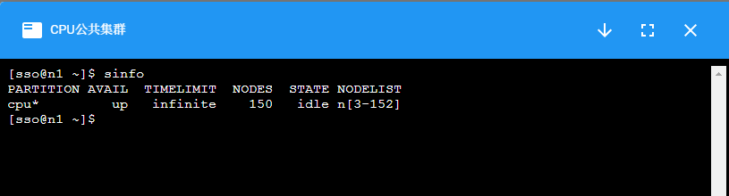

> squeue：查看队列状态

[TABLE]

[TABLE]

[TABLE]

**高性能计算云平台用户手册**

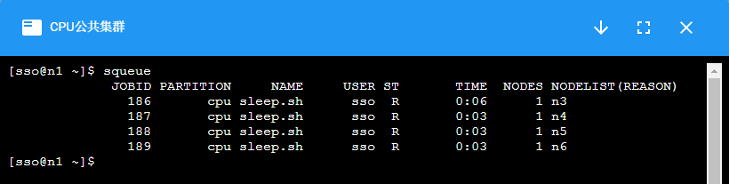

> scancel：取消作业

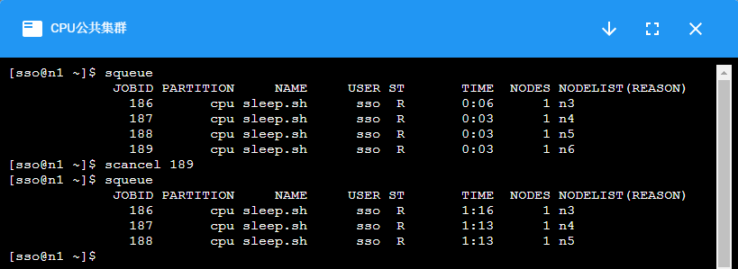

> **8.4 Slurm 作业提交**  
> **8.4.1 系统页面提交**
>
> 系统支持直接在页面提交作业。
>
> 点击上方“集群”按钮，选择“提交作业”。

[TABLE]

> **高性能计算云平台用户手册**
>
> 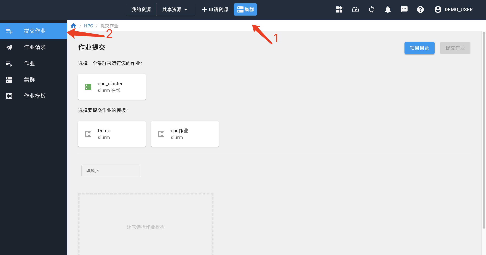
>
> 选择需要使用的集群和作业模板，填写作业名称，在脚本编辑器里填入作业脚本，点击右上方的“提交作业”按钮。
>
> 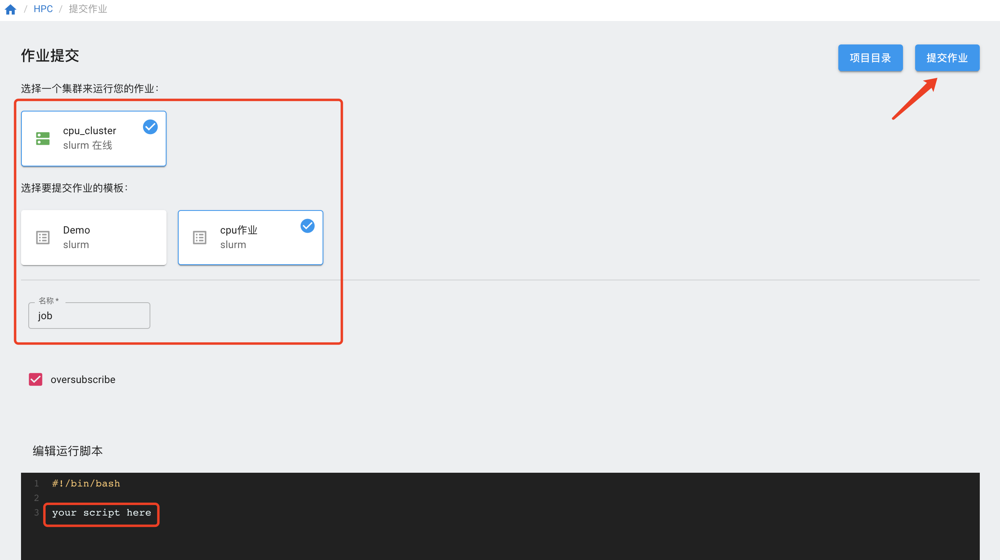
>
> 提交作业后，可以在“作业”页面查看是否提交成功。

[TABLE]

**高性能计算云平台用户手册**

> 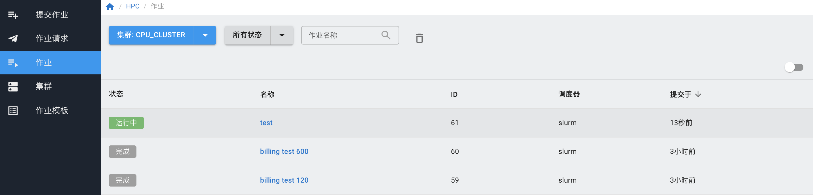
>
> 如果提交的作业有输出，需要下载，等待作业运行完成后，点击作业名称，进入作业详情。
>
> 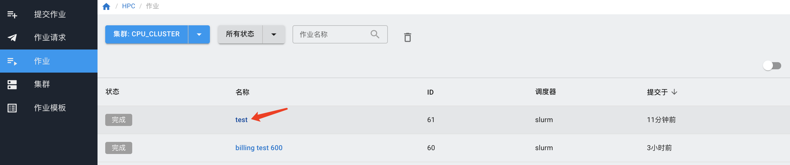
>
> 在“作业输出”页面，点击“下载输出日志”。
>
> 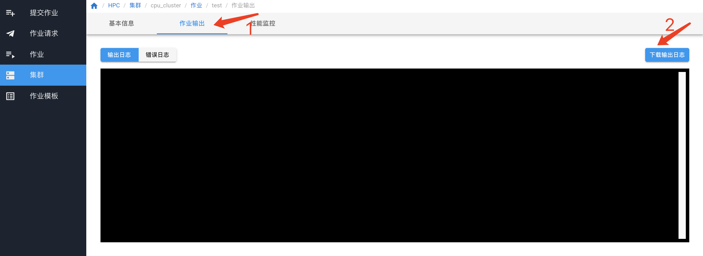
>
> **8.4.2 终端提交**
>
> Slurm 作业通常分为交互式和批量式两种。交互式作业通常用于代码编译、脚本调试、交互式计算等工作。长期后台计算的任务通常以作业脚本的方式进行批量提交。

[TABLE]

> **高性能计算云平台用户手册**
>
> **交互作业**

[TABLE]

> 集群的计算节点默认不允许用户直接登录，对需要交互式处理的程序，在登录到集群后，使用 salloc 命
>
> 令分配节点，然后再 ssh 到分配的节点上进行处理：
>
> 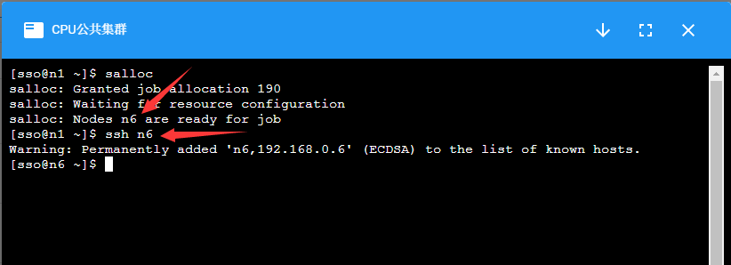
>
> 计算完成后，使用 exit 命令推出节点，注意需要 exit 两次，第一次 exit 是从计算节点退出到登录节
>
> 点，第二次 exit 是释放所申请的资源。
>
> 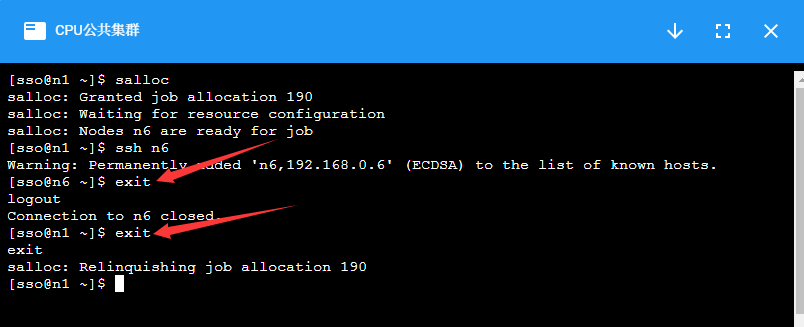
>
> **批量作业**
>
> 可以通过将程序执行命令放入作业提交脚本，并通过 sbatch 命令作业提交的方式在集群中进行计算。
>
> 一个简单的脚本示例如下：

[TABLE]

**高性能计算云平台用户手册**

[TABLE]

[TABLE]

> 第一行表示这是一个 bash 脚本，第 4-17 行以 \#SBATCH 开头的命令表示这些是需要 slurm 系统处理的参数。
>
> 如下图所示，通过 sbatch+ 作业脚本名提交作业，系统会返回作业编号，通过 squeue 命令可以看到作 业运行状态，等作业执行完成后，默认会把程序的输出放到 slurm-作业编号.out 的文件中，可通过该文 件查看程序的输出。
>
> 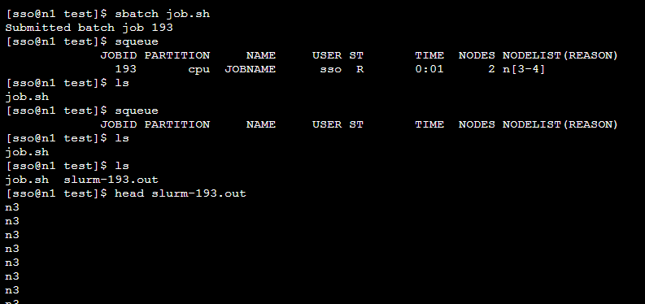

[TABLE]

> **高性能计算云平台用户手册**
>
> **GPU 集群作业提交**
>
> 如果是 GPU 集群，需要在作业脚本中增加--gres=gpu:\<number of card\> 参数。例如 \#SBATCH
>
> --gres=gpu:2，意味着指定 2 张 GPU 卡数。
>
> 以下为 GPU 作业的一个示例：

[TABLE]

[TABLE]

> 例如：

[TABLE]

> 如果要在 GPU 集群中使用 Nvidia 指令，请参考/app/gpu_cluster 。

[TABLE]

**高性能计算云平台用户手册**

> **常见提交作业参数参考**

[TABLE]

> **8.5 参考链接**  
> Slurm 作业调度系统使用指南 by 中国科大超级计算中心李会民

[TABLE]

> **高性能计算云平台用户手册**

[TABLE]

CHAPTER9

项目共享

项目共享的作用在于项目组内的成员可以使用共享资源，比如实例和数据。组员在项目组中创建的实例，计

> 费在项目组账单中。
>
> 典型的用例如下：
>
> 1\. 导师或组长在项目组中创建一个共享实例，其他组员都可以使用该实例。
>
> 2\. 将需要共享的数据放入项目组的 share 目录下，所有组员都可以访问。
>
> **9.1 创建项目**
>
> 点击“项目”后选择“创建新项目”，为项目设定项目名和显示名称后确定。

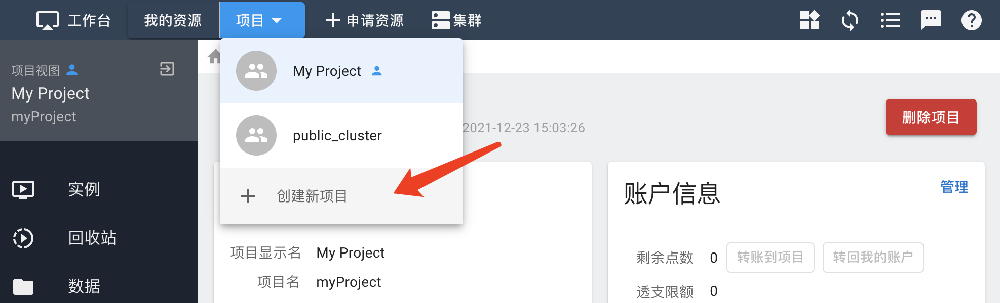

**83**

> **高性能计算云平台用户手册**

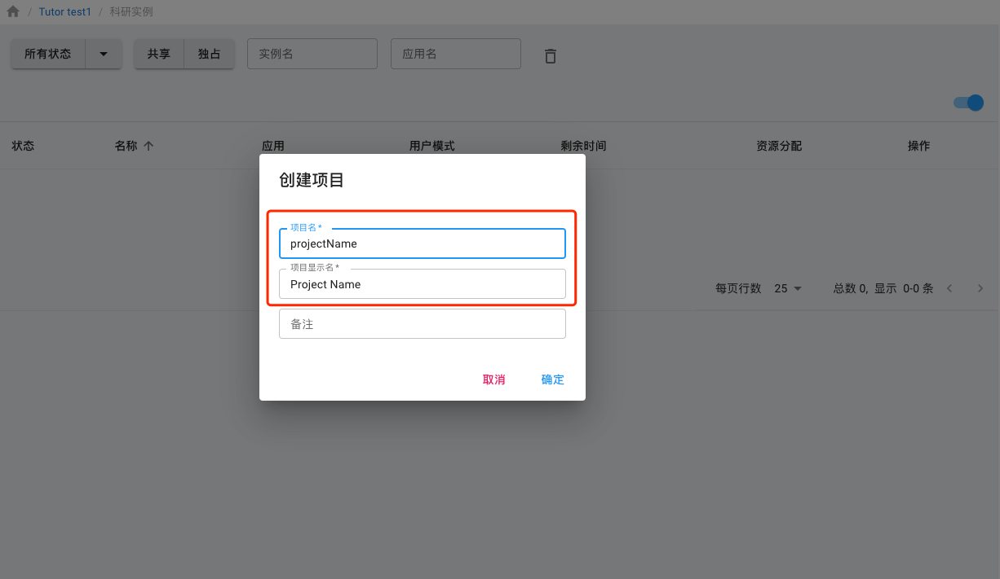

[TABLE]

> 待项目创建完毕后，点击“项目资源”选择新创建的项目，进入项目管理界面。
>
> 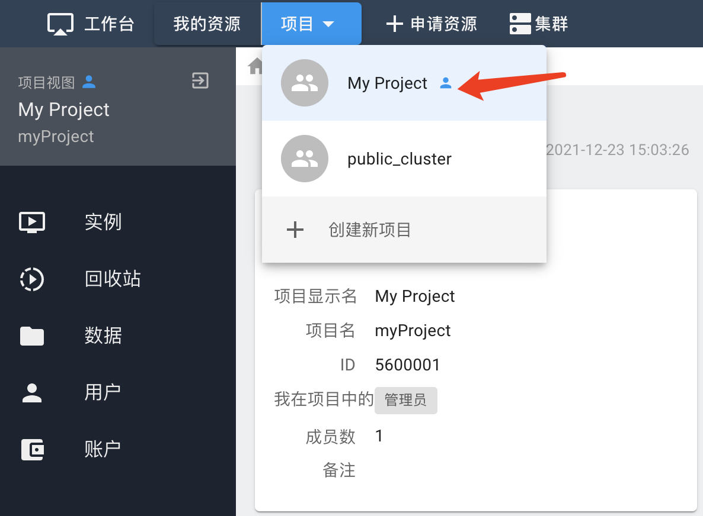
>
> 当前用户默认为新建项目的管理员。

[TABLE]

**高性能计算云平台用户手册**

[TABLE]

> **9.2 用户类型**
>
> 项目组用户分管理员、组长和组员，具体项目组各成员权限参见下表。

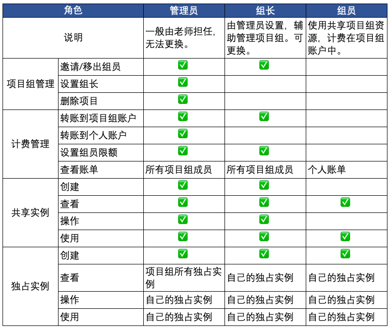

[TABLE]

> **高性能计算云平台用户手册**
>
> **9.3 项目成员管理**
>
> 如果需要和其他用户共享项目实例、账户或数据，需要邀请其他用户进入项目组。项目管理界面中选择“用户”，在搜索框中输入用户 ID 并邀请。

[TABLE]

> 用户接受邀请后，就可与其共享实例和项目数据。  
> 管理员还可以移出项目成员。
>
> **9.4 项目数据**
>
> 项目数据目录下的 share 目录是项目共享目录，项目组所有成员都可以读写。如果是希望共享的数据，需 要放在 share 目录下。
>
> 项目数据 **根目录**下，只有当前用户有读写权限，项目组其他成员无法访问。

以下面目录结构为例，a.csv 全项目组成员都有权限访问，而 b.h 和 c.txt 只有当前用户能查看和读写。

[TABLE]

> 共享项目数据的目录结构和管理请参见文件传输。
>
> **9.5 删除项目**
>
> 点击“项目”，进入自己管理的项目，点击页面右上角的删除按钮。

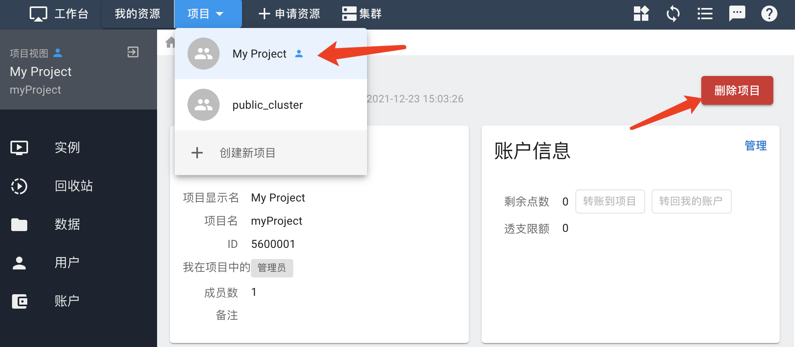

[TABLE]

**高性能计算云平台用户手册**

[TABLE]

[TABLE]

> **高性能计算云平台用户手册**

[TABLE]

CHAPTER10

计费统计

> 本页将介绍系统的计费功能，包括计费方法、查看个人账户、指定计费账户、转帐到项目组账户等。
>
> **10.1 计费方法**
>
> 系统的扣费账户分为两类，一类是个人账户，一类是共享项目账户。用户在提交实例或作业时，可以指定是 从个人账户扣款还是从共享项目账户扣款。
>
> 系统采用点数计算资源费用。个人账户的点数需要管理员充值，点数 = 充值金额 \* 充值汇率。项目帐户的点 数由项目管理员 从个人账户内转账至项目账户。
>
> 用户的实例或作业完成后，系统根据资源使用类型、时长和计费权值计算费用。
>
> 计费公式：∑(*r ∗ t ∗ w*) *r* 是资源数量，比如 CPU 核数，GPU 卡数。
>
> *t* 是资源运行时长。具体运行时长的计算方式参见下文。
>
> *w* 是计费权值。计费权值是调节不同资源价格的参数，可以将不同类型的资源消耗，折算成统一的计费点数。作业运行时长：用户在集群中通过提交作业的形式来进行批量计算。作业启动开始收费，停止时结束收费。实例运行时长：用户申请到容器或虚拟机，不管是否运行，从资源分配后，即开始收费，直到资源释放结束 收费。
>
> 存储计费分为块存储和文件存储两部分。
>
> 块存储：这是系统根据管理员设置，给实例分配的逻辑块设备。只要建立实例就开始计费，不论是否启动实 例。另外，实例释放资源后由于依然占用存储，因此会继续计费，只有在“资源回收”里删除实例后，才停 止计费。
>
> 文件存储：用户 home 目录占用的存储空间。文件存储从账户创建开始按配额计费。
>
> **注解:** 存储按天计算点数。虽然提供计费详单，但不会从个人账户或项目账户里扣费。

**89**

> **高性能计算云平台用户手册**

| **注意:** 实例进入“资源回收”后，CPU/GPU/内存等资源停止计费，块存储会继续计费直至实例被删除。 |
|----------------------------------------------------------------------------------------------|

> 除了点数外，无论是个人账户还是项目账户，都有透支限额，允许用户在欠费的情况下运行实例或是作业。个人和项目的可透支额度均由管理员设置，个人无法修改。
>
> 比如用户已经欠费 1800 点数，但是透支额度为 2000 点数，则用户可以运行新的实例或提交作业。如果欠费 超过 2000 点数，则无法再运行实例或提交作业。
>
> **10.1.1 提交实例到扣费账户**  
> 用户在创建个人实例时，选择需要扣费的账户。

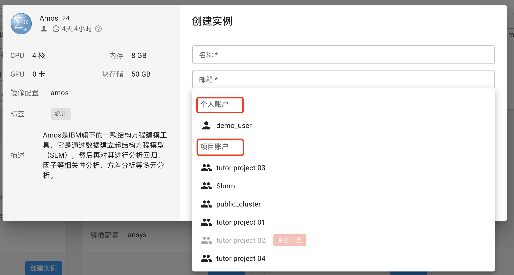

> **10.1.2 提交作业到扣费账户**
>
> 指定扣费项目账户有两种方法。一是在作业脚本中加入如下命令:

[TABLE]

> 二是在提交作业时，在命令行上加上参数--comment project，例如：

[TABLE]

> 如果不加--comment 参数，则默认从个人账户扣费。

[TABLE]

**高性能计算云平台用户手册**

[TABLE]

> **10.2 个人账户**

点击右上角的用户名称，在下拉菜单中选择“费用中心”，进入“我的账户”查看个人账户信息，包括账户中

> 的剩余点数，可透支的额度，以及个人创建的项目账户的剩余点数和可透支额度。

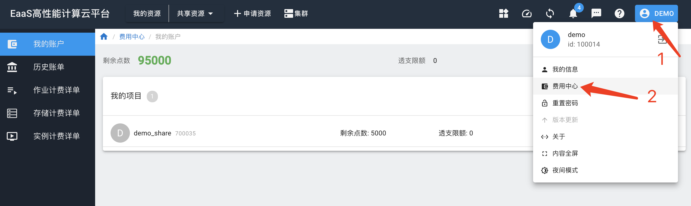

> **10.2.1 给项目转账**

项目的点数由项目管理员从个人账户转账至项目。在“我的账户”-“我的项目”中，点击“转账到项目”。

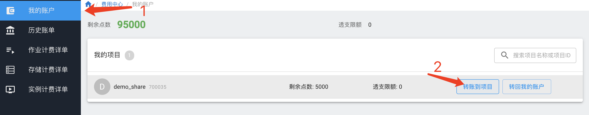

> 在弹出窗口中输入需要转入的项目点数。注意该点数必须 \>0，且不能超过个人账户的点数。

[TABLE]

> **高性能计算云平台用户手册**

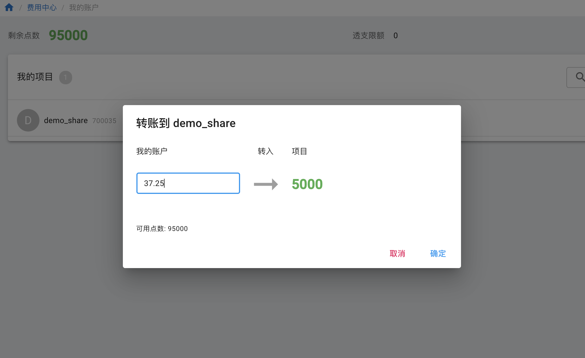

> **10.2.2 转回个人账户**
>
> 项目管理员可以将自己项目的点数转回个人账户。
>
> 在“我的账户”-“我的项目”中，点击“转账到项目”。

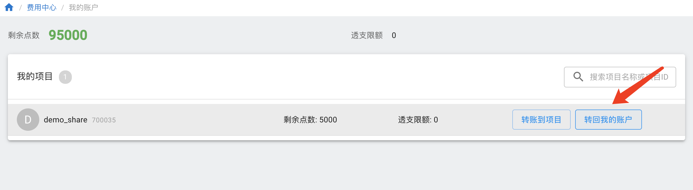

> 在弹出窗口中输入需要转回自己账户的点数。注意该点数必须 \>0，且不能超过项目户的点数。

[TABLE]

**高性能计算云平台用户手册**

> 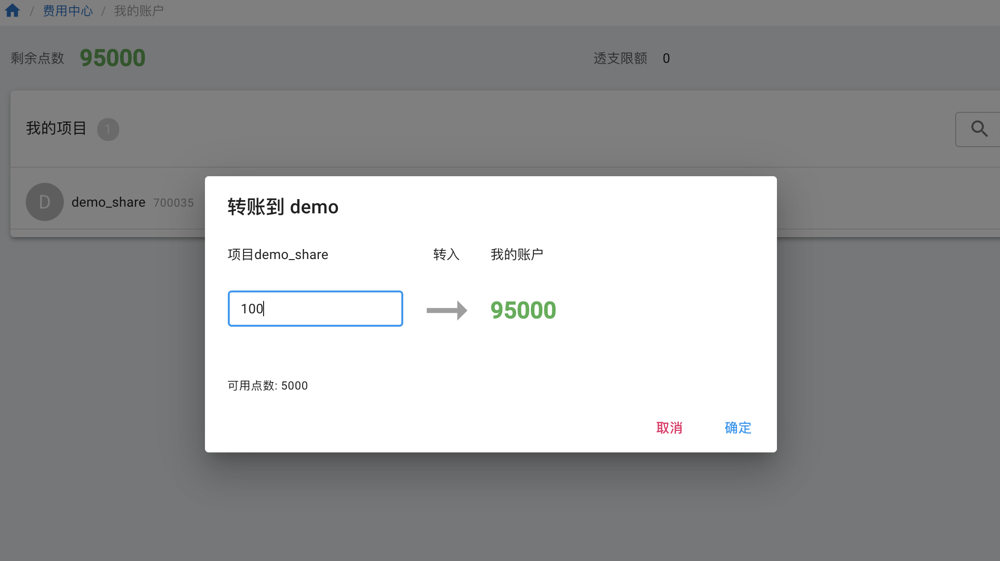
>
> **10.3 历史账单**  
> 用户可以在历史账单中查看所有与点数变动有关的记录，包括充值、资源使用扣费，以及项目组的点数分配。
>
> 用户可以根据账单类型、充值类型、时间和项目名分别查询个人账户和项目账户的点数变动。
>
> 
>
> 可以设置列，显示自己关心的信息。

[TABLE]

> **高性能计算云平台用户手册**

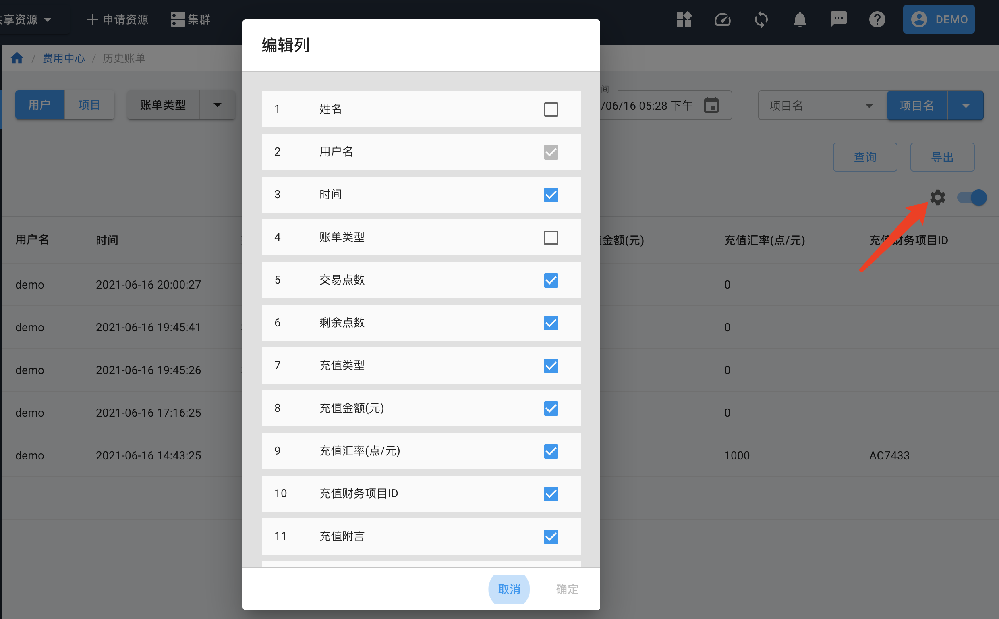

> 用户可以将查询获得的充值记录导出为 csv 格式下载到电脑上进一步处理。

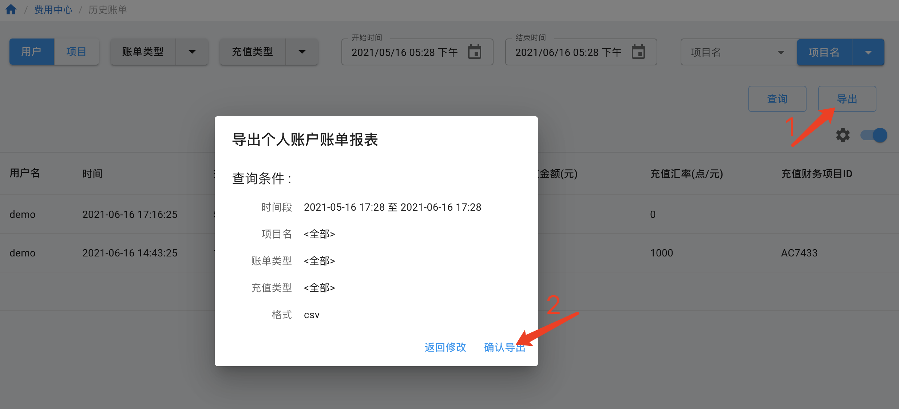

[TABLE]

**高性能计算云平台用户手册**

> **10.4 计费详单**  
> 计费详单详细记录了用户使用的资源情况和费用统计，具体分为作业计费详单、存储计费详单和实例计费详
>
> 单。点数的计算方法可以查看计费方法。
>
> 详单的查询、列设置和导出的操作和历史账单类似，此处不再赘述。

[TABLE]

> **高性能计算云平台用户手册**

[TABLE]

CHAPTER11

Linux 基本操作

> **11.1 搜索文件**  
> find 用于搜索文件  
> find 命令的一般形式为：

[TABLE]

> 参数含义：

[TABLE]

> 使用方法举例如下：

[TABLE]

**97**

> **高性能计算云平台用户手册**
>
> **11.2 获取 Linux 系统信息**
>
> uname -a

[TABLE]

> **11.3 文件打包压缩常用的命令**
>
> gzip：用 gzip 新建的压缩文件为 \*.gz 的文件名，默认的状态下原本的文件被压缩为.gz 的文件名，原文 件就不存在了。
>
> 使用方法：

[TABLE]

> 常见参数：

[TABLE]

> bzip2：用 bzip2 新建的压缩文件为.bz2 的文件名，当压缩文件的名称为.bz、.bz2、.tbz、.tbz2 等时，可 用 bzip2 来解压缩。
>
> 使用方法

[TABLE]

> 常见参数：

[TABLE]

> tar：tar 命令的参数很多，  
> 使用方法

[TABLE]

> 常见参数：

[TABLE]

**高性能计算云平台用户手册**

[TABLE]

[TABLE]

> **11.4 文件编辑命令 vim**
>
> vim 共分为 3 个模式，即一般模式（默认的模式）、编辑模式、命令行模式。3 种模式的作用分别如下：**一般模式**：以 vim 打开一个文件就直接进入了一般模式。在这个模式中，用户可以使用上下左右按键来移动 光标，可以删除字符或删除整行，也可以复制、粘贴文件数据。
>
> **编辑模式**：要编辑文件内容，需要按下”i,I,o,O,a,A,r,R”等任何一个字母来进入编辑模式。通常在 Linux 中，按下这些按键时，在界面的左下方出现 INSERT 或 REPLACE 的字样，此时才可以进行编辑。如果要回到一 般模式，则必须按下 ESC 按键退出编辑模式。
>
> **命令行模式**：在一般模式中，输入”:、/、?”3 个中的任何一个按键，光标会移动到最下面一行。在此模式 中，可以提供查找数据的操作，而读取、保存、大量替换字符、离开 vim、显示行号等操作均是在此模式中 完成的。
>
> 使用 vim 的常用命令快捷按键：  
> 在一般模式底下输入：i, I, a, A 为在本行当中输入新字符；（出现 “-Insert-“ ）  
> 在一般模式当中输入：o, O 为在一个新的一行输入新字符；  
> 在一般模式当中输入：r, R 为取代字符！（左下角出现 -Replace-）  
> 如何由编辑模式跳回一般模式？\[Esc\]  
> 若上下左右键无法使用时，请问如何在一般模式移动光标？h, j, k, l  
> 若 \[pagedown\] \[ pageup\] 在一般模式无法使用时，如何往前或往后翻一页？\[Ctrl\] + \[f\] \[Ctrl\] + \[b\]  
> 如何到本档案的最后一行、第一行；本行的第一个字符、最后一个字符？G, 1G, 0, \$  
> 如何删除一行、n 行；如何删除一个字符？dd, ndd, x 或 X （dG 及 d1G 分别表示删除到页首及页尾）如何复制一行、n 行并加以贴上？yy, nyy, p 或 P  
> 如何搜寻 string 这个字符串？?string (往前搜寻) /string (往后搜寻)  
> 如何取代 word1 成为 word2，而若需要使用者确认机制，又该如何？:1,\$s/word1/word2/g 或 :1,\$s/ word1/word2/gc （需要使用者确认）
>
> 如何读取一个档案 filename 进来目前这个档案？:r filename  
> 如何另存新档成为 newfilename？:w newfilename  
> 如何存盘、离开、存盘后离开、强制存盘后离开？:w； :q： :wq； :wq!
>
> 如何设定与取消行号？:set nu :set nonu

[TABLE]

> **高性能计算云平台用户手册**
>
> 类似的编辑修改文件命令还有：nano、vim、emacs 等，请参考各软件相应的帮助手册。
>
> **11.5 显示列出目录下的文件 ls**
>
> ls 最常用的参数有三个：-a、-l、指定目录，参数可混合使用。
>
> ls -a Linux 上的文件以“.”开头的文件被系统视为隐藏文件，仅用 ls 命令是看不到它们的，而用 ls -a 除了 显示一般文件名外，连隐藏文件也会显示出来。超算中心用户经常需要操作的隐藏文件是 ~/.bashrc 文件，用 于设定使用程序的环境变量。
>
> ls -l（这个参数是字母 L 的小写，不是数字 1）以更加详细的信息方式显示目录下文件的属性。超算中心 用户经常需要注意的是，查看需要调用的程序是否有可执行权限。指定目录 ls 命令之后，指定一个目录，
>
> 用于显示列出指定目录下的所有文件。
>
> **11.6 查看文件内容命令 cat**
>
> cat 是 concatenate 的简写，它的功能是显示或连结一般的 ascii 文本文件。cat 会将文件里的内容全部显示 出来。当文件内容过多，一个屏幕显示不全时，可使用类似功能的操作命令，head、less、more、tail
>
> 等，区别是它们每次仅显示部分内容。
>
> 它的用法如下：
>
> cat text 显示 text 这个文件里的内容。
>
> cat file1 file2 依顺序显示 file1,file2 的内容。
>
> cat file1 file2\>file3 把 file1,file2 的内容结合起来，再“重定向（\>）”到 file3 文件中。
>
> \> 是往右重定向的意思，就是把左边的结果当成是输入，然后输入到 file3 这个文件中。这里要注意一点是 file3 是在重定向以前还未存在的文件，如果 file3 是已经存在的文件，那么它本身的内容被覆盖，而变成 file1+file2 的内容。
>
> 如果\> 左边没有文件的名称，而右边有文件名，例如：cat \>file1 结果是会“空出一行空白行”，等待你
>
> 输入文字，输入完毕后再按 \[Ctrl\]+\[c\] 或 \[Ctrl\]+\[d\]，就会结束编辑，并产生 file1 这个文件，而 file1 的内容就 是刚刚输入的内容。
>
> 另外，如果你使用如下的指令：cat file1\>\>file2 两个\>，这将变成将 file1 的文件内容“附加”到 file2 的文件后面，而 file2 的内容依然存在。
>
> **11.7 获取命令的帮助手册**
>
> 一般参数说明可在命令名后加-h 或--help，详细的命令帮助与参数说明可用 man、info 命令。
>
> 例如命令 ‘*ls‘*的帮助信息：ls --help 或 man ls 或 info ls 或者使用 baidu、google 等搜索相关的帮助信 息。

[TABLE]

**高性能计算云平台用户手册**

> **11.8 重命名、移动、复制命令**
>
> 重命名、移动命令：mv  
> 重命名文件可以理解为对原文件进行移动，保存成另一个名称的新文件，并将原文件删除。移动文件则可以 将文件移动到当前目录下，或指定的其他目录下。
>
> 新建删除命令：touch、mkdir、rm  
> 新建普通文件命令：touch，也可以用 cat、vi 等命令完成 新建目录命令：mkdir，即 make directory 的意思。
>
> 删除文件命令：rm，即 remove 的意思。执行此命令需要小心，删除后的文件将无法恢复。
>
> 复制命令：cp、scp  
> 复制命令 cp，即 copy 的意思，用于复制一个文件在当前目录下或指定的另一个目录下。
>
> scp 命令用于跨节点或远程服务器之间的复制操作。

[TABLE]

> **高性能计算云平台用户手册**

[TABLE]

CHAPTER12

Conda

> **12.1 应用介绍**
>
> 是一个用于科学计算的 Python 发行版，支持 Linux、Mac、Windows 系统以及 Python、R 等科学计算 语言，提供了包（Package）管理与环境（Environment）管理的功能，可以很方便地解决多版本多环境并存的 问题。用户可以为某项具体的任务创建单独的环境，环境之间相互隔离。这样可以避免同一环境中各类软件
>
> 相互冲突的问题。Anaconda 利用 conda 命令来进行包和环境的管理，并且已经包含了 Python 和相关的配 套工具。

[TABLE]

> **12.2 使用指南**
>
> **12.2.1 增加源**
>
> Anaconda 默认的软件源在国外，速度比较慢，可以将其更换为清华源，详见的说 明。
>
> 系统内已经安装了 Anaconda 应用，同时保存 Miniconda 的安装包。

在安装无需向 anaconda 目录写入内容的包时，可以通过配置环境变量使用，即在.bahsrc 中添加路径即可。

[TABLE]

> 编辑路径，在脚本末尾添加 export PATH=/opt/app/anaconda3/bin:\$PATH
>
> 然后运行命令 source ~/.bashrc 使配置的环境变量生效。
>
> 如果在使用 conda 时，遇到没有权限写入等错误，则需要在自己路径下安装 Miniconda。
>
> Miniconda 在路径：/opt/app/anaconda3/Miniconda3-latest-Linux-x86_64.sh

**103**

> **高性能计算云平台用户手册**
>
> 将该安装包复制到自己路径下，然后输入如下命令进行安装，安装完成后即可使用。

[TABLE]

> **12.2.2 环境管理**
>
> 使用 Anaconda，默认情况下是在 base 环境中，base 环境有一些基础的工具，可以直接在这个环境下安装 软件，也可以创建新的环境，在新环境下安装软件。
>
> **创建新环境**

[TABLE]

> \<env_name\> 即创建的环境名。建议以英文命名，且不加空格，名称两边不加尖括号“\<\>”。
>
> \<package_names\> 即安装在环境中的包名。名称两边不加尖括号“\<\>”。如果要在新创建的环境中创建多 个包，则直接在\<package_names\> 后以空格隔开，添加多个包名即可。例如，创建一个名为 py37 的环 境，环境中安装版本为 3.7 的 python，同时也安装了 numpy 和 pandas：

[TABLE]

> 新的环境以及环境内的包会被安装到/home/yourname/.conda/envs/目录下。
>
> **切换环境**
>
> 切换环境：

[TABLE]

> 当成功切换环境之后，在该行行首将以“(env_name)”开头。其中，“env_name”为切换到的环境名。例如切换到新建的 py37 环境：

[TABLE]

> 退出环境：

[TABLE]

> 退出环境后，会切换至 base 环境。
>
> **复制环境**

[TABLE]

\<new_env_name\> 为复制的新环境名称，\<new_env_name\> 为原有的环境名称。环境名两边不加尖括号“\<\>”。由于 conda 不支持重命名环境，如果要重命名，可以通过先复制一个新环境，再删除原来环境。

[TABLE]

**高性能计算云平台用户手册**

> **显示环境**

[TABLE]

> **删除环境**

[TABLE]

> 注意：\<env_name\> 为被删除环境的名称。环境名两边不加尖括号“\<\>”。
>
> **12.2.3 包管理**  
> **获取当前环境中已安装的包信息**

[TABLE]

> **在指定环境中安装包**

[TABLE]

> 注意：  
> 1. \<env_name\> 即将包安装的指定环境名。环境名两边不加尖括号“\<\>”。
>
> 2\. \<package_name\> 即要安装的包名。包名两边不加尖括号“\<\>”。3. 不加-name \<env_name\>，则安装到当前所在的环境。
>
> **卸载包**

[TABLE]

> **12.2.4 pip**  
> 相比 Anaconda，pip 可以安装的包更多。用户可以先切换到所需环境，再在环境中执行 pip install \<package_name\>。
>
> **12.2.5 ARM 下编译和安装 Conda**  
> 执行脚本安装：

[TABLE]

> 请按照提示输入相关的信息进行安装。  
> 然后配置环境变量：

[TABLE]

> **高性能计算云平台用户手册**

[TABLE]

> 输入 conda -v 查看 Conda 版本确认已安装完成。
>
> **12.3 命令参考**

[TABLE]

> **12.4 常见问题**

[TABLE]

CHAPTER13

公共集群

> **13.1 应用介绍**  
> 公共集群适合对 Linux 命令行和作业调度系统比较熟悉的用户。
>
> **13.2 使用指南**  
> 请参见集群登录 和作业系统 。
>
> **13.3 常见问题**  
> **13.3.1 1. 如何在集群中使用个人目录和项目中的数据？**
>
> **home 目录路径**

[TABLE]

> 以用户 demo123 为例，该用户为某项目组成员，该项目组的 id 为 700008，则对应的各个 home 目录为：

[TABLE]

**107**

> **高性能计算云平台用户手册**
>
> **详细说明**
>
> 公共集群进入后，默认是进入集群的 home 目录 /home/\<username\> ，WEB 页面对应的是“工作台”-“数 据总览”-“public_cluster”的数据。
>
> 公共集群 home 目录内，只有当前用户有读写权限，集群其他用户无法访问。
>
> 公共集群 home 目录下的 share 目录是集群共享目录，集群中所有用户都可以读写。如果是希望共享的数 据，需要放在 share 目录下。
>
> 下面以用户 demo123 为例，其中 a.txt 只有当前用户有访问权限，share 目录下的文件所有集群用户都 能访问。

[TABLE]

> 如果希望在集群中使用个人 home 目录中的数据，路径为 /users/\<username\> 。集群中的个人 home 目录 只有本人可以访问。

[TABLE]

> 如果希望在集群中使用项目目录中的数据，路径为 /groups/\<project id\>/home/\<username\> 。项目 目录数据的访问权限请参见项目数据 。
>
> 项目 ID 在项目基本信息中查询。

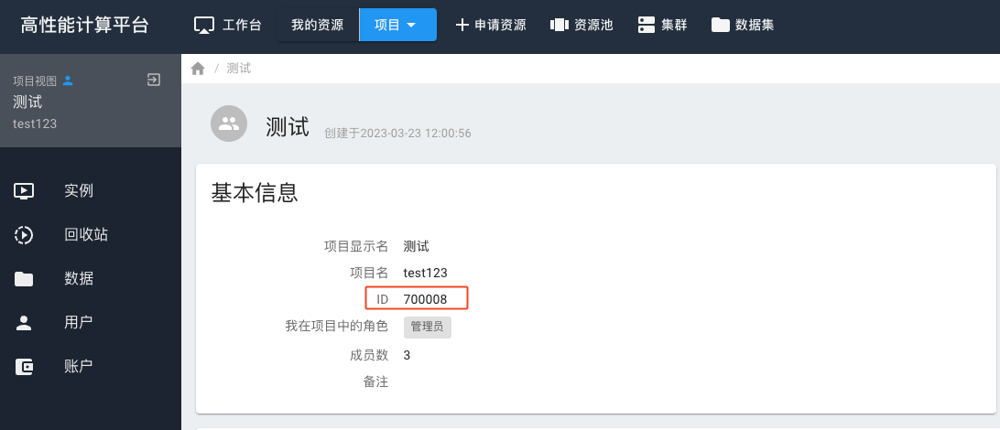

[TABLE]

[TABLE]
