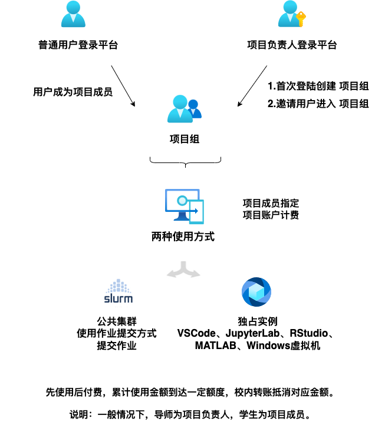

# 前言

## 简介

中国人民大学校级计算平台（Public Computing Cloud, Renmin University of China）以算力和数据赋能各学科发展，是由学校大型科学仪器共享平台（简称“共享平台”）直管的成套大型仪器。

学校先后于2017年、2020年、2023年投资建设，目前共有114台计算节点，CPU节点88台，GPU计算节点26台，4台存储，2台登录管理节点，存储空间1PB（高性能全闪存储250TB）。高端GPU卡共计146块，均为NVIDIA a100、a800等高端人工智能计算卡。

## 首次使用指南

整个平台使用流程如所示。

也可先观看下面的入门视频。视频主要内容为**使用必读**中的绝大多数内容，并进行了演示：计算平台管理方式、教师用户创建课题组并管理学生用户、计算平台三种使用方式、数据上传和管理。

文字版推荐阅读顺序为：阅读**使用必读**中的绝大多数内容，包括：

1. 教师用户对自己的[课题组](./manual/project.md)进行创建，管理学生用户，了解[计费机制](./manual/bill.md)。
2. 根据自己对各类软件工具和计算机的掌握程度，选择适合自己的[使用模式](./manual/usage-mode.md)，选择适合自己的方式登录和传输数据。
3. 根据自己的计算需求，在**软件使用**中选择相对应内容详细阅读。

!!! warning "使用前请注意！"
    1. 计算平台采取**计费和奖励**的管理模式，用户首次使用前**务必仔细阅读本用户手册后再进行操作**。学生用户需经导师同意后方可使用，学生计算所产生的费用将记在导师名下。所产生的科研成果需要标注本平台，成果可作为奖励抵消计算费用。[管理办法与收费奖励机制](./regulation.md)。
    2. 计算平台是学校投资的教学科研基础设施，计费政策主要目的不在于收费，而在于调节资源，避免乱用滥用，根据以往经验，绝大多数的用户可以通过论文奖励覆盖所产生的费用，请大家不要因为计费收费等而放弃使用。
    3. 校级计算平台平台是学校的公共服务，应避免在其上进行任何非科学计算类的行为，否则将影响他人正常使用。非计算行为包括但不限于恶作剧、挖矿、网络攻击、编写恶意程序导致服务器宕机等。一经发现，将取消该用户使用权，情况恶劣的，将通报教务处和学院，并依相关校规校纪处理。
    4. 平台无法保证100%的数据安全和数据恢复功能，重要数据请及时、定期备份。
    5. 严禁进行涉密项目的计算。

## 标注和致谢

### 成果标注

对在科研成果、项目、奖项中明确标注或致谢计算平台并及时反馈成果产出的用户，计算平台将返还一定奖励机时。中文标注格式为：“本研究获得中国人民大学校级计算平台支持”，英文标注为：“This research was supported by Public Computing Cloud, Renmin University of China”。

### 科研项目申请

科研项目申请书中，一般都需要填写开展研究的保障条件或资源条件。如果用户有此需求，建议参考下面的介绍文字：

!!! note "以下文字可用于科研项目申请"

    中国人民大学建设有校级计算平台，提供计算和数据服务，由学校专门单位和专职技术人员管理和维护，同时学校实施了相应的制度来规范计算资源的管理和使用。目前共有114台计算节点，CPU节点88台，GPU计算节点26台，4台存储，4台登录管理节点，存储空间1PB（高性能全闪存储250TB）。高端GPU卡共计146块，均为NVIDIA a100、a800等高端人工智能计算卡，能够为前沿人工智能计算提供必要算力支持。校级计算平台集计算设备、技术支持、管理制度三位一体，为本项目研究工作的顺利开展提供了基础资源的保证。

## 成果反馈

请填写微人大[表单](https://v.ruc.edu.cn/servcenter/front/form/draw/10357)反馈相关科研成果。

## 缴费

经费科目：

* 纵向经费：业务费（2022年以后），测试化验加工费（2022年以前）
* 横向经费：业务费

缴费流程与其他劳务费、日常报销相似，只不过需要填写下面结算单，然后送至财务处：

1. 计算平台填写结算单中金额部分，用户填写经费部分，详见[结算单模板](./files/中国人民大学大型科学仪器开放共享服务费用结算单-校内用户.pdf)
2. 项目负责人签字盖章，大型科学仪器共享平台盖章，送至财务处指定窗口

## 联系我们

如有其他问题，也可以按照如下方式联系我们。

1. 电话：010-82503969
2. 邮箱答疑：<hpc@ruc.edu.cn>
3. 微信公众号发布通知：gxrdruc