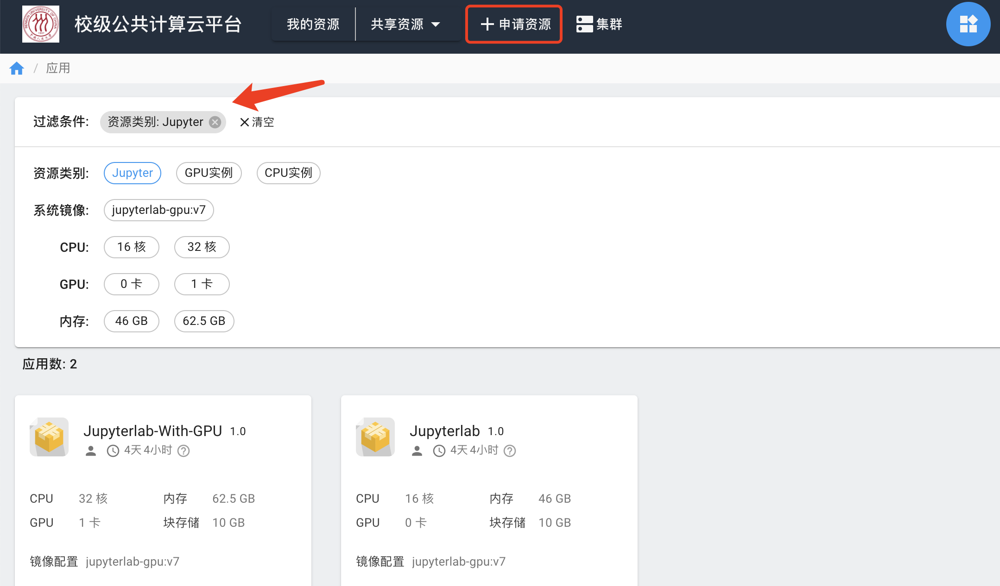
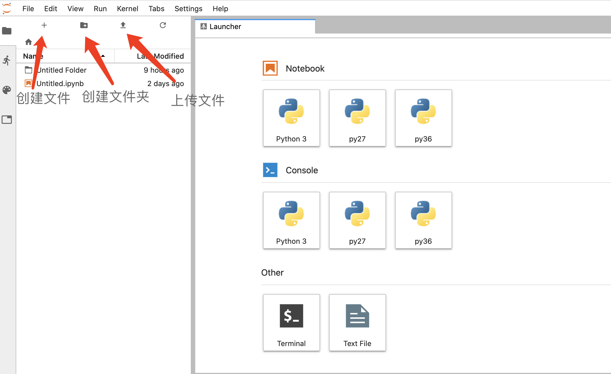
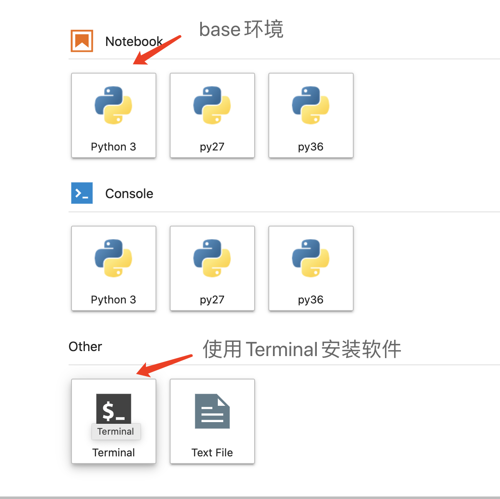
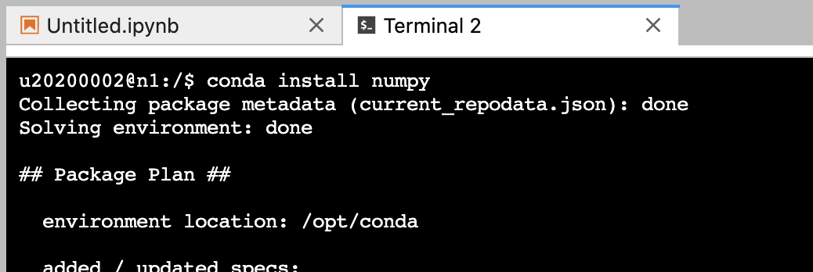

# JupyterLab

JupyterLab是下一代Jupyter Notebook，它集成了更多功能，是一个集成开发环境。我们提供了CPU版本和GPU版本的实例，其中，GPU版本的实例使用的显卡为NVIDIA GeForce 2080 Ti。

## 1. 申请实例

JupyterLab属于交互实例，在计算平台上使用时，需要先申请资源。首先点击“申请资源”，然后在所有应用中过滤出Jupyter。我们准备了CPU版和GPU版的镜像，用户按需申请。



## 2. 使用JupyterLab

启动好后，即可进入Jupyter交互界面。用户可以前往[JupyterLab的官方文档](https://jupyterlab.readthedocs.io/en/latest/)学习详细使用方法。



!!! tip "提示"
    在计算平台上，我们强烈建议用户使用 Anaconda 来管理和使用Python和R。我们已经在 Jupyter 交互实例上安装好了 Anaconda 。`conda` 命令的使用方法可以详见我们提供的[conda/mamba入门教程](../app/conda.md)。

用户进入Jupyter后默认使用`/opt/app/anaconda3/bin`下的`conda`和`python`。其中，Python3为Anaconda`base`环境提供的Python。



## 3. 拷贝粘贴

如果个人电脑是 Windows，JupyterLab 里粘贴的快捷键是：“Ctrl + Shift + V”。多增加了一个 “Shift”。

## 4. 安装包

如果用户希望安装自己的软件包，需要启动一个Terminal，在Terminal中执行下列操作。

我们强烈建议用户使用`conda` 或 `mamba` 创建属于自己版本的Python，这样有几个好处：

1. Python生态中各个包版本迭代速度很快，基于不同的环境，可以使用不同的包版本。
2. 可以为某项任务、某个工程创立单独的环境，环境之间相互隔离，方便相互切换。
3. 如果不创建单独环境，当默认环境中的包越来越多时，包与包之间会产生一些冲突，导致整个环境不可用。创建单独的环境可以避免包冲突。

```bash
conda create -n <env_name> <package_names>
```

`<env_name>` 即创建的环境名。建议以英文命名，且不加空格，名称两边不加尖括号“<>”。

`<package_names>` 即安装在环境中的包名。名称两边不加尖括号“<>”。如果要在新创建的环境中创建多个包，则直接在`<package_names>`后以空格隔开，添加多个包名即可。例如，创建一个名为`python3`的环境，环境中安装版本为3.7的python，同时也安装了`numpy`和`pandas`：

```bash
conda create -n python3 python=3.7 numpy pandas
```

使用`conda install`或`pip install`命令来安装所需软件包。

```bash
# 使用 conda 安装
conda install numpy

# 使用 pip 安装
pip install lightgbm
```

如下图所示：



安装好之后，我们就可以在Notebook中使用这些包了。

## 5. 在多个环境之间切换

如果创建了新的环境，并且在Notebook中使用这个环境，必须安装`ipykernel`包。`ipykernel`帮助我们管理多个环境中的Kernel。

```bash
conda create -n <env_name> python=3.7 ipykernel
```

上面的代码在创建环境时安装了Python 3.7，同时也安装了`ipykernel`包。`<env_name>` 即创建的环境名。建议以英文命名，且不加空格，名称两边不加尖括号“<>”。

如果创建环境时忘了安装`ipykernel`，也可以后续手动安装这个包：

```bash
conda install -n <env_name> ipykernel
```

激活环境：

```bash
source activate <env_name>
```

将环境写入Notebook的Kernel中：

```bash
python -m ipykernel install --user --name <env_name> --display-name "<env_name>"
```

这时，我们已经将新环境中的安装好。关闭当前JupyterLab页面，并在“我的资源”中重新打开这个JupyterLab交互界面。点击JupyterLab左上角的“+”就可以启动一个`env_name`环境的Notebook，也可以在“Kernel”->“Change Kernel...”将当前Notebook切换为`env_name`。

## 6. 实例的关停与资源释放

当不需要进行计算时，应及时关停这些计算资源。

1.在“我的资源”中点击图中的停止按钮，对实例进行关停操作。


2.点击释放资源按钮释放所分配的资源。释放后，该实例进入回收站，可在“资源回收”中找到。


3.下次使用时，可不必重新申请资源，只需在“资源回收”中点击“恢复分配”按钮。


!!! note "软件和数据"
    用户可以在实例中安装自己所需的软件或开发包、上传自己的数据，比如使用`conda`安装Python包。释放资源后，这些软件依然保存在镜像中，下次使用，可以在“资源回收”页面恢复，该实例将恢复至“我的资源”页面，这些软件和数据不会被清理删除，用户可继续使用它们。

## 6. VSCode Remote和个人电脑SSH客户端

我们也可以将申请到的 JupyterLab 当作一个虚拟机，使用本地的客户端例如 VSCode 远程登录到 JupyterLab 中进行开发。需要参考[SSH客户端免密登录](../manual/ssh.md)中提供的方法，具体而言，需要：

1. 设置免密码登录：将个人电脑中的 SSH Key 添加到JupyterLab中的 `~/.ssh/authorized_keys` 中。

2. 在个人电脑上配置 VSCode Remote，远程登录到计算实例上。

