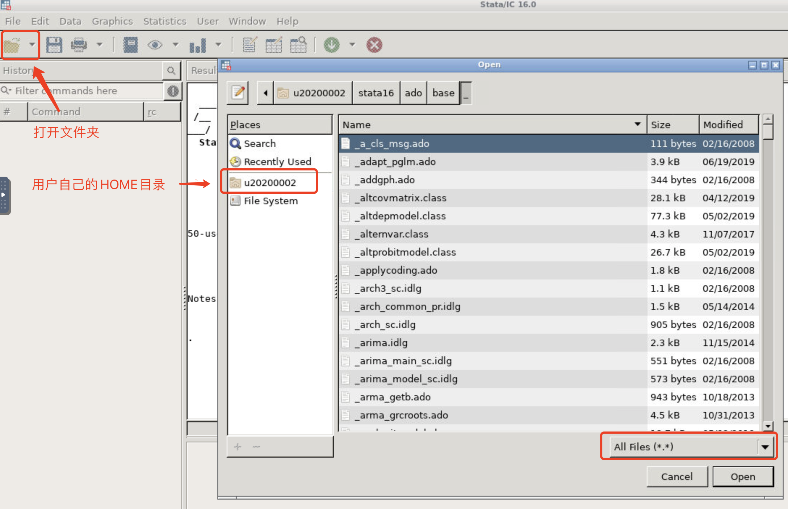

# Stata

Stata是一款集数据分析、数据管理以及图表绘制等多功能的统计软件，经常被用在经济和金融领域。

## 交互实例

### 申请资源和启动

我们已经提供了交互实例版本的 Stata，如果需要图形化界面，请点击“申请资源”，寻找到名为“Stata”的实例。接着给您的实例起个作业名，方便识别和记忆。

“分配中”，表示正在排队。分配好资源后，点击启动按钮：

启动好后，点击“远程桌面”，登录到远程桌面，进入远程桌面后，Stata已经在启动。

### 文件管理

本Stata为Linux操作系统版本，其功能与绝大多数的Windows、macOS操作系统下的Stata使用习惯几乎一致，只是在文件夹目录结构稍有区别。

用户的代码和数据可以使用“我的资源”->“数据管理”来上传，上传之后的目录为用户的HOME目录，关于HOME目录的介绍，详情参考[数据管理和文件传输](../manual/transfer.md#linux)。

用户自己的`.ado`或数据文件通过“数据管理”模块上传后，即上传到了用户自己的HOME目录。在Stata里可以点击左上角的打开按钮，打开文件和文件夹。

如果上图中文件显示为空，注意选择为“All Files(*.*)”。