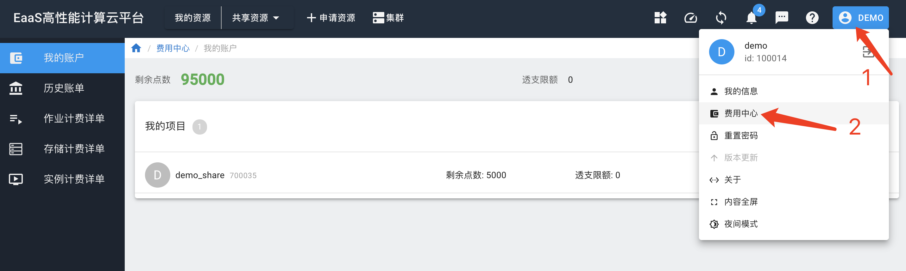
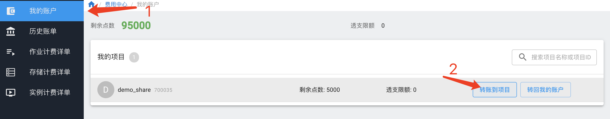
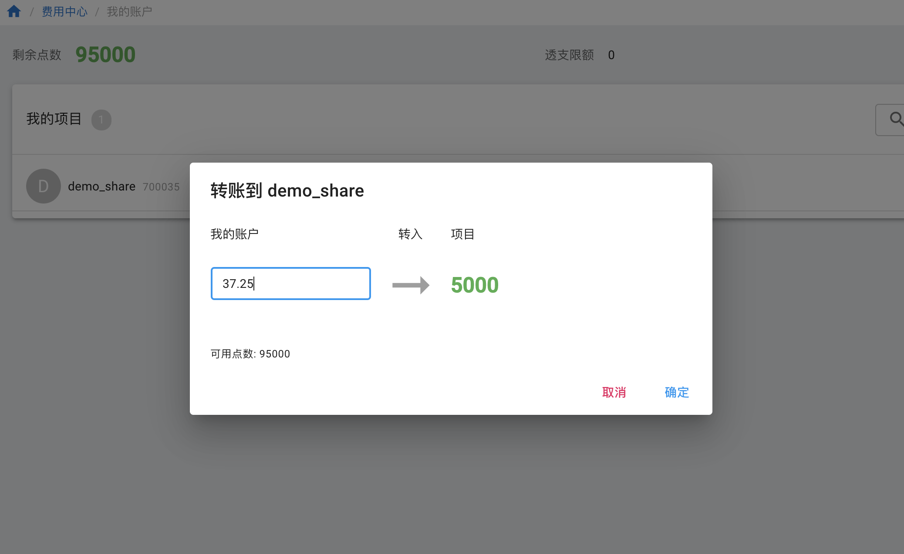
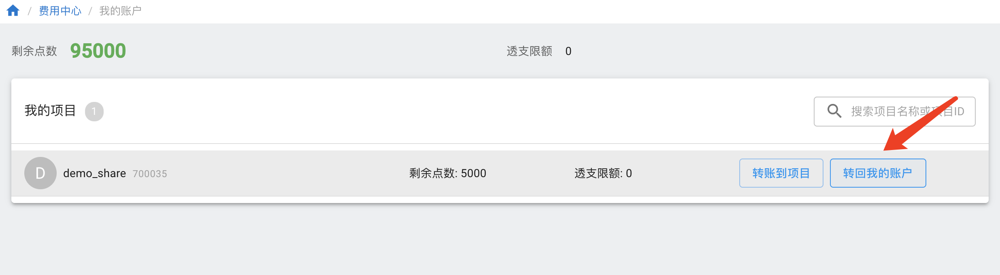
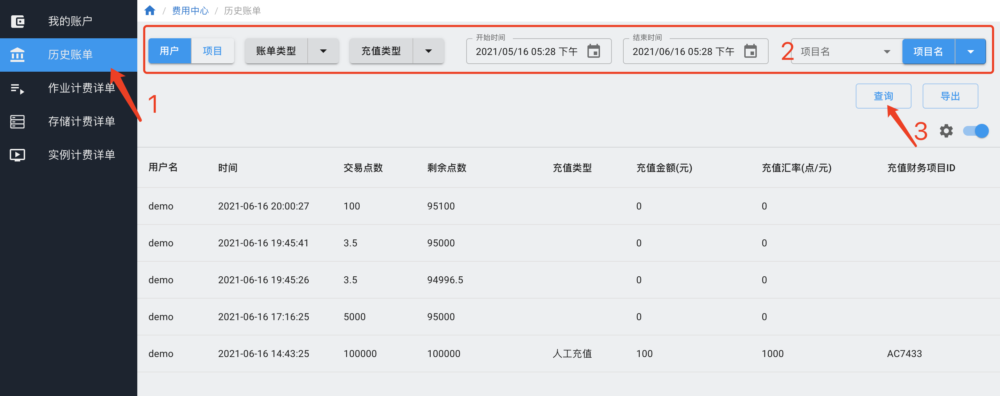
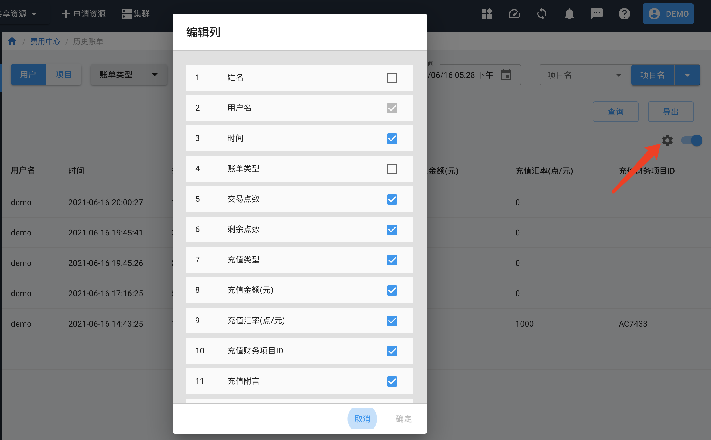
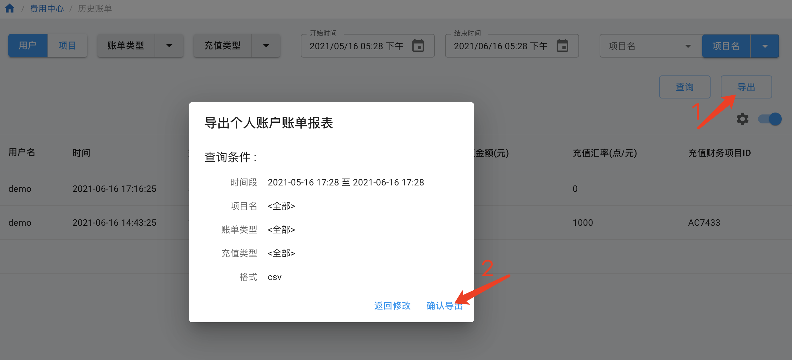
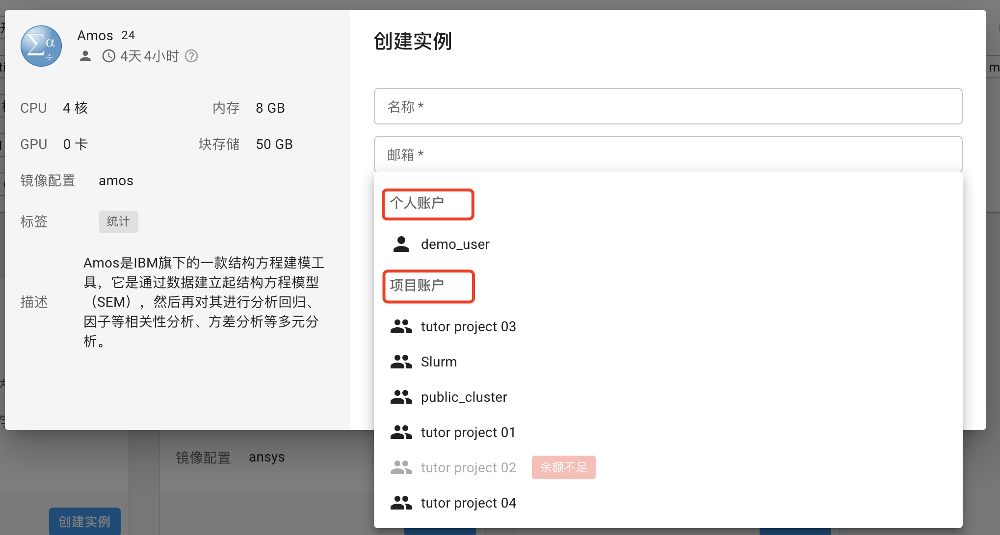

# 计费统计

类似于信用卡消费，计算平台采用先使用后付费的形式，每个教师都有一定可透支的机时点数额度（目前为50,000机时点），超过该额度后需要使用科研经费冲销透支。

教师用户个人使用，使用时会从教师个人账户中计费。

一个课题组完整的计费流程为：

1. 教师创建课题组项目（只需创建一次），在课题组项目内邀请学生等其他用户。按照下文账户管理内容，将个人账户中的机时点转至课题组中。
2. 定期查看课题组内各学生用户使用情况。
3. 将相关成果反馈给计算平台，计算平台根据管理办法，将成果折算成奖励机时点数到教师账户中。
4. 使用超出额度后，将无法使用计算资源，联系校级计算平台缴费充值。

## 1. 课题组项目

我们目前主要有两类用户，学生用户和教师用户。每位用户都有机时点数额度，如账户内无额度，则无法使用计算资源。学生应依托教师，教师将学生拉入课题组后，学生可使用教师课题组额度。

学生用户使用前，请先联系教师按照[课题组团队管理](./project.md)中的方式创建课题组，让教师拉入相应课题组，获得课题组项目的名称`tutor_project`。

## 2. 计费方法

### 2.1 账户与计费方式

计算平台允许教师用户先使用后付费，即先使用预设的可透支的额度（50000），超出透支额度时，使用科研经费冲销透支额度。

冲入计算平台的费用被称为**机时点数**，机时点数 = 充值金额 × 充值汇率。校内用户充值汇率为3.3，即：校内用户在实际充值时享受30%折扣，或者说：实际充值金额 = 30% × （实际使用产生的点数 - 反馈科研成果奖励点数）。

系统的扣费账户分为两类，一类是个人账户，一类是课题组项目账户。用户使用计算资源时，可以指定是从个人账户计费还是从课题组项目账户计费。

教师账户的机时点数需要联系计算平台管理人员充值，教师所负责课题组项目帐户的点数从教师个人账户内转至课题组项目账户。

用户的实例或作业完成后，系统根据资源使用类型、时长和计费权值机时。

机时点数计算公式：

Sum(Res × Time × Weight)

* Res 是资源数量，比如CPU核数，GPU卡数。
* Time 是资源运行时长。
* Weight 是计费权值。计费权值是调节不同资源价格的参数，可以将不同类型的资源，折算成统一的机时点数。
* Sum 是对不同类型资源求和。

!!! tip "机时点数示例"
    32核CPU节点使用2小时，CPU的Weight为0.1，机时点数为：32 × 2 × 0.1 = 6.4。

    64核+2卡Tesla GPU节点使用2小时，CPU的Weight为0.1，Tesla GPU的权重为2，机时点数为： 64 × 2 × 0.1 + 2 × 2 × 2 = 20.8。

### 2.2 运行时长

共享集群作业运行时长：用户在共享集群中通过提交作业的形式来进行批量计算。作业启动开始收费，停止时结束收费。

交互式实例运行时长：用户申请到交互式资源，不管是否进行计算，从资源分配后，即开始收费，直到资源释放结束收费（如下图，点击“已分配”后释放资源，计时结束）。


教师用户有透支额度，允许用户在欠费的情况继续使用。

比如用户已经欠费1800机时点数，但是透支额度为50,000机时点数，则用户可以运行新的实例或提交作业。如果欠费超过50,000机时点数，则无法再运行实例或提交作业。

## 3. 费用管理与查询
### 3.1 个人账户

点击右上角的用户名称，在下拉菜单中选择“费用中心”，进入“我的账户”查看个人账户信息，包括账户中的剩余点数，可透支的额度，以及个人创建的项目账户的剩余点数和可透支额度。



### 3.2 教师用户给项目组转账

项目的点数由教师用户从其个人账户转账至课题组项目。在“我的账户”-“我的项目”中，点击“转账到项目”。



在弹出窗口中输入需要转入的项目点数。注意该点数必须>0，且不能超过个人账户的点数。



### 3.3 转回个人账户

项目管理员可以将自己项目的点数转回个人账户。

在“我的账户”-“我的项目”中，点击“转账到项目”。



在弹出窗口中输入需要转回自己账户的点数。注意该点数必须>0，且不能超过项目户的点数。

### 3.4 历史账单

用户可以在历史账单中查看所有与点数变动有关的记录，包括充值、资源使用扣费，以及项目组的点数分配。

用户可以根据账单类型、充值类型、时间和项目名分别查询个人账户和项目账户的点数变动。



可以设置列，显示自己关心的信息。



用户可以将查询获得的充值记录导出为 `csv` 格式下载到电脑上进一步查看。



### 3.5 计费详单

计费详单详细记录了用户使用的资源情况和费用统计，具体分为共享集群作业计费详单、存储计费详单和交互式实例计费详单。 

详单的查询、列设置和导出的操作和历史账单类似，此处不再赘述。

存储按天计算点数。虽然提供计费详单，但不会从个人账户或项目账户里扣费。

## 4. 选择计费账户

### 4.1 交互式实例

用户在创建交互式示例时，选择需要计费的账户。学生用户应选择导师课题组项目。



### 4.2 共享集群

在Slurm作业提交脚本中加入如下参数:

```bash
#SBATCH --comment tutor_project
```

或是在提交作业时，在命令中上加上参数 `--comment tutor_project` ，例如：

```bash
salloc --comment tutor_project 
```

如果不加`--comment` 参数，则默认从个人账户扣费。

!!! warning "计费报错"
    提交作业时如果报错`invalid account or account/partition combination specified`，可能的原因有：
    
    1. `tutor_project`名称没写对，要注意大小写一致。
    
    2. 账户余额不足，超过透支额度。