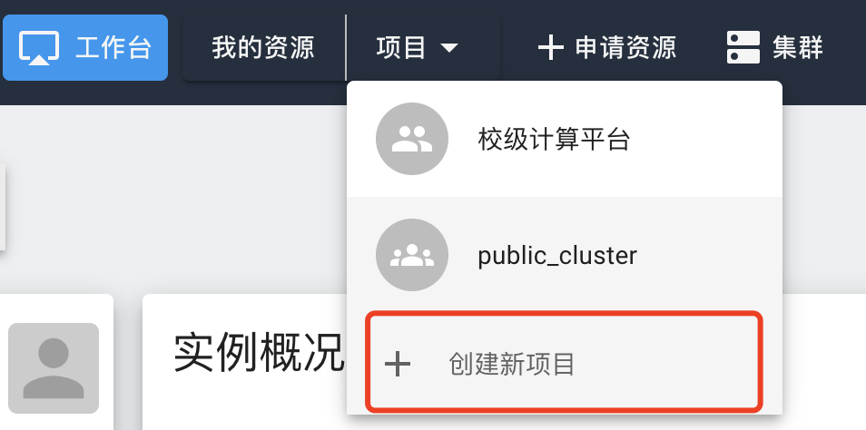
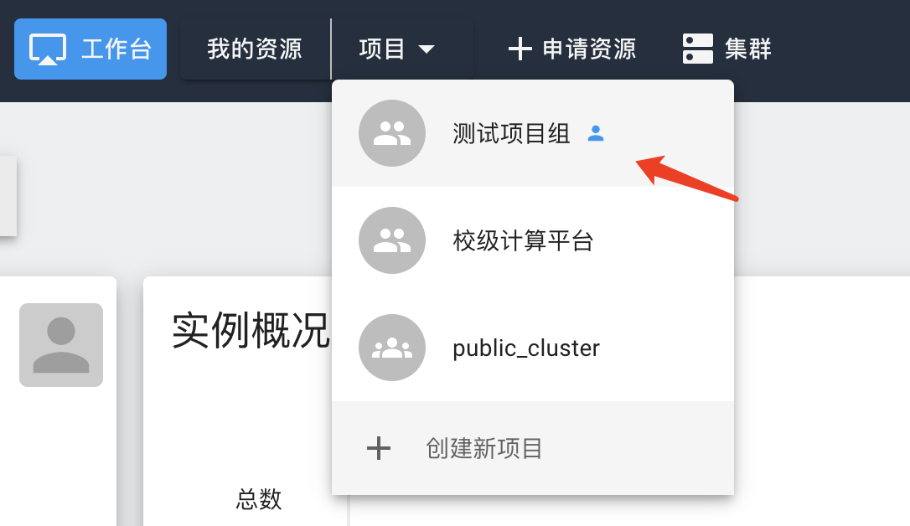
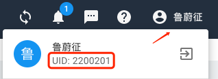
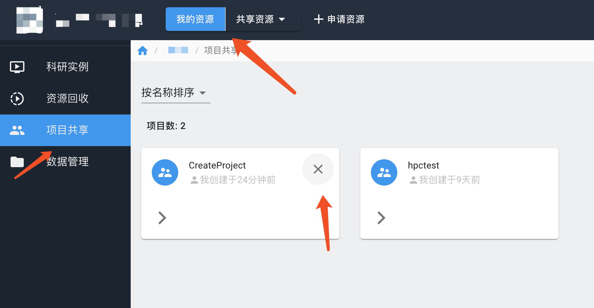

# 课题组团队管理

## 1. 课题组项目的创建

我们目前主要有两类用户，学生用户和教师用户。每位用户都有机时额度，如账户内无额度，则无法使用计算资源。学生应依托教师，教师将学生拉入课题组后，学生可使用教师课题组额度。教师使用科研经费支付本人和学生所产生的计算费用。

为对自己课题组的学生进行各类管理，**教师用户**应注册本平台，创建自己的课题组项目。

项目名：即课题组项目英文名，（本手册后续称为 `tutor_project`），只能由字母、数字、下划线组成。建议为 **学院名英文缩写_教师姓名拼音** 或 **学院名英文缩写_实验室团队英文名**，最好有一定区分度。课题组项目名称（`tutor_project`）是一个重要概念，学生在申请计算资源时，需要使用这个名称，并将相关费用计入该名下。

项目别名：可以是中文。

## 2. 项目成员管理

待项目创建完毕后，点击“共享资源”选择新创建的项目，进入课题组项目管理界面。

在课题组项目管理页面中的“用户”栏，填写想邀请的用户id，对本课题组的成员进行添加或移除。

!!! warning "获取用户id"
    邀请用户前，需要被邀请用户提供用户id（注意，不是学号），用户id为系统右上角，点击姓名处的id。
    
    

用户接受邀请后，就可与同项目组的成员共享数据。

管理员还以可以移出项目成员，或是更改成员权限。

## 3. 删除项目

课题组项目创建者在“我的资源”界面中选择“项目管理”，找到需要删除的项目，点击项目卡片右上角的删除按钮。

