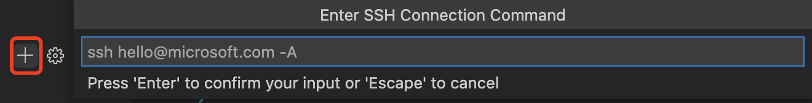

# 使用SSH客户端

首先，我们需要获取目标实例的SSH登录信息。在“我的资源”中找到自己的实例，这里以“public_cluster”为例，点击右边的SSH连接信息，会显示该实例的IP和端口号：


## 1. 免密码登录

SSH免密码登录需要一对密钥对，包括一个公钥和一个私钥，其中私钥放在用户本机，公钥放在目标实例的`~/.ssh/authorized_keys`目录。下次登录时，用户本机的私钥和远程集群的公钥通过加密协议验证配对，验证成功后将不需要密码直接登录成功。所以这里需要生成公私钥，并将公钥上传到目标实例的指定位置。

使用SSH客户端免密码登录主要需要两步：

1. 在用户本机生成公私钥
2. 将公钥添加到计算平台目标实例的`~/.ssh/authorized_keys`文件末尾

### 1.1 Windows

Windows 上的SSH Key参考[这篇文档](https://docs.microsoft.com/en-us/windows-server/administration/openssh/openssh_keymanagement#user-key-generation)按照如下方式生成

打开Windows的 PowerShell，在命令行中输入：

```
ssh-keygen -t rsa
```

一般直接输入回车，生成的Key一般在：`C:\Users\username\.ssh\` 文件夹下。打开 `.pub` 文件，拷贝到剪贴板。

### 1.2 macOS

打开个人电脑的终端或者iTerm，在命令行中输入：

```bash
ssh-keygen -t rsa
```

一般直接输入回车，这时公钥存储在 `~/.ssh/id_rsa.pub` 文件里，私钥存储在 `~/id_rsa` 文件里。

获取公钥：

```bash
cat ~/.ssh/id_rsa.pub
```
### 1.3 计算平台

接下来需要我们将个人电脑上的公钥追加到计算平台目标实例 `~/.ssh/authorized_keys`。在计算平台侧所申请的资源里，打开命令行：

```
echo "ssh-rsa AAAA..." >> ~/.ssh/authorized_keys
```

其中 `ssh-rsa AAAA...` 为刚刚拷贝的 `.pub` 文件中的 Key，注意要全文粘贴过来。


## 2. VSCode Remote

VSCode、PyCharm等IDE提供了SSH登录的功能，十分方便。下载安装VSCode后，再安装Remote插件，非常适合用来开发和调试。



在这里输入：`ssh -p 2xxxx u20200002@10.77.90.101`，其中 `2xxxx` 为所申请的这个某个计算资源实例的端口号，每个实例的不一样，在“我的资源”，右侧查看。


