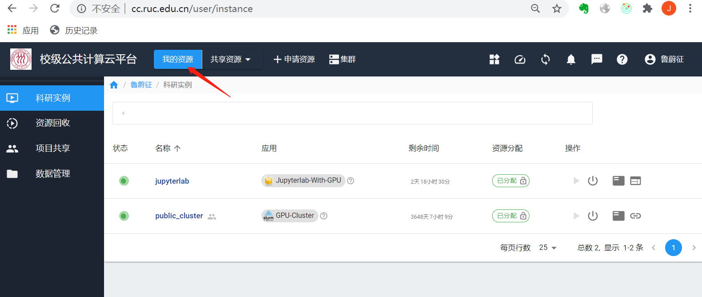
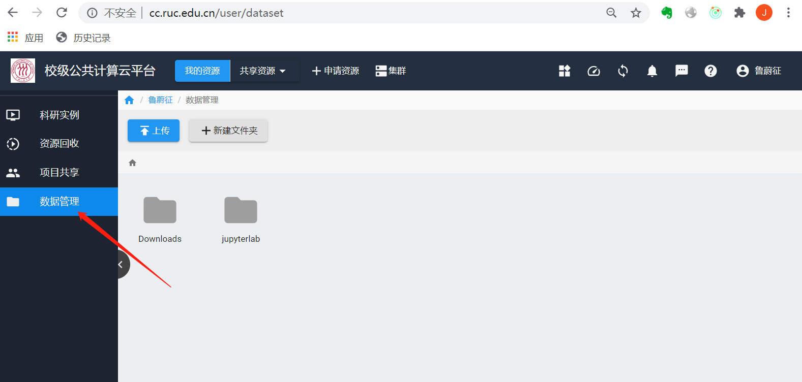
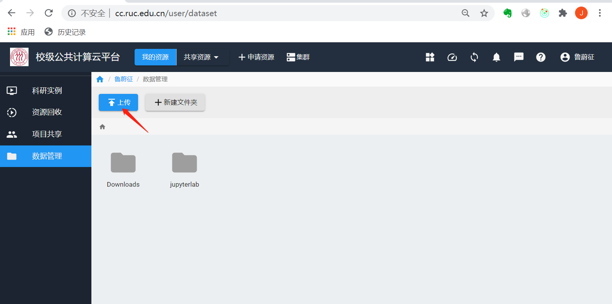
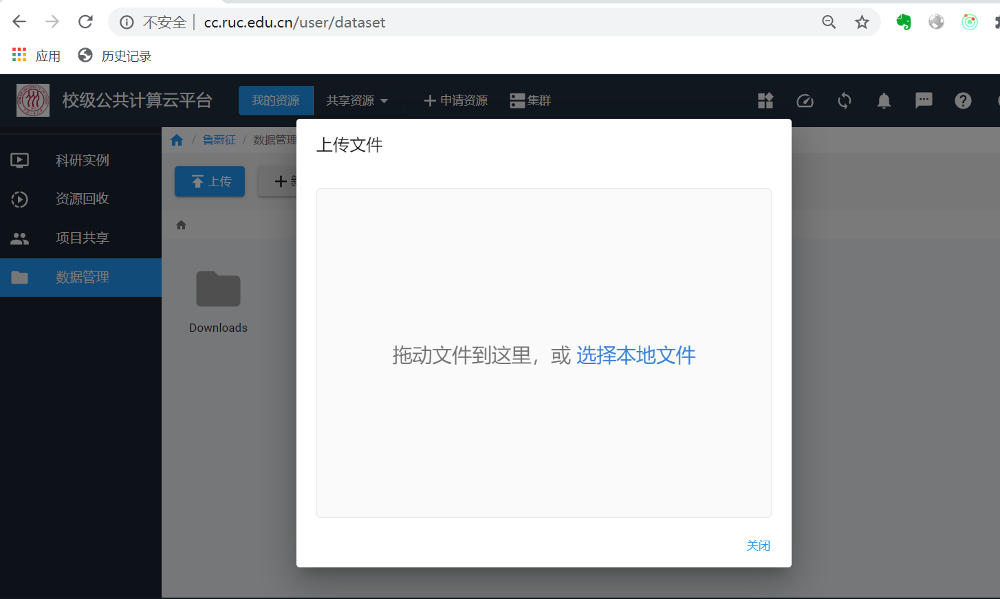

# 文件传输

## 用户数据存储空间

在云平台上，系统会为用户在共享文件系统上分配两种目录：

  * 每个用户分配一个共享文件系统上的目录，作为个人交互式实例里的Home目录。
  
  * 对于加入共享项目组的用户，系统会为用户在每个项目组中分配一个Home目录。

## Web页面访问

### 访问个人Home目录

#### 上传文件

点击**我的资源**



点击**数据管理**, 可以看到Home目录下的子目录和文件。



点击**上传**, 会弹出上传文件对话框。





#### 下载文件

选中要下载的文件，然后点击**下载**按钮


### 访问项目Home目录

项目Home目录的访问方式与个人Home目录的访问类似，只是先要选择某个共享项目，进入项目页面。


## 通过SSH账户访问

对于开放了SSH端口的集群或实例，用户可以通过SSH账户使用scp类的工具来传输数据。

以公共集群项目为例，用户在public_cluster共享项目的页面里，选择**科研实例**，可以看到名为`public_cluster`的实例：


点击最右侧的**ssh**服务地址按钮，会弹出平台对外开放的IP地址和端口：


用户在校内，能够直接访问平台服务IP地址的情况下，可以使用scp, winscp命令之类的工具来传输数据：

```bash
scp -P 20014 some_data u20200002@10.77.90.101:
```

## WebDAV 协议访问

由于页面文件上传功能有限，每次只能上传下载单个文件。而SSH端口不是所有实例都提供的访问方式。平台还提供了WebDAV协议的文件访问方式。

WebDAV协议访问的地址是`https://10.77.90.102:4918`。用户验证请使用平台内部用户名（`u` + 学号， 例如u20200002）和密码。

Windows系统建议使用[RaiDrive](https://www.raidrive.com/)。Mac系统建议使用[Cyberduck](https://cyberduck.io/)。

## 容器实例内访问项目Home目录

个人独占容器实例内，是可以访问到本用户所有所在项目的Home目录的。平台会自动把项目目录挂载到/group_homes下。 用户可以在交互式实例里把脚本和数据直接复制或移动到任何所在项目的Home目录中。


## 虚拟机实例内访问Home目录

平台内的虚拟机实例访问共享文件系统上的Home目录的机制类似于用户从外部访问WebDAV服务。目前平台上的虚拟机镜像预先做好了WebDAV卷的自动挂载，挂载点是/webdav。

```bash
root@ruc2:~# ssh -p 20017 root@10.77.90.101
root@10.77.90.101's password:
Welcome to Ubuntu 18.04.3 LTS (GNU/Linux 4.15.0-66-generic x86_64)

 * Documentation:  https://help.ubuntu.com
 * Management:     https://landscape.canonical.com
 * Support:        https://ubuntu.com/advantage

  System information as of Sun Jul 12 09:20:59 UTC 2020

  System load:  0.65              Processes:           105
  Usage of /:   8.0% of 19.21GB   Users logged in:     0
  Memory usage: 11%               IP address for ens4: 10.0.0.1
  Swap usage:   0%

 * "If you've been waiting for the perfect Kubernetes dev solution for
   macOS, the wait is over. Learn how to install Microk8s on macOS."

   https://www.techrepublic.com/article/how-to-install-microk8s-on-macos/

88 packages can be updated.
0 updates are security updates.


*** System restart required ***
Last login: Sun Jul 12 09:12:39 2020 from 10.0.255.254
root@ubuntu:~# ls /webdav/
 MyData  'ProjectGroup(hpctest)'  'ProjectGroup(public_cluster)'   lost+found
root@ubuntu:~#
```