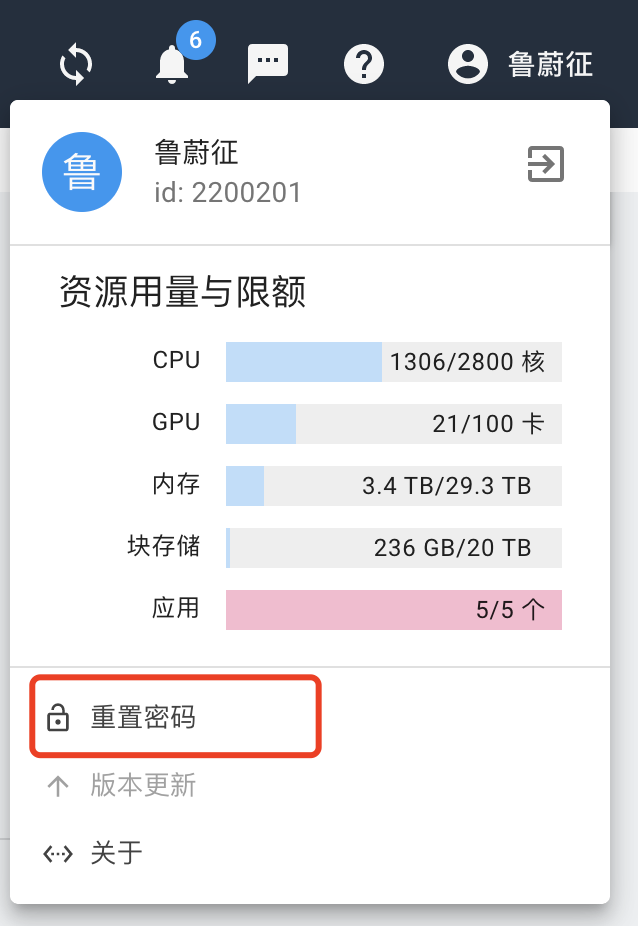

# 文件传输

## 用户数据存储空间

在计算云上，系统会为用户在共享文件系统上分配两种目录：

  * 每个用户分配一个共享文件系统上的目录，作为**交互实例**里的Home目录。
  
  * 对于加入**共享集群**的用户，系统会为用户在共享集群中分配一个Home目录。

## Web页面访问

### 访问交互实例中的Home目录

#### 上传文件

点击**我的资源**


点击**数据管理**, 可以看到Home目录下的子目录和文件。


点击**上传**, 会弹出上传文件对话框。


#### 下载文件

选中要下载的文件，然后点击**下载**按钮


### 访问共享集群的Home目录

共享集群Home目录的访问方式与交互实例Home目录的访问类似，只是先要选择共享集群，进入共享集群页面，再点击左侧“数据管理”。


## 通过SSH账户访问

对于开放了SSH端口的集群或实例，用户可以通过SSH账户使用scp类的工具来传输数据。

以公共集群项目为例，用户在`public_cluster`共享集群的页面里，选择**科研实例**，可以看到名为`public_cluster`的实例：


点击最右侧的SSH服务地址按钮，会弹出计算云对外开放的IP地址和端口：


首次使用SSH登录的用户需要设置SSH密码，此密码为计算云平台密码，用于计算云SSH登录时使用：点击右上角用户名，重置密码。



用户在校内，能够直接访问计算云服务IP地址的情况下，可以使用scp, winscp之类的工具来传输数据：

```bash
scp -P 20014 some_data u20200002@10.77.90.101:
```
