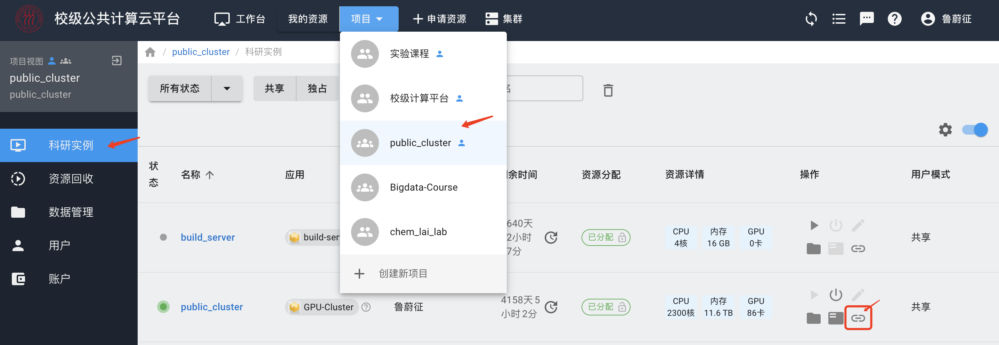
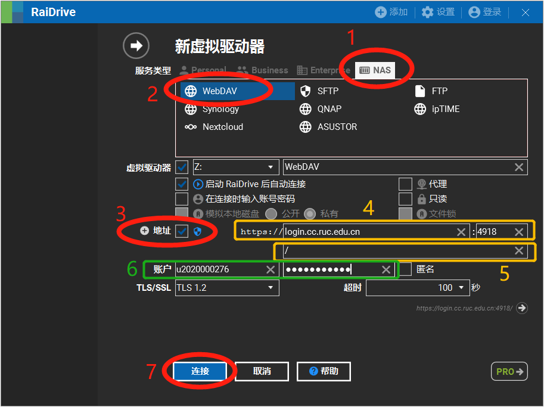

# 文件传输

## 用户数据存储空间

在计算云上，系统会为用户在共享文件系统上分配两种目录：

  * 每个用户分配一个共享文件系统上的目录，作为**交互实例**里的Home目录。
  
  * 对于加入**共享集群**的用户，系统会为用户在共享集群中分配一个Home目录。

## Web页面访问

### 访问交互实例中的Home目录

#### 上传文件

点击**我的资源**


点击**数据管理**, 可以看到Home目录下的子目录和文件。


点击**上传**, 会弹出上传文件对话框。


#### 下载文件

选中要下载的文件，然后点击**下载**按钮


### 访问共享集群的Home目录

共享集群Home目录的访问方式与交互实例Home目录的访问类似，只是先要选择共享集群，进入共享集群页面，再点击左侧“数据管理”。


## 通过SSH账户访问

对于开放了SSH端口的集群或实例，用户可以通过SSH账户使用scp类的工具来传输数据。

以公共集群项目为例，用户在“public_cluster”共享集群的页面里，选择**科研实例**，可以看到名为`public_cluster`的实例：



点击最右侧的SSH服务地址按钮，会弹出计算云对外开放的IP地址和端口：


首次使用SSH登录的用户需要设置SSH密码，此密码为计算云平台密码，用于计算云SSH登录时使用：点击右上角用户名，重置密码。


用户在校内，或者校外使用VPN，能够直接访问计算云服务IP地址的情况下，可以使用scp, winscp之类的工具来传输数据：

```bash
scp -P 20014 some_data u20200002@10.77.90.101:/home/your-user-id/
```

## 大数据文件：使用WebDAV协议

由于页面文件上传功能有限，每次只能上传下载单个文件，而且文件不能太大，**建议大量数据使用WebDAV协议传输**。WebDAV是一种通信协议，支持大批量的文件传输。对于用户来说，相当于将计算云的服务器以网盘的形式挂载到用户的个人电脑，用户将个人电脑里的数据拷贝或者上传到计算云的服务器上。

首先我们需要下载支持WebDAV协议的软件：Windows系统建议使用[RaiDrive](https://www.raidrive.com/)或[Cyberduck](https://cyberduck.io/)，Mac系统建议使用[Cyberduck](https://cyberduck.io/)。

#### Cyberduck 使用简介

打开Cyberduck，点击“新建连接”，按照下图所示填写连接方式，要选择“WebDAV(HTTPS)”方式，WebDAV协议访问的地址是`https://10.77.90.102:4918`。用户验证请使用平台内部用户名（`u` + 学工号， 例如u20200002），密码为计算云密码，首次使用需要设置一下：进入计算云页面，点击右上角用户名，重置密码。连接过程中出现任何提示，直接点“继续”。


连接成功后，可以使用软件的创建文件夹、上传等功能。注意，使用共享实例，比如交互式的JupyterLab、RStudio、Stata、MATLAB的用户，目标文件夹是“MyData”文件夹。软件的“操作”按钮下有“新建文件夹”、“上传”等功能。


#### Raidrive 使用简介

下载免费标准版Raidrive并安装后，点击窗口顶部的“添加”按钮，按照下图所示创建WebDAV驱动器。



点击确定后，会跳出一个Windows资源浏览器窗口。可以看到Raidrive已经把新添加的WebDAV连接创建成了一个网络存储驱动器。我们可以像操作本地磁盘一样从其他驱动器里拖拽文件到这个驱动器下的子目录中。


!!! warning "Raidrive WebDAV驱动器功能局限"

    * WebDAV驱动器里的文件不支持编辑，只支持创建和删除。

    * 根目录下不能创建目录或文件，只能在列出的顶层目录下操作。

## 交互实例内访问共享集群Home目录

交互实例模式内，是可以访问到本用户共享集群模式的Home目录的。平台会自动共享集群模式的Home目录挂载到`/group_homes`下。 用户可以在交互实例里把脚本和数据直接复制或移动到共享集群模式的Home目录中。


## 虚拟机实例内访问Home目录

平台内的虚拟机实例访问共享文件系统上的Home目录的机制类似于用户从外部访问WebDAV服务。目前平台上的虚拟机镜像预先做好了WebDAV卷的自动挂载，挂载点是/webdav。

```bash
root@ruc2:~# ssh -p 20017 root@10.77.90.101
root@10.77.90.101's password:
Welcome to Ubuntu 18.04.3 LTS (GNU/Linux 4.15.0-66-generic x86_64)

 * Documentation:  https://help.ubuntu.com
 * Management:     https://landscape.canonical.com
 * Support:        https://ubuntu.com/advantage

  System information as of Sun Jul 12 09:20:59 UTC 2020

  System load:  0.65              Processes:           105
  Usage of /:   8.0% of 19.21GB   Users logged in:     0
  Memory usage: 11%               IP address for ens4: 10.0.0.1
  Swap usage:   0%

 * "If you've been waiting for the perfect Kubernetes dev solution for
   macOS, the wait is over. Learn how to install Microk8s on macOS."

   https://www.techrepublic.com/article/how-to-install-microk8s-on-macos/

88 packages can be updated.
0 updates are security updates.


*** System restart required ***
Last login: Sun Jul 12 09:12:39 2020 from 10.0.255.254
root@ubuntu:~# ls /webdav/
 MyData  'ProjectGroup(hpctest)'  'ProjectGroup(public_cluster)'   lost+found
root@ubuntu:~#
```