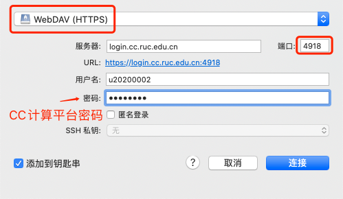
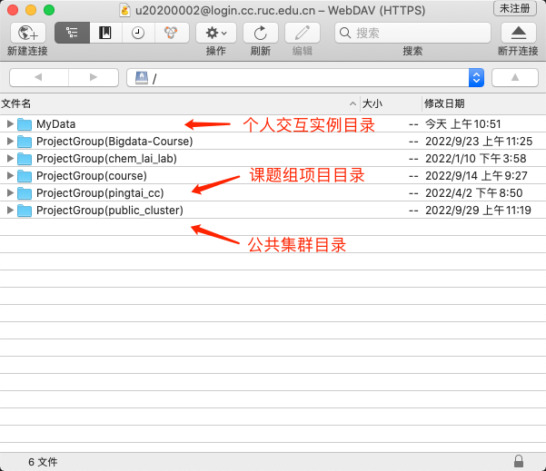
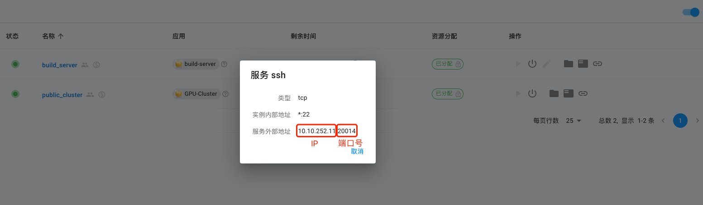

# 数据管理与文件传输

向计算平台上传数据有几种方式：

* 使用浏览器的Web页面：有图形界面，适用于不熟悉Linux的用户，不能上传11G以上文件。
* 在Windows和Mac上，使用支持WebDAV协议的客户端软件（Cyberduck或RaiDrive）：有图形界面，适用于不熟悉Linux的用户，能管理文件夹，能上传大文件。
* 在Linux上，使用SSH协议（`scp`、`rsync`）或WebDAV协议：无图形界面，需对Linux比较熟悉，适用于熟悉Linux的用户，能上传大文件。

本页面先介绍Linux目录入门知识，再介绍计算平台的存储空间目录，最后分别介绍上述三种上传和管理数据的方式。

## 1. Linux的目录结构

计算平台主要基于Linux操作系统，在计算平台上，每个用户都有属于自己的个人目录，例如：`/home/u20200002`，该目录在Linux中被称为Home目录。该目录是交互实例下的用户主目录，用户的数据和程序都应放在Home目录里。

!!! warning "路径格式"
    与Windows不同，Linux的目录分隔符使用`/`而非`\`。而且Linux下没有C盘、D盘的概念，个人数据和程序都应放在Home目录下。例如，在Windows下，一个路径可以是：`C:\Documents\Summer2020.pdf`；在Linux下，我们可以在Home目录下创建`Documents`的目录，并文件上传到这个目录下，路径为：`/home/u20200002/Documents/Summer2020.pdf`。未使用过Linux的用户一定要注意这样的目录路径格式的变动。

## 2.用户数据存储空间

在计算平台上，系统会为用户在文件系统上分配三种目录：

  * 独占实例目录，作为**交互实例**里的Home目录。比如，JupyterLab、MATLAB、Stata实例的HOME目录都是基于这样的目录。
  * 共享集群目录：对于加入**共享集群**的用户，系统会为用户在共享集群中分配一个Home目录。

交互实例的Home目录可以和共享集群的Home目录之间相互拷贝数据，在交互实例中，可以通过`/group_homes/public_cluster`目录访问到在共享集群里的数据。在共享集群中，可以通过`/users/uxxxx`目录访问到在独占实例里的数据。详见[如何从交互实例内访问共享集群的Home目录](#7-home)和[如何共享集群内访问交互实例的Home目录](#8-home)。

## 3. 设置密码

首次登录的用户需要设置系统内密码，此密码为CC计算平台平台密码，用于本文登录时使用：点击右上角用户名，重置密码。


## 4. Web页面

### 4.1 访问交互实例中的Home目录

#### 上传文件

点击**我的资源**

* 已分配计算资源的交互实例：

已经分配到计算资源的交互实例，从交互实例右侧“操作区”数据按钮进入数据管理界面，如下图所示：


* 已过期的交互实例：
  

已过期的交互实例，从“资源回收”页面中找到实例，点击进入该实例，如下图所示：


右侧有“数据管理”按钮：


可以看到交互实例的Home目录下的子目录和文件：

点击**上传**, 会弹出上传文件对话框。


#### 下载文件

选中要下载的文件，然后点击**下载**按钮


### 4.2 访问共享集群的Home目录

共享集群Home目录的访问方式与交互实例Home目录的访问类似，只是先要选择共享集群，进入共享集群页面，再点击左侧“数据管理”。


## 5. Win/Mac客户端软件

由于页面文件上传功能有限，每次只能上传下载单个文件，而且文件不能太大，**建议中大型数据使用WebDAV协议传输**。WebDAV是一种通信协议，支持大批量的文件传输。对于用户来说，相当于将计算平台的服务器以网盘的形式挂载到用户的个人电脑，用户将个人电脑里的数据拷贝或者上传到计算平台的服务器上。

我们需要下载支持WebDAV协议的软件：Windows系统建议使用[RaiDrive](https://www.raidrive.com/)或[Cyberduck](https://cyberduck.io/)，macOS系统建议使用[Cyberduck](https://cyberduck.io/)。


WebDAV协议访问的地址是`https://login.cc.ruc.edu.cn:4918`。用户名为平台内部用户名（`u` + 学工号， 例如u20200002），密码为计算平台密码，首次使用密码需要设置一下：进入计算平台页面，点击右上角用户名，重置密码。

#### 5.1 Cyberduck

打开Cyberduck，点击“新建连接”，按照下图所示填写连接方式，要选择“WebDAV(HTTPS)”方式。用户验证请使用平台内部用户名（`u` + 学工号， 例如u20200002），密码为CC计算平台密码。

!!! warning "密码为CC计算平台密码"
    密码为CC计算平台密码，非微人大密码，未设置过的请在CC计算平台右上角设置！



连接过程中出现任何提示，直接点“继续”。


连接成功后，可以使用软件的创建文件夹、上传等功能。注意，使用交互实例，比如交互式的JupyterLab、RStudio、Stata、MATLAB的用户，目标文件夹是“MyData”文件夹。软件的“操作”按钮下有“新建文件夹”、“上传”等功能。



#### 5.2 RaiDrive

下载免费标准版RaiDrive并安装后，点击窗口顶部的“添加”按钮，按照下图所示创建WebDAV驱动器。注意图中的步骤。


点击确定后，会跳出一个Windows文件管理器窗口。可以看到RaiDrive已经把新添加的WebDAV连接创建成了一个网络存储驱动器。我们可以像操作本地磁盘一样从其他驱动器里拖拽文件或者拷贝到这个驱动器下的子目录中。


!!! warning "Raidrive WebDAV驱动器功能局限"

    * WebDAV驱动器里的文件不支持编辑，只支持创建和删除。
    * 根目录下不能创建目录或文件，只能在列出的顶层目录下操作。

## 6. Linux

### 6.1 SSH

对于开放了SSH端口的集群或实例，用户可以通过SSH账户使用scp类的工具来传输数据。

以公共集群项目为例，用户在“public_cluster”共享集群的页面里，选择**科研实例**，可以看到名为`public_cluster`的实例：


点击最右侧的SSH服务地址按钮，会弹出计算平台对外开放的IP地址和端口：



用户在校内，或者校外使用[VPN](vpn.md)，可以使用scp, winscp之类的工具来传输数据：

```bash
scp -P 20014 some_data u20200002@login.cc.ruc.edu.cn:/home/your-user-id/
```

### 6.2 WebDAV

!!! tip "中大规模数据请使用这种方式"
    大规模数据推荐使用WebDAV这种方式，而非SSH！

Rclone是Linux上支持WebDAV协议的客户端。如果用户想从自己的Linux服务器上传数据到计算平台，需要在自己的Linux服务器上下载安装Rclone，使用Rclone连接到计算平台，上传和管理计算平台上的数据。

!!! warning "操作位置"
    以下操作均在用户自己的Linux服务器上，并非计算平台的服务器上！

1 下载安装Rclone

前往[https://rclone.org/install/](https://rclone.org/install/)根据指南，下载并安装到自己Linux服务器上。

```bash
curl -O https://downloads.rclone.org/rclone-current-linux-amd64.zip
unzip rclone-current-linux-amd64.zip
cd rclone-*-linux-amd64
```

使用有root权限的用户拷贝到`/usr/bin/`下：

```bash
sudo cp rclone /usr/bin/
sudo chown root:root /usr/bin/rclone
sudo chmod 755 /usr/bin/rclone
```

2 配置用户名密码

执行`rclone config`进行必要的配置：

```bash
# rclone config
> n #新建连接
name> remote #设置连接名称
Storage> webdav #设置存储类型
url> https://10.10.252.11:4918 #设置webdav服务端地址
vendor>other #设置服务端vendor
user> username #设置计算平台用户名：u2xxxxxx
y/g/n> y
password: ****** #设置计算平台密码
bearer_token>    #键入回车，跳过
Edit advanced config? (y/n) #键入回车，跳过
Remote config       				#键入回车，跳过
e/n/d/r/c/s/q> q     				#配置完成，退出
```

3 关闭证书检查

!!! warning "关闭证书检查"
    注意：此项必须关闭，不然远程操作会报错！

有两种关闭检查的方式，如下：
1.在执行命令时带上--no-check-certificate参数，如：rclone ls remote: --no-check-certificate
2.在环境变量里指定，如：export RCLONE_NO_CHECK_CERTIFICATE=true

4 常用操作

```bash
# 列出远程目录，remote替换为配置时设置的连接名称
rclone lsd remote：

# 将本地文件复制到远程的MyData目录
rclone copy -P /tmp/*  remote:/MyData/

#远程的文件复制到本地
rclone copy -P remote:/MyData/rclone-v1.55.1-linux-amd64.zip /tmp
```

其中，SLURM共享集群数据在 `ProjectGroup(public_cluster)` 中，课题组数据在 `ProjectGroup(course)`。

!!! warning "括号前后要加单引号'"
    `ProjectGroup(public_cluster)` 这样的目录，在访问和拷贝数据时，需要加单引号，例如：`rclone copy -P /tmp/*  remote:ProjectGroup'('public_cluster')'/u2020xxxx/`

5 其它操作可参考官方文档：https://rclone.org/docs/

## 7. 共享集群专用 sftp

SLURM 共享集群启动了专用 sftp，速度更快，集群目标地址为 `/fs/fast/uxxxx` 下的个人目录。关于集群存储和目录结构请参考[这个页面](../slurm/storage.md)。使用支持 sftp 协议的各类工具可以上传。

* IP地址：10.10.252.12
* 端口号：10021
* 集群对应地址：`/fs/fast/uxxxx`

Linux 下连接方式：

```bash
$ sftp -P 10021 u20200002@10.10.252.12
# 将本地的某个文件拷贝到集群 `/fs/fast/uxxxx` 下
sftp>put /path/to/chart.png ./
```

!!! warning "sftp 目前只支持 `/fs/fast/` 目录"
    sftp 目前只支持 `/fs/fast/` 目录，为快速传输大数据所准备，应该在 `/fs/fast` 下处理完数据，并归档到 `/fs/archive` 。

## 8. 交互实例内访问共享集群Home目录

交互实例模式内，是可以访问到本用户共享集群模式的Home目录的。计算平台平台会自动将共享集群的Home目录挂载到`/group_homes`下。 用户可以在交互实例里把脚本和数据直接复制或移动到共享集群模式的Home目录中。

例如，在一个交互实例JupyterLab里，启动命令行，使用下面的命令拷贝数据：`cp /group_homes/public_cluster/home/u20200002/run.sh ./`。注意，将里面的学工号改为自己的学工号。

## 9. 共享集群访问交互实例Home目录

在共享集群中可以访问到交互实例的目录，在共享集群的命令行内，通过 `/users/u20200002/` 来访问交互实例中的数据。注意，将里面的学工号改为自己的学工号。

例如，在共享集群的登录节点，启动命令行，使用下面的命令从共享集群拷贝数据到交互实例：`cp ./run.sh /users/u20200002/`。注意，将里面的学工号改为自己的学工号。

## 10. 虚拟机实例内访问Home目录

平台内的虚拟机实例访问共享文件系统上的Home目录的机制类似于用户从外部访问WebDAV服务。目前平台上的虚拟机镜像预先做好了WebDAV卷的自动挂载，挂载点是/webdav。

```bash
# 登录Linux虚拟机
ssh -p 20017 root@login.cc.ruc.edu.cn
# 查看 /webdav 目录
root@ubuntu:~# ls /webdav/
 MyData  'ProjectGroup(hpctest)'  'ProjectGroup(public_cluster)'   lost+found
```